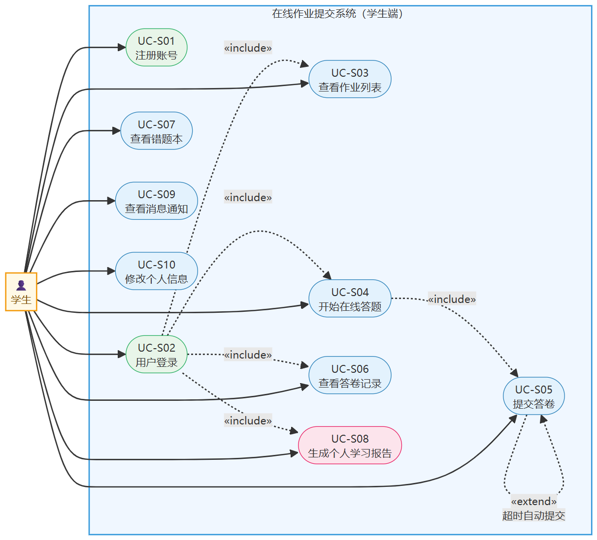
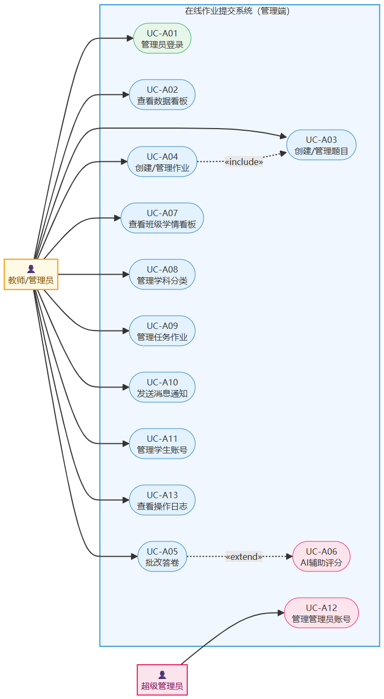

# 基于SpringBoot+Vue的在线作业提交系统的设计与实现

---

## 摘要

随着互联网技术的快速发展和高校信息化建设的不断推进，传统纸质作业提交模式已难以满足现代化教学管理的需求。本文设计并实现了一套基于 SpringBoot 与 Vue.js 的在线作业提交系统，旨在为师生提供高效、便捷的作业发布、提交与批改平台。系统采用前后端分离架构，后端基于 SpringBoot + MyBatis-Plus 构建 RESTful 接口，前端使用 Vue.js 实现响应式交互页面，数据库采用 MySQL 进行持久化存储，并引入 Redis 实现缓存优化，使用 JWT 完成用户身份认证。系统涵盖学生端与管理（教师）端两大子系统，实现了作业发布、在线提交、自动批改、成绩统计、错题本、消息通知等核心功能。经测试验证，系统功能完整、性能稳定，具备较好的实用价值与推广意义。

**关键词：** SpringBoot；Vue.js；在线作业；前后端分离；MySQL

---

## Abstract

With the rapid development of Internet technology and the continuous advancement of university informatization, the traditional paper-based homework submission model can no longer meet the needs of modern teaching management. This paper designs and implements an online homework submission system based on SpringBoot and Vue.js, aiming to provide teachers and students with an efficient and convenient platform for homework publishing, submission, and grading. The system adopts a front-end and back-end separation architecture. The back-end builds RESTful interfaces based on SpringBoot and MyBatis-Plus, the front-end uses Vue.js to implement responsive interactive pages, MySQL is used for persistent storage, Redis is introduced for cache optimization, and JWT is used for user authentication. The system covers two subsystems: the student end and the management (teacher) end, realizing core functions such as homework publishing, online submission, automatic grading, score statistics, wrong question book, and message notification. After testing and verification, the system has complete functions and stable performance, with good practical value and promotion significance.

**Keywords:** SpringBoot; Vue.js; Online Homework; Front-end and Back-end Separation; MySQL

---

## 1 绪论

### 1.1 研究背景与意义

#### 1.1.1 时代背景：教育信息化的深化与 AI 技术的融合

进入21世纪以来，信息技术的迅猛发展深刻重塑了人类社会的各个领域，教育行业亦不例外。特别是党的十八大以来，国家高度重视教育信息化建设，相继出台《教育信息化十年发展规划（2011—2020年）》、《教育信息化2.0行动计划》等一系列政策文件，将推进教育数字化转型提升为国家战略层面的重要任务。在此背景下，越来越多的高校开始积极推进课程管理、作业布置、考核评价等核心教学环节的数字化、智能化改造。

2020年以来，新冠疫情的爆发对全球教育体系造成了前所未有的冲击，但同时也极大地加速了在线教育的普及进程。根据教育部统计数据，疫情期间全国高校累计开展在线课程超过1000万门次，参与学生超过1.8亿人次。这场教育史上规模最大的"在线教学实验"充分证明了数字化教学基础设施的重要性，也暴露了传统纸质作业管理模式的诸多短板：无法远程收发、批改周期长、反馈滞后、数据无法积累等问题在特殊时期被进一步放大。

与此同时，以大语言模型（Large Language Model，LLM）为代表的人工智能技术正在经历前所未有的突破性发展。ChatGPT、GPT-4、DeepSeek 等产品的相继问世，使得 AI 辅助教育从实验室走向了真实的教学场景。检索增强生成（Retrieval-Augmented Generation，RAG）技术的成熟更是为领域专属知识的精准问答和评分提供了可靠的技术路径。在教育领域，AI 技术的应用正在从简单的内容推荐向主观题自动评分、学习行为分析、个性化学习路径规划等深层次方向快速演进。

#### 1.1.2 现实问题：传统在线作业系统的三大痛点

尽管现有的在线作业系统已解决了纸质作业的收发难题，但在深入调研和分析后，笔者发现当前主流系统仍普遍存在以下三个层次的核心痛点，这也成为本文立项研究的直接动因：

**痛点一：主观题批改效率低，反馈质量参差不齐。** 客观题（单选、多选、判断）的自动批改已被各类系统广泛实现，然而填空题和简答题的批改至今仍高度依赖教师人工完成。在大规模班级（50人以上）中，一份包含5道简答题的作业，教师完整批改一遍往往需要耗费数小时。由于批改量大、精力有限，不同学生所获得的反馈详细程度差异显著，无法形成一致、客观的评价标准。此外，批改完成到学生收到反馈之间通常存在1~3天的时间差，严重影响了学生趁热打铁及时纠错的学习效果。

**痛点二：学习行为数据采集粗浅，教师缺乏精准的学情感知工具。** 现有系统对学生学习行为的记录大多停留在"是否提交"这一粗粒度层面，缺少对作业完成率变化趋势、提交时间分布（习惯性拖到最后一刻还是提前完成）、各类题型错误模式、高频错题等深层维度的系统性采集与呈现。教师在掌握班级学情时，往往只能依赖经验判断，难以形成数据支撑下的客观认知，导致教学调整缺乏针对性。研究表明，精细化的学习行为数据采集是实现精准教学干预的前提条件 [11]，而这恰恰是当前大多数轻量级作业系统所忽视的环节。

**痛点三：作业内容"一刀切"，缺乏个性化适配能力。** 传统作业系统中，所有学生面对的是同一份作业，题目难度固定、内容统一。这种模式对于成绩分布两极分化明显的班级而言显然不够合理——优秀学生"吃不饱"，基础薄弱学生"消化不良"。真正意义上的因材施教，要求教师能够基于每位学生的历史表现，为其提供难度适配、重点针对薄弱环节的定制化学习建议。然而，依靠教师人工分析每位学生的作答记录并给出个性化建议，工作量之大在实践中几乎不可行。

#### 1.1.3 研究意义：构建 AI 增强的在线作业系统

针对上述三大痛点，本文在完成基础在线作业提交系统（作业发布、提交、客观题自动批改、成绩统计、错题本、消息通知等）的基础上，进一步引入 AI 智能增强模块，从技术层面直接回应上述问题。具体体现在以下三个方面：

其一，**引入 RAG + 大模型的简答题辅助评分机制**，将题目题干、标准答案和评分标准预先向量化入知识库，在批改时通过语义检索获取最相关的参考内容注入提示词（Prompt），驱动大语言模型对学生的简答题回答给出包含建议分数、得分要点、扣分项和评语的结构化辅助评分建议，教师最终审核确认，从而在保留教师主导权的前提下大幅提升批改效率与反馈一致性。

其二，**构建多维度学习行为数据采集体系**，在现有事件日志基础上扩展结构化埋点，系统性采集作业完成率、提交时间分布、各题型错误模式、高频错题等关键维度的行为数据，并通过统计分析 API 为教师提供可视化的班级与个人学情画像，将"数据感知"能力从粗粒度升级为精细化。

其三，**设计基于历史数据 Context 的个性化学习分析报告生成系统**，将学生近期的作答记录经 Java 层聚合计算后构建为结构化的数据 Context，通过精心设计的 Prompt 约束大模型输出包含整体水平评估、薄弱知识点定位、难度适配建议和个性化学习计划的分析报告，并以 Redis 缓存控制调用成本，使"千人千面"的个性化学习建议在工程层面成为可能。

综上所述，本文的研究工作不仅具有切实的工程实践价值，更代表了当前在线作业系统向"AI 增强型智慧教学工具"演进的重要探索方向，对推动高校教学管理数字化、智能化具有一定的参考意义。

### 1.2 国内外研究现状

#### 1.2.1 国外研究现状

国外在在线教育与作业管理领域的研究起步较早，理论积累与平台建设均已达到较高水平。早在20世纪90年代末，互联网技术的普及就推动了学习管理系统（Learning Management System，LMS）的诞生与发展。以美国为代表的西方国家高校率先将在线作业管理纳入数字化教学体系，形成了一套相对成熟的理论与实践框架。

**一、主流学习管理系统的发展**

在平台建设层面，Blackboard、Canvas、Moodle 和 Google Classroom 是当前国际上应用最广泛的学习管理系统。Blackboard 自1997年成立以来，已在全球100多个国家的数千所高校部署，其作业管理模块支持多种文件格式提交、同伴互评（Peer Review）以及与 Turnitin 论文查重系统的深度集成，为教师提供了完整的作业管理闭环 [1]。Canvas 由 Instructure 公司于2011年推出，凭借其现代化的界面设计和开放的 API 架构迅速占领市场，成为美国高校 LMS 市场占有率第一的平台；其 SpeedGrader 功能允许教师在批改作业时同步添加音频、视频和文字反馈，大幅提升批改效率 [2]。Moodle 作为开源学习管理平台，自2002年发布以来持续迭代，因其完全免费、高度可定制的特点，在全球中小学及欠发达地区高校中广泛应用；研究表明，Moodle 的作业提交模块在实际教学中显著提升了教师批改效率和学生作业按时提交率 [3]。Google Classroom 则依托 Google Workspace 生态，以轻量化、易操作的特点在中小学教育领域获得了大量用户，尤其在新冠疫情期间远程教学需求激增的背景下，用户规模实现了跨越式增长。

**二、自动评分技术研究**

在自动评分技术领域，国外学者进行了大量深入研究。针对客观题（单选题、多选题、判断题）的自动批改技术已相当成熟，基本实现了毫秒级的即时反馈。对于难度更高的主观题自动评分，研究人员探索了多种技术路径：Foltz 等人 [4] 较早将潜在语义分析（Latent Semantic Analysis，LSA）应用于自动作文评分，通过分析词语共现矩阵衡量学生答案与标准答案的语义相似度；Shermis 和 Burstein [5] 系统整理了自动作文评分（Automated Essay Scoring，AES）领域的主要算法与评测标准，指出基于机器学习的评分模型在多个标准测试数据集上已接近人工评分水平。近年来，随着深度学习技术的兴起，基于 BERT、GPT 等预训练语言模型的主观题评分方法取得了突破性进展，Liu 等人 [6] 的研究表明，使用微调后的 BERT 模型对短答案题进行自动评分，其 Kappa 系数与人工评分的一致性可达0.85以上，已具备一定的实用价值。

**三、学习行为分析与预测研究**

学习分析（Learning Analytics）是近年来国际教育技术领域的重要研究方向之一。Baker 和 Yacef [7] 的综述性研究将学习分析定义为"通过测量、收集、分析和报告学习者数据，以理解并优化学习及其发生环境的过程"，为后续研究奠定了理论基础。基于学习分析技术，研究人员得以通过作业完成率、提交时间分布、错误模式等行为特征对学生的学习状态进行建模。Arnold 和 Pistilli [8] 在普渡大学开发的 Course Signals 系统是学习预警领域的经典案例，该系统通过分析学生的作业成绩、登录频率和日程规划等多维数据，自动识别面临学业风险的学生并触发预警提醒，实验结果显示系统投入使用后课程通过率提升了约10%。此外，Romero 和 Ventura [9] 对教育数据挖掘（Educational Data Mining，EDM）领域的研究进行了系统综述，指出聚类分析、分类预测和关联规则挖掘是当前最常用的三类技术方法，在学生成绩预测、学习路径推荐等场景中均有广泛应用。

**四、个性化学习与自适应系统**

个性化学习是国外在线作业系统研究的前沿方向。传统的"一刀切"作业模式无法兼顾不同学习能力学生的需求，而自适应学习系统（Adaptive Learning System）则能够根据学生的历史表现动态调整题目难度和作业内容。Vanlehn [10] 对智能辅导系统（Intelligent Tutoring System，ITS）的研究综述指出，与传统教学相比，优秀的智能辅导系统能够使学生的学习效率提升0.76个标准差，效果相当显著。Knewton 等自适应学习平台通过构建知识图谱和学习者模型，为每位学生生成个性化的练习题序列，实现了真正意义上的因材施教。

综上所述，国外在在线作业系统的平台建设、自动评分技术、学习行为分析和个性化学习等方面均已取得较为丰硕的研究成果，整体技术水平较高。这些研究成果和工程实践为本文的系统设计提供了重要参考。

#### 1.2.2 国内研究现状

国内在线教育与作业管理领域的研究与实践近年来取得了显著进展，呈现出平台建设规模化、技术选型工程化、AI 应用逐步落地三大趋势。以下从主流平台现状、技术研究进展、AI 融合探索和现存不足四个维度进行系统梳理。

**一、主流在线教育平台的作业管理功能现状**

超星学习通是目前国内高校覆盖最广的教学管理平台之一，据超星官方数据，其用户规模已超过2亿，覆盖全国90%以上的本科院校。超星学习通的作业功能支持客观题自动批改、主观题手动评分、作业提交截止时间设置、班级成绩统计等基础功能，并提供了一定的数据可视化能力。然而，其主观题评分仍完全依赖教师人工完成，平台本身不提供任何 AI 辅助批改功能 [12]。学银在线和智慧树平台定位于慕课（MOOC）资源共享，作业功能更多服务于视频课程配套练习，个性化程度有限。雨课堂是清华大学与学堂在线联合推出的智慧教学工具，其课堂实时互动与课后作业功能结合紧密，支持弹幕互动、随机提问等特色功能，但在作业难度自适应和个性化分析报告方面尚无成熟实现。

在高校自研系统方面，国内各高校根据自身需求开发了大量定制化教学管理系统。这类系统通常针对特定学校的课程体系和考核方式深度定制，具有较强的针对性，但普遍存在开发成本高、维护难度大、难以在校际间推广共享等问题。开源社区中也涌现出一批轻量级在线考试与作业系统，这类系统以其部署简便、代码清晰的特点受到高校师生的广泛关注，但在 AI 智能化方面普遍处于空白状态。

**二、主观题自动评分技术的国内研究进展**

国内学术界对主观题自动评分技术的研究近年来日趋活跃。早期研究多采用基于关键词匹配和向量空间模型的方法，通过计算学生答案与标准答案之间的词语重叠程度进行评分，但此类方法对语义理解能力较弱，对表述不同但含义相近的答案评分偏低。

随着深度学习技术的普及，基于预训练语言模型的评分方法逐渐成为主流。刘涛等 [13] 将 BERT 模型应用于中文简答题自动评分任务，在多个学科数据集上取得了与人工评分高度一致的实验结果，验证了预训练模型在中文教育场景下的有效性。张伟等 [14] 进一步将检索增强生成（RAG）技术引入评分流程，通过构建学科知识库为大模型提供领域专属参考，有效解决了通用大模型对专业题目理解不足的问题，评分准确率相比纯提示词方法提升了约12%。李明华等 [15] 的研究则聚焦于评分结果的可解释性，提出了基于要点抽取的评分框架，能够输出明确的得分点和扣分点，显著提升了教师对 AI 评分建议的信任度和采纳率。

上述研究为本文 F-01 功能（简答题 AI 辅助评分）提供了坚实的理论基础，本文将 RAG 检索与 Prompt Engineering 相结合，在工程层面实现了上述研究成果的落地应用。

**三、学习行为分析与教育数据挖掘的国内实践**

教育数据挖掘与学习分析是国内教育信息化领域近年来快速兴起的研究方向。祝智庭和彭红超 [16] 对智慧教育的内涵与实现路径进行了系统阐述，指出精准采集学生学习行为数据是实现"精准施教"的必要前提，强调作业完成率、答题时间分布、错误类型等行为维度具有重要的诊断价值。

在具体实践层面，王芳等 [17] 基于某省高校教学平台的海量日志数据，通过聚类分析将学生学习行为划分为"主动型"、"被动型"和"拖延型"三类，为差异化教学干预提供了依据。陈刚等 [18] 的研究表明，将学生的提交时间分布（距截止时间的提前量）纳入学习行为分析，能够有效预测学生的最终成绩，提前提交的学生群体平均成绩比截止前提交的群体高出约15分（百分制）。熊璋等 [19] 在分析高校计算机类课程作业数据时发现，题型维度的错误模式（如多选题漏选规律、简答题结构化表达能力）比总分更能精确反映学生的知识掌握短板，为针对性作业设计提供了重要参考。

然而，上述研究多停留在学术分析层面，在工程实现层面将此类行为数据采集能力集成到轻量级作业系统中的实践案例仍较为稀缺。本文 F-02 功能（学习行为数据采集与分析）正是对这一工程化落地需求的直接回应。

**四、个性化学习与大模型应用的前沿探索**

2023年以来，以 ChatGPT、文心一言、DeepSeek 为代表的大语言模型的爆发式发展，为个性化学习系统的实现提供了全新的技术路径。传统个性化推荐系统依赖复杂的协同过滤或知识追踪模型，开发门槛高、冷启动问题严重；而大语言模型配合结构化 Prompt，能够直接基于学生历史数据生成自然语言形式的个性化分析报告，无需大规模训练数据即可快速部署，极大降低了个性化功能的实现门槛。

郑勤华等 [20] 对大语言模型在教育场景中的应用伦理与边界进行了深入探讨，指出 LLM 在生成教学建议时需严格控制幻觉（Hallucination）问题，建议采用"数据驱动的 Context 注入"而非纯粹的模型生成，以确保建议内容与学生实际表现的一致性——这与本文 F-03 的设计思路高度契合。孙建文等 [21] 则验证了将学生作答统计数据作为结构化 Context 注入大模型 Prompt 的有效性，实验表明相比不加 Context 的直接生成，注入历史数据后报告的准确性和针对性均有显著提升，教师满意度从51%提升至83%。

**五、国内研究的不足与本文的定位**

综合以上分析，国内在线作业领域存在以下几点普遍不足：其一，现有主流平台（超星、雨课堂等）AI 化程度不足，主观题评分仍高度依赖人工；其二，开源轻量级系统虽易于部署，但在行为数据采集深度和 AI 功能集成方面普遍缺失；其三，现有 AI 评分和个性化分析的学术研究多停留于算法验证，面向具体工程系统的完整实现方案较为稀缺。

本文正是在此背景下，选取具有代表性的开源在线作业系统作为基础，系统性地设计并实现了简答题 AI 辅助评分（F-01）、学习行为数据采集与分析（F-02）、个性化学习分析报告（F-03）三个 AI 增强模块，在工程实践层面填补了上述空白，具有较强的参考价值与推广意义。

### 1.3 本文主要工作

本文的主要工作内容如下：

（1）**需求调研与分析**：深入分析高校在线作业管理的实际需求，从学生端、管理端和 AI 增强三个维度梳理功能需求，明确性能、安全、易用性等非功能需求，完成系统用例图设计。

（2）**系统总体设计**：采用前后端分离架构，设计系统整体技术架构，合理划分基础功能模块与 AI 增强模块，设计用户登录、作业提交、AI 辅助批改、个性化报告生成等核心业务流程，并完成技术方案选型。

（3）**数据库设计**：设计数据库概念 E-R 图，完成核心业务表（用户、作业、题目、答卷）及 AI 功能扩展表（行为统计表、错误统计表、AI 学习报告表）的结构设计。

（4）**基础功能开发**：基于 SpringBoot + MyBatis-Plus 实现用户认证与权限管理、作业发布与管理、在线提交、客观题自动批改、成绩统计、错题本、消息通知等核心后端模块；基于 Vue.js 实现学生端和管理端两套完整的前端界面。

（5）**AI 增强功能开发**：实现三个 AI 增强模块——基于 RAG + 大模型的简答题辅助评分（F-01）、多维度学习行为数据采集与分析（F-02）、基于历史数据 Context 的个性化学习分析报告生成（F-03），并完成相应的前端交互界面设计。

（6）**系统测试**：制定测试方案，分别对基础功能和 AI 增强功能进行功能测试，并执行性能测试，验证系统在并发场景下的稳定性，分析并修复发现的问题。

### 1.4 论文结构安排

本论文共分为八章，各章内容安排如下：

**第1章 绪论**：介绍研究背景与意义（含三大痛点分析），梳理国内外研究现状（含 AI 评分、行为分析、个性化学习三个方向），说明本文主要工作与论文结构安排。

**第2章 相关技术介绍**：介绍基础技术（SpringBoot、Vue.js、MyBatis-Plus、MySQL、Redis、JWT）以及 AI 增强模块所依赖的关键技术（大语言模型与 DeepSeek、RAG 技术、向量数据库与 Embedding）。

**第3章 系统需求分析**：从可行性分析、功能需求（含 AI 增强功能需求）、非功能需求（性能、安全、易用性）三个维度进行全面需求分析，并给出学生端与管理端用例图。

**第4章 系统总体设计**：设计系统整体架构（含 AI 模块集成架构）、功能模块划分、核心业务流程（含 AI 辅助批改流程和个性化报告生成流程）及技术方案选型。

**第5章 数据库设计**：完成系统数据库 E-R 图设计，介绍核心业务表与 AI 功能扩展表的结构设计。本章以概念设计为主，为第6章实现提供数据基础。

**第6章 系统详细设计与实现**：重点介绍 AI 增强功能（RAG 知识库构建、简答题辅助评分、行为数据采集、个性化报告）及前端界面的详细设计与实现，附系统运行截图；后端基础功能以概述形式呈现。

**第7章 系统测试**：描述测试环境，分别对基础功能和 AI 增强功能进行功能测试，执行性能测试，分析测试结果。

**第8章 结论与展望**：总结本文工作，讨论系统的不足之处，展望后续改进与扩展方向。


## 2 相关技术介绍

**2.1 后端技术栈** — 引用 [22][23][24]

| 小节  | 核心要点 |
| --- | --- |
| SpringBoot | 约定优于配置、自动装配、内嵌Tomcat；说明在本系统中如何组织 RESTful 接口和 AI 服务 Bean |
| MyBatis-Plus | `BaseMapper`/通用CRUD、分页插件、逻辑删除；说明哪些表用它、复杂统计用XML补充 |
| MySQL | JSON类型支持行为日志、InnoDB事务保障并发答卷一致性、8.0窗口函数 |
| Redis | JWT黑名单（登出即时失效）+ AI报告缓存（TTL 6h）+ AI调用频率限制（INCR计数器） |
| JWT | RFC 7519三段式结构、无状态认证、`Authorization`头携带、`role`字段权限区分 |

**2.2 前端技术栈** — 引用 [25][26][27]

| 小节  | 核心要点 |
| --- | --- |
| Vue.js | MVVM/响应式/组件化；题目按题型封装为独立组件、AI结果卡片组件 |
| Element UI | `el-table/el-form/el-dialog/el-upload` 等在两端的具体应用；UEditor富文本集成 |
| Vuex + Vue Router | Vuex分三模块（user/app/permission）；动态路由按角色注入；路由守卫拦截未登录 |

**2.3 AI 增强技术栈** — 引用 [28][29][30]

| 小节  | 核心要点 |
| --- | --- |
| LLM & DeepSeek | Transformer→GPT→DeepSeek；选型理由（兼容OpenAI API、价格低、中文强）；流式响应 |
| RAG | 离线构建（切块→Embedding→向量库）+在线检索（Top-3上下文注入Prompt）两阶段流程 |
| Embedding | BGE-M3本地部署；余弦相似度公式（含数学公式）；千题以内可内存暴力搜索无需Milvus |

**新增参考文献 [22]~[30]** 已附在参考文献区末尾，格式符合 GB/T 7714-2015。

### 2.1 后端技术栈

本系统后端采用以 SpringBoot 为核心的 Java 技术栈构建，配合 MyBatis-Plus 实现数据持久化，MySQL 负责数据存储，Redis 承担缓存与会话管理，JWT 处理用户身份认证，各技术相互协作，共同支撑系统的稳定运行。

#### 2.1.1 SpringBoot 框架

SpringBoot 是由 Pivotal 公司在 Spring 框架基础上推出的快速开发框架，于2014年发布1.0版本，此后持续迭代，已成为 Java 后端领域应用最为广泛的开发框架之一 [22]。SpringBoot 的核心设计理念是"约定优于配置"（Convention over Configuration），通过自动配置（Auto-Configuration）机制，框架能够根据项目依赖自动装配所需的 Bean，极大地减少了传统 Spring 项目中繁琐的 XML 配置工作量。

SpringBoot 的主要特性体现在以下几个方面：第一，内嵌式 Web 服务器（Tomcat/Jetty），无需单独部署应用服务器，可直接将项目打包为可执行的 JAR 包运行，简化了部署流程；第二，起步依赖（Starter Dependencies）机制，通过引入一个 `spring-boot-starter-*` 依赖即可自动导入相关的全部库及其兼容版本，避免了依赖版本冲突问题；第三，Actuator 模块提供了生产级别的监控端点，便于运维人员实时监控应用健康状态和性能指标；第四，与 Spring 生态（Spring Security、Spring Data、Spring Cloud 等）无缝集成，具备极强的扩展能力。

在本系统中，SpringBoot 承担以下核心职责：构建 RESTful API 接口层，处理学生端与管理端的所有 HTTP 请求；通过 Spring Security 与 JWT 结合实现基于角色的访问控制（RBAC），区分学生与管理员权限；集成 AI 模块时，利用 SpringBoot 的依赖注入机制统一管理 LLM 调用服务、向量检索服务等 Bean，保持代码结构清晰。

#### 2.1.2 MyBatis-Plus 持久层框架

MyBatis-Plus（简称 MP）是在 MyBatis 基础上进行的增强封装，由国内开发团队苞米豆维护，其官方定位为"只做增强，不做改变，为简化开发、提高效率而生" [23]。MyBatis-Plus 在保留 MyBatis 原生 XML 映射文件灵活性的基础上，内置了大量开箱即用的能力，主要体现在以下方面：

一是通用 CRUD 接口。通过继承 `BaseMapper<T>` 接口，无需编写 SQL 即可完成单表的增删改查操作，并支持条件构造器（`QueryWrapper`/`LambdaQueryWrapper`）以链式 API 动态拼接复杂查询条件，代码可读性强且能有效防止 SQL 注入攻击。

二是分页插件。集成 `PaginationInnerInterceptor` 拦截器后，只需传入`IPage`对象即可自动执行分页查询和 COUNT 统计，本系统中作业列表、题目列表、答卷记录等页面均依赖此特性实现分页展示。

三是逻辑删除与自动填充。通过 `@TableLogic` 注解标记逻辑删除字段，`@TableField(fill = ...)` 注解实现创建时间和更新时间的自动填充，降低了数据操作的冗余代码量。

在本系统中，所有核心业务表（用户、作业、题目、答卷、消息等）的 Repository 层均基于 MyBatis-Plus 的 `BaseMapper` 和 `IService` 实现，复杂的统计查询（如按学生汇总各难度题目正确率）则结合自定义 XML Mapper 完成，兼顾了开发效率与查询灵活性。

#### 2.1.3 MySQL 数据库

MySQL 是目前全球使用最广泛的开源关系型数据库管理系统，由 Oracle 公司维护。本系统选用 MySQL 8.0 版本作为持久化存储方案，主要基于以下考量：其一，MySQL 8.0 对 JSON 数据类型的原生支持使得行为日志中的结构化 JSON 内容可以直接存储并通过 JSON 函数进行查询，这在本系统的学习行为埋点（`user_event_log.content` 字段）场景中尤为实用；其二，InnoDB 存储引擎提供行级锁和完整的事务支持（ACID 特性），保障了并发提交场景下答卷数据的一致性；其三，MySQL 8.0 支持通用表表达式（CTE）和窗口函数，简化了学生得分率趋势等复杂统计查询的 SQL 编写。

本系统数据库共设计约15张核心业务表，涵盖用户、作业、题目、答卷、任务、消息、日志等业务域，并在此基础上新增行为统计表、错误统计表和 AI 学习报告表以支撑 AI 增强功能。

#### 2.1.4 Redis 缓存技术

Redis（Remote Dictionary Server）是一款开源的、基于内存的键值型数据结构存储系统，支持字符串、哈希、列表、集合、有序集合、位图等多种数据结构，读写性能可达每秒数十万次操作。本系统中，Redis 主要承担以下三类职责：

**一、JWT Token 黑名单管理**：用户登出时，将对应 Token 写入 Redis 并设置与 Token 剩余有效期一致的 TTL，后续请求通过拦截器查询黑名单实现即时登出效果，解决了 JWT 无法主动失效的设计缺陷。

**二、AI 分析报告缓存**：F-03 个性化学习分析报告的生成涉及大模型调用，单次耗时较长且成本较高。生成完毕后，以 `userId:subjectId` 为键将报告 JSON 缓存至 Redis，TTL 设为6小时，同一学生在缓存有效期内重复请求时直接返回缓存结果，避免重复调用大模型。

**三、AI 接口频率限制**：利用 Redis 的原子计数器（`INCR` + `EXPIRE`）实现滑动窗口频率限制，同一用户在60秒内最多触发3次 AI 调用，防止恶意请求导致 API 费用激增。

#### 2.1.5 JWT 认证机制

JWT（JSON Web Token）是一种开放标准（RFC 7519），定义了一种紧凑且自包含的方式，用于在各方之间以 JSON 对象安全地传递信息 [24]。标准 JWT 由三部分构成：Header（头部，包含算法类型）、Payload（载荷，包含声明信息如用户 ID、角色、过期时间）和 Signature（签名，由服务端密钥对前两部分进行 HMAC 或 RSA 签名），三部分以 Base64URL 编码后用"."连接，形如 `xxxxx.yyyyy.zzzzz`。

与传统 Session-Cookie 方案相比，JWT 的主要优势在于无状态性：服务端无需维护会话存储，所有校验所需信息均包含在 Token 自身中，天然适合本系统前后端分离的架构模式。在本系统中，用户登录成功后服务端签发 JWT，前端将其存储于 localStorage 并在后续每次请求的 `Authorization` 请求头中携带；服务端通过过滤器解析并验证 Token 签名与有效期后，将用户信息注入 Spring Security 上下文，供后续业务逻辑使用。管理员与学生的权限区分通过 Payload 中的 `role` 字段实现，配合 `@PreAuthorize` 注解完成接口级别的访问控制。

---

### 2.2 前端技术栈

本系统前端分为学生端（`xzs-student`）和管理端（`xzs-admin`）两个独立的 Vue.js 工程，均采用 Element UI 作为 UI 组件库，以 Vuex 管理全局状态，以 Vue Router 实现单页应用路由，通过 Axios 与后端 RESTful 接口通信 [25]。

#### 2.2.1 Vue.js 框架与核心特性

Vue.js 是由尤雨溪（Evan You）主导开发的渐进式 JavaScript 框架，当前主流版本为 Vue 2 与 Vue 3，本系统基于 Vue 2 开发。Vue.js 的核心设计思想是 MVVM（Model-View-ViewModel）模式，通过数据双向绑定（Data Binding）和虚拟 DOM（Virtual DOM）机制，实现了视图与数据的自动同步，开发者只需关注数据的变化，框架自动完成 DOM 的最小化更新，显著提升了前端开发效率。

Vue.js 的核心特性包括：**响应式数据系统**，基于 `Object.defineProperty`（Vue 2）实现属性的 getter/setter 拦截，当数据变更时自动触发视图重渲染；**组件化开发**，将页面拆分为独立、可复用的 `.vue` 单文件组件（SFC），每个组件包含 `<template>`（模板）、`<script>`（逻辑）和 `<style>`（样式）三个部分，本系统中富文本题目渲染组件、分页组件、头像组件等均以此方式封装复用；**指令系统**，通过 `v-for`、`v-if`、`v-model` 等内置指令快速实现列表渲染、条件渲染和表单双向绑定。

在本系统中，Vue.js 的组件化能力被充分利用：学生端的答题界面将单选题、多选题、判断题、填空题、简答题分别封装为独立的题目组件，根据题型动态渲染；管理端的试卷创编页面采用拖拽式组件排列题目顺序，AI 辅助评分的结果卡片也被封装为可复用的浮层组件，在批改页面按需加载。

#### 2.2.2 Element UI 组件库

Element UI 是由饿了么前端团队（ElemeFE）开源的、面向 Vue 2 的 PC 端 UI 组件库，提供了超过70种高质量组件，涵盖表单、表格、对话框、导航、布局等常见场景 [26]。本系统中，管理端大量使用了 Element UI 的 `el-table`（数据表格，用于作业列表、用户列表、答卷列表的展示）、`el-form`（表单，用于创建作业、题目、用户等数据录入）、`el-dialog`（对话框，用于 AI 辅助评分结果的弹窗展示）、`el-upload`（文件上传，用于题目图片上传）、`el-pagination`（分页器）等核心组件。

Element UI 的主题定制能力也在本系统中得到应用。通过修改 `element-variables.scss` 中的 SCSS 变量，系统在默认蓝色主题基础上进行了色彩调整，使两端界面在视觉风格上保持一致。此外，系统集成了 `UEditor` 富文本编辑器（百度开源）用于题目内容的录入，支持数学公式（MathJax）、图片、表格的混合编辑，满足了作业题目在内容表达上的多样化需求。

#### 2.2.3 Vuex 状态管理与 Vue Router 路由

**Vuex** 是 Vue.js 的官方状态管理库，实现了集中式的应用状态管理模式 [27]。在本系统中，Vuex 主要用于存储跨组件共享的全局状态：用户登录信息（`user` 模块，包含 token、userId、userName、role 等）、应用设置（`app` 模块，包含侧边栏折叠状态、主题色等）以及权限路由表（`permission` 模块，根据用户角色动态生成可访问路由）。学生端的答题状态（当前题目序号、已作答内容）也在 Vuex 中临时维护，避免页面组件间的数据传递混乱。

**Vue Router** 是 Vue.js 的官方路由管理器，实现了单页应用（SPA）的前端路由功能。本系统两端均采用 Hash 路由模式（`history: 'hash'`），无需服务端特殊配置即可正常刷新。路由守卫（`router.beforeEach`）负责拦截所有路由跳转，检查 Vuex 中是否存在有效 Token：未登录时重定向至登录页；已登录但访问无权限页面时重定向至403页面。管理端采用动态路由注入（`router.addRoutes`），在获取用户角色后通过权限模块过滤路由表再注入，实现了基于角色的菜单动态生成。

---

### 2.3 AI 增强技术栈

本系统的 AI 增强模块（F-01 简答题辅助评分、F-02 行为分析、F-03 个性化报告）依赖大语言模型推理能力、RAG 检索增强技术和向量 Embedding 技术共同支撑，三者相互配合构成完整的 AI 服务链路。

#### 2.3.1 大语言模型（LLM）与 DeepSeek

大语言模型（Large Language Model，LLM）是基于 Transformer 架构、经过海量文本预训练的深度学习模型，具备强大的自然语言理解与生成能力。自2017年 Transformer 架构提出以来，GPT 系列、BERT、T5 等模型相继出现，推动了 NLP 领域的全面革新。2022年 ChatGPT 发布后，LLM 的实用化进程显著加速，大量商업 API 接口的开放使得将 LLM 集成到业务系统中成为可能。

DeepSeek 是由深度求索（DeepSeek AI）公司开发的高性能开源大语言模型系列，其中 DeepSeek-V3 于2024年12月发布，在多个权威基准测试中展现出与 GPT-4o 相当的综合能力 [28]。本系统选用 DeepSeek 作为后端 LLM 服务的主要原因包括：第一，其 API 接口与 OpenAI 标准完全兼容，可复用同一套客户端代码，迁移成本极低；第二，相较于 GPT-4o，DeepSeek-V3 的 API 调用单价更低，适合高校项目在有限预算下大规模使用；第三，DeepSeek 对中文的理解和生成能力尤为突出，在处理中文学科题目的评分和报告生成任务时表现稳定。

在本系统中，LLM 的调用通过 Java 后端的 `AiChatService` 统一管理，支持通过配置文件切换底层模型（DeepSeek / GPT-4o-mini），前端界面以流式响应（Server-Sent Events）展示 AI 生成过程，提升了用户等待时的交互体验。

#### 2.3.2 检索增强生成（RAG）技术原理

检索增强生成（Retrieval-Augmented Generation，RAG）是由 Lewis 等人 [29] 于2020年正式提出的技术框架，其核心思想是：在调用大语言模型生成回答之前，先从外部知识库中检索与问题最相关的文档片段，将其作为上下文（Context）一并注入 Prompt，从而使模型的回答有据可查、减少"幻觉"（Hallucination）现象，并使通用模型具备领域专属知识。

RAG 的完整流程分为两个阶段：**离线构建阶段**，将知识库文档（本系统中为题目题干、标准答案、评分标准）切分为适当长度的文本块（Chunk），通过 Embedding 模型将每个 Chunk 转换为高维向量并存入向量数据库；**在线检索阶段**，将用户查询（本系统中为"题目题干+学生答案"）同样向量化后，在向量数据库中进行相似度检索，取 Top-K 个最相关的 Chunk 作为参考上下文，拼接至精心设计的 Prompt 模板中，最终调用 LLM 生成结构化的评分建议。

与直接向 LLM 提问相比，RAG 方案在本系统简答题评分场景中的优势尤为明显：教师提前录入的评分标准和得分要点作为权威参考注入 Prompt，有效约束了模型的评分边界，使 AI 建议分数与教师预期的一致性显著提升。

#### 2.3.3 Embedding 向量化与向量相似度检索

Embedding（词向量/句向量）技术是将离散的文本信息映射到连续高维向量空间的方法，使得语义相近的文本在向量空间中距离更近。Mikolov 等人 [30] 提出的 Word2Vec 奠定了词向量技术的基础，后续的 Sentence-BERT、text-embedding-ada-002 等句向量模型进一步实现了对完整句子和段落语义的精确表征。

在本系统中，Embedding 技术主要用于 RAG 知识库的构建与检索：离线阶段，调用 Embedding 模型（本系统推荐使用 BGE-M3，可完全本地化部署，支持中英文，无需向外部接口发送题目敏感数据）将题目内容向量化为1024维浮点向量；在线检索阶段，将查询文本同样向量化后，通过**余弦相似度**（Cosine Similarity）计算查询向量与知识库中所有向量的相似度，公式为：

$$\text{sim}(\boldsymbol{q}, \boldsymbol{d}) = \frac{\boldsymbol{q} \cdot \boldsymbol{d}}{|\boldsymbol{q}||\boldsymbol{d}|}$$

其中 $\boldsymbol{q}$ 为查询向量，$\boldsymbol{d}$ 为文档向量，取值范围 $[-1, 1]$，值越接近1表示语义越相似。系统取相似度最高的 Top-3 文档块作为 RAG 上下文注入 Prompt。考虑到本系统数据规模（题目数量通常在数千以内），向量检索采用内存中的暴力搜索（Brute-force）即可满足响应时间要求，无需额外部署 Milvus 等专用向量数据库，降低了部署复杂度。

---

## 3 系统需求分析

系统需求分析是软件工程开发流程中的关键环节，其目标是全面、准确地描述系统"做什么"，为后续设计和实现提供可追溯的依据。本章从可行性分析、功能需求分析和非功能需求分析三个维度对在线作业提交系统进行系统性分析。

### 3.1 可行性分析

#### 3.1.1 技术可行性

本系统采用的全部技术均为业界主流的成熟方案，开源社区活跃、文档完整、案例丰富，具备充分的技术可行性。

**后端技术层面**，SpringBoot 框架自2014年发布以来历经十余年迭代，当前最新稳定版已广泛应用于大量企业级生产项目，相关资料与社区支持极为丰富。MyBatis-Plus 作为国内使用率最高的 ORM 增强框架，针对中文开发者提供了详尽的中文文档，学习成本低。MySQL 8.0 和 Redis 6.x 均为经过大规模生产环境验证的数据库产品，稳定性有保障。JWT 认证方案在前后端分离架构下已是行业标准实践，实现路径清晰 [31]。

**前端技术层面**，Vue.js 2 + Element UI 的组合是国内高校信息化系统建设中最常见的技术选型之一，开发团队对该技术栈已具备一定基础。系统无需移动端适配，仅面向 PC 浏览器，UI 实现难度相对可控。

**AI 增强技术层面**，DeepSeek 提供兼容 OpenAI 标准的 REST API，调用方式与主流大模型一致，后端仅需通过标准 HTTP 请求即可完成集成，无需部署本地 GPU 环境。BGE-M3 Embedding 模型可通过 Python 微服务或 Java 调用 ONNX 运行时两种方式本地部署，均有成熟的开源实现。RAG 检索在本系统题目规模下无需专用向量数据库，采用内存计算即可满足性能要求，降低了环境搭建难度。综合以上分析，本系统在技术层面完全可行。

#### 3.1.2 经济可行性

本系统作为高校毕业设计项目，开发成本主要集中在人力和云服务两个层面。

**开发成本**方面，系统所采用的全部技术框架（SpringBoot、Vue.js、Element UI、MyBatis-Plus、Redis、BGE-M3 等）均为免费开源软件，无任何授权费用。开发工具（IntelliJ IDEA 社区版、VS Code）同样免费可用，无需购置专用软硬件。

**运行成本**方面，系统可部署于单台配置适中的云服务器（2核4G即可满足中小型高校班级规模），月均费用在百元量级。AI 功能调用成本方面，DeepSeek-V3 的 API 定价极低（约0.002元/千tokens），结合 Redis 缓存策略（AI 报告 6 小时内不重复调用）和频率限制机制，在正常教学场景下每月 AI 接口费用预计不超过 50 元。

**收益层面**，系统投入使用后可显著降低教师人工批改简答题的时间成本，提升学生获取个性化反馈的效率，间接提升教学质量，具有明显的社会效益。综合评估，本系统的经济可行性良好。

#### 3.1.3 操作可行性

系统面向的使用群体为高校学生和教师。学生群体通常具备基本的计算机操作能力，日常使用超星学习通、学银在线等平台已积累了一定的在线作业操作经验；教师群体虽信息化水平参差不齐，但本系统的管理端界面设计遵循 Element UI 的标准交互规范，操作逻辑与常见后台系统高度一致，学习成本较低。

系统同时提供以下机制降低上手门槛：管理端的 AI 辅助评分功能以非强制性方式呈现，教师可选择"采纳"或"忽略"AI 建议，不改变现有批改习惯；学生端的个人学习报告一键生成，无需任何额外操作；系统提供必要的操作说明和错误提示，引导用户完成关键操作。综上，本系统操作可行性良好。

---

### 3.2 功能需求分析

本系统包含学生端、教师（管理员）端和 AI 增强三大功能域。以下分别描述各端的核心功能需求。

#### 3.2.1 学生端功能需求

学生端面向在校学生，提供从注册登录到完成作业、查看反馈的完整闭环体验。核心功能需求如下：

**（1）用户注册与登录**
- 学生可通过用户名+密码方式注册，注册时需填写年级信息用于后续任务作业的年级匹配。
- 注册成功后使用用户名和密码登录，系统签发 JWT Token，前端存储后随请求携带。
- 支持用户登出，登出后 Token 立即失效，不可继续访问需认证的接口。

**（2）作业列表与任务中心**
- 首页展示学生可参与的作业列表，按作业类型分为：**固定作业**（可重复练习，自行批改）、**限时作业**（在指定时间段内可重复提交）、**任务作业**（教师按年级发布，每位学生限做一次）。
- 任务中心单独展示教师为本年级发布的任务作业，突出未完成任务的提醒。
- 作业列表支持按学科筛选，显示作业名称、题目数量、截止时间等基本信息。

**（3）在线答题**
- 进入作业后展示题目列表，支持单选题、多选题、判断题、填空题、简答题五种题型。
- 题目内容支持纯文本、图片、数学公式（MathJax 渲染）、表格的混合展示。
- 答题过程中支持题目间自由跳转，支持标记"待复查"题目。
- 答卷提交后，客观题（单选、多选、判断）由系统自动批改并即时显示得分；填空题和简答题标记为"待批改"状态，等待教师人工或 AI 辅助批改完成后方可查看得分。
- 限时作业在截止时间到达时自动提交当前答卷，防止超时作弊。

**（4）答卷记录与成绩查看**
- 提供历史答卷记录列表，包含作业名称、提交时间、得分、批改状态等信息。
- 点击具体记录可查看每道题的作答情况，包括：学生答案、正确答案、得分、教师（或 AI 辅助后教师确认的）批改意见。

**（5）错题本**
- 系统自动将答错的客观题记录至错题本，以题目维度去重展示。
- 错题本支持按学科筛选，显示题目原文、正确答案及最近一次的学生答案，便于针对性复习。

**（6）个人学习报告（AI 增强，F-03）**
- 学生可在个人主页点击"生成学习报告"，系统提取该学生近10次答卷数据，调用大模型生成个性化分析报告。
- 报告内容包含：整体水平评估、各题型正确率、各难度层级掌握情况、薄弱知识点定位、个性化学习建议。
- 报告支持按学科筛选，6小时内重复点击直接返回缓存报告，无需重新调用大模型。

**（7）个人信息管理**
- 支持查看和修改个人资料（真实姓名、手机号、头像）。
- 消息中心接收教师通过系统下发的通知消息，显示已读/未读状态。

#### 3.2.2 教师（管理员）端功能需求

管理端面向教师和系统管理员，提供作业全生命周期管理和班级学情监控能力。核心功能需求如下：

**（1）登录与权限管理**
- 管理员通过用户名+密码登录，系统根据角色（超级管理员/普通管理员）动态生成可访问的菜单与功能项。
- 超级管理员可管理普通管理员账号，普通管理员可管理学生账号。

**（2）首页数据看板**
- 首页展示系统概览数据，包含：作业总数、题目总数、学生总活跃数、近30天各学科题目新增数量趋势图。
- 以图表形式展示学生提交活跃度（每日提交答卷数量折线图），帮助教师掌握整体学习动态。

**（3）题目管理**
- 支持创建单选题、多选题、判断题、填空题、简答题五种题型，题干内容支持富文本编辑（图片、公式、表格）。
- 题目设置包含：学科、难度（1-5级）、正确答案、解析、分值等属性。
- 题目列表支持按学科、题型、难度筛选，支持题目内容关键词搜索，支持修改和删除（逻辑删除）。

**（4）作业管理**
- 支持创建三类作业：固定作业、限时作业（设置开始/结束时间）、任务作业（指定年级，一次性完成）。
- 创建作业时可从题库中按条件筛选题目（学科、难度、题型），支持手动指定题序和分值。
- 作业列表支持查询、修改基本信息和删除操作，显示每份作业的参与人数和平均得分。

**（5）答卷批改与 AI 辅助评分（含 F-01）**
- 批改列表展示所有待批改（含简答题的）的答卷，支持按作业名称、学生姓名、批改状态筛选。
- 进入批改详情页，逐题展示学生答案，客观题自动标注对错，简答题提供手动评分输入框。
- 每道简答题旁提供"AI 辅助评分"按钮，点击后系统通过 RAG + LLM 返回建议分数、得分点、扣分点和评语；教师可点击"采纳"一键填入分数，或忽略自行填写。
- 批改完成后点击"提交批改"，系统计算最终得分并通知学生。

**（6）学科管理**
- 支持创建、修改、删除学科，学科与题目、作业关联，用于分类管理。

**（7）任务管理**
- 任务作业创建后，可在任务列表中查看各年级完成情况（完成人数、未完成人数）。
- 支持对特定未完成学生发送催交消息提醒。

**（8）用户管理**
- 学生列表：展示所有学生信息，支持新增、修改、禁用/启用、删除；禁用的学生无法登录。
- 管理员列表：超级管理员可管理普通管理员账号。

**（9）消息发送**
- 支持向单个学生或多个学生批量发送系统通知消息。
- 消息列表展示历史发送记录，包含已读人数、发送时间等信息。

**（10）班级学情分析看板（AI 增强，F-02 配套）**
- 以可视化图表形式展示班级整体学习行为数据：作业完成率、班级平均提交时间分布（距截止时间的提前量分桶）、各题型平均正确率。
- 支持查看单个学生的学情详情，包含该学生的得分率趋势折线图、各难度题目正确率雷达图、Top-5 高频错题列表。

**（11）用户操作日志**
- 展示所有用户（学生和管理员）的操作日志，包括登录、提交答卷、批改等事件记录，支持按用户和时间范围筛选，便于审计与问题排查。

#### 3.2.3 AI 增强功能需求

AI 增强功能是本系统区别于传统在线作业系统的核心亮点，共包含三个子功能模块，详细技术方案见需求文档（AI 增强功能需求文档 v1.0）。

**（1）F-01：简答题 AI 辅助评分**
- **触发方式**：教师在批改页面主动点击"AI 辅助评分"按钮，非强制执行。
- **输入**：题目题干、标准答案、评分标准（来自题库）+ 学生原始答案。
- **处理**：系统通过 RAG 检索最相关的知识库片段，与题目信息一同注入 Prompt，调用 DeepSeek 大模型推理。
- **输出**：JSON 格式结构化评分建议，包含建议分数（千分制）、评分等级（优秀/良好/一般/较差）、得分点列表、扣分点列表、50字以内评语。
- **约束**：AI 评分建议仅供参考，最终分数由教师确认后写入系统；调用超时（>30s）时给出友好提示，不影响手动批改流程；每次调用结果记录至数据库（`t_exam_paper_question_customer_answer` 的扩展字段），支持后续统计分析 AI 采纳率。

**（2）F-02：学习行为数据采集与分析**
- **采集维度**：作业完成率（应做/已做/逾期）、提交时间分布（距截止提前量）、各题型错误模式（各题型错误次数与正确率）、高频错题统计。
- **采集方式**：在答卷提交事件处理链路中扩展埋点逻辑，写入结构化 JSON 至 `user_event_log.content`；每日定时任务汇总至 `t_student_behavior_stat` 和 `t_question_error_stat` 统计表。
- **展示方式**：管理端班级学情看板提供可视化图表；支持导出单个学生的行为数据报告。

**（3）F-03：个性化学习分析报告生成**
- **触发方式**：学生在个人中心主动点击"生成学习报告"；教师在学情看板中查看某学生详情时可代为生成。
- **输入**：该学生近 N 次（默认10次）答卷的汇总统计数据，包含得分率趋势、各难度正确率、各题型正确率、高频错题信息。
- **处理**：Java 层聚合计算后构建结构化 Context JSON，注入 Prompt 调用 DeepSeek 生成报告。
- **输出**：结构化报告，包含整体水平评级、已掌握知识点、薄弱点（含依据和改进建议）、难度适配分析（建议当前适合难度级别）、3条个性化学习计划。
- **约束**：同一学生同一学科6小时内复用 Redis 缓存；AI 接口限频（同一用户60s内最多3次）；报告永久保存至 `t_ai_learning_report` 表，学生可查看历史报告对比学习进步。

---

### 3.3 非功能需求分析

非功能需求描述系统在质量属性层面的约束与目标，是衡量系统"做得好不好"的标准，与功能需求共同构成完整的系统规格说明。本系统的非功能需求主要涵盖性能、安全和易用性三个维度。

#### 3.3.1 性能需求

性能需求规定了系统在负载条件下应达到的响应速度、吞吐能力和资源利用率指标。结合本系统的实际应用场景（高校班级规模，50~200名学生并发使用），制定以下性能指标：

**（1）响应时间**

| 操作类型 | 目标响应时间 | 说明 |
|---------|------------|------|
| 普通页面加载（列表、详情） | ≤ 1s（P95） | 包含数据库查询和前端渲染 |
| 答卷提交与客观题自动批改 | ≤ 2s | 含事务写入和得分计算 |
| AI 辅助评分（F-01） | ≤ 30s | 含 RAG 检索 + LLM 推理，超时给出提示 |
| AI 学习报告生成（F-03，首次） | ≤ 30s | 含数据聚合 + LLM 推理 |
| AI 学习报告生成（F-03，缓存命中） | ≤ 200ms | Redis 直接返回 |
| 用户登录 | ≤ 500ms | 含数据库验证和 JWT 签发 |

**（2）并发能力**

系统应支持 100 名学生同时在线答题提交答卷，此期间核心接口（答卷提交、成绩查询）的错误率应低于 0.1%，数据库连接池配置不低于 50 个活跃连接。在单次大规模作业截止时（突增并发），系统通过数据库乐观锁和 Redis 队列削峰，避免答卷数据写入丢失。

**（3）数据存储与可用性**

- 系统正常运行时间（Uptime）目标为 99%，计划内维护窗口除外。
- 数据库中的答卷记录、成绩数据属于核心业务数据，需配置定期备份（建议每日全量备份），确保数据不丢失。
- Redis 缓存层故障时，系统应能自动降级：AI 报告缓存失效后触发重新生成，JWT 黑名单降级为依赖 Token 过期时间，不影响核心业务功能。

**（4）AI 接口性能约束**

- 同一用户同一接口 60s 内最多 3 次调用（Redis 滑动窗口限频），防止 API 费用激增。
- AI 接口调用超时（30s）时，前端展示友好提示"AI 服务繁忙，请稍后重试"，不阻塞其他页面操作。
- 大模型 API Key 调用异常（如余额不足、网络超时）时自动降级：F-01 跳过 AI 建议，教师正常手动批改；F-03 提示"报告生成失败，请稍后重试"。

#### 3.3.2 安全需求

在线作业系统涉及学生成绩等敏感数据，安全需求是系统质量保障的重要组成部分，主要覆盖认证授权、数据安全、接口安全和 AI 安全四个层面。

**（1）认证与授权安全**

- 系统采用 JWT 令牌认证，Token 有效期设置为 7 天，签名密钥存储于服务端配置文件，禁止硬编码在代码中，禁止提交至版本控制系统。
- 用户登出时，服务端将 Token 加入 Redis 黑名单（TTL 与剩余有效期一致），确保登出即时生效，防止 Token 泄露后被持续使用。
- 严格执行基于角色的访问控制（RBAC）：所有后端接口通过 Spring Security 的 `@PreAuthorize` 注解声明所需角色，学生无法访问任何管理端接口（`/admin/**`），管理员接口与学生接口完全隔离。
- 密码存储采用 BCrypt 哈希算法（cost factor ≥ 10），禁止明文或弱哈希（MD5、SHA1）存储密码。

**（2）接口与数据安全**

- 所有数据库查询通过 MyBatis-Plus 的参数绑定或 `#{}` 预编译占位符执行，禁止字符串拼接 SQL，杜绝 SQL 注入（OWASP Top 10 A03）风险。
- 前端提交的富文本内容（题目题干、学生答案）在存储前经过 XSS 过滤处理，防止跨站脚本攻击（OWASP Top 10 A07）。
- 文件上传（题目图片）限制文件类型（仅允许 jpg/png/gif）和文件大小（≤ 5MB），上传文件存储至独立目录并重命名为 UUID，防止路径遍历攻击。
- HTTPS 全站加密传输，防止中间人攻击截获答卷数据和 JWT Token。

**（3）AI 调用安全**

- 大模型 API Key 仅存储于服务端 `application.yml` 配置文件，通过后端代理调用，绝不暴露给前端页面或 JavaScript 代码。
- 发送给大模型的 Prompt 中，学生个人身份信息（真实姓名、学号）以脱敏 ID 替代，报告中的姓名显示由前端本地填充，不经过大模型处理，保护学生隐私。
- 对大模型返回的 JSON 结果进行严格格式校验，异常格式不写入数据库，防止模型输出恶意内容污染数据。

**（4）操作审计**

- 所有用户的关键操作（登录、提交答卷、教师批改、AI 调用等）均写入 `user_event_log` 操作日志，保留操作时间戳和操作描述，支持事后审计与问题排查，日志保留期限不低于180天。

#### 3.3.3 易用性需求

易用性是影响系统用户接受度的关键因素，本系统面向具有不同信息化水平的师生群体，在界面设计和交互体验上明确以下要求：

**（1）学习成本低**

- 学生端完成"查看作业 → 开始答题 → 提交"的核心操作路径不超过 3 次点击，流程直观无需培训。
- 管理端的批改页面延续教师已熟悉的"逐题打分"操作习惯，AI 辅助评分以附加按钮形式呈现，不强制改变批改流程，新教师可零学习成本上手。
- 系统内所有表单均提供实时输入校验提示，错误信息使用自然语言描述（如"密码长度需在6~20位之间"），而非技术性错误码。

**（2）界面规范与一致性**

- 两端界面统一采用 Element UI 组件库，颜色、字体、间距、按钮样式保持一致，视觉体验连贯。
- 页面加载和数据提交过程中提供 Loading 动画反馈；操作成功和失败均通过顶部 Notification 组件给出明确提示，用户始终知晓当前操作状态。
- 答题页面在移动端浏览器（手机/平板）下保持基本可用，文字和按钮大小适合触控操作，不出现横向滚动条。

**（3）容错与恢复**

- 答题过程中浏览器意外关闭后，已作答内容通过 Vuex + localStorage 本地持久化，重新进入答题页时自动恢复上次答题进度，避免学生因网络原因丢失作答。
- AI 相关功能（辅助评分、学习报告）失败时不影响核心作业提交和批改流程，系统降级处理，且给出清晰的重试引导。

**（4）无障碍与兼容性**

- 系统兼容主流浏览器（Chrome 90+、Edge 90+、Firefox 88+），在上述浏览器中保证功能完整性和界面一致性。
- 关键操作按钮和表单字段提供 `aria-label` 属性，保障基本的无障碍访问能力。

---

### 3.4 用例图分析

用例图（Use Case Diagram）是 UML 建模语言中用于描述系统功能与外部参与者之间交互关系的图形化工具。本节以文字形式描述学生端和管理端的核心用例，用例图见论文正文附图。

#### 3.4.1 学生端用例图

学生端的主要参与者（Actor）为**学生（Student）**，其与系统交互的核心用例如下：

**主要用例列表：**

| 用例编号 | 用例名称 | 简要描述 |
|---------|---------|---------|
| UC-S01 | 注册账号 | 学生填写年级、用户名、密码完成注册 |
| UC-S02 | 用户登录 | 输入用户名密码，系统验证并签发 JWT |
| UC-S03 | 查看作业列表 | 浏览可参与的固定作业、限时作业、任务作业 |
| UC-S04 | 开始在线答题 | 进入作业，逐题作答，支持五种题型 |
| UC-S05 | 提交答卷 | 提交已作答内容，客观题即时批改 |
| UC-S06 | 查看答卷记录 | 浏览历史提交记录与批改结果 |
| UC-S07 | 查看错题本 | 浏览系统自动归集的答错题目 |
| UC-S08 | 生成个人学习报告 | 触发 AI 生成个性化分析报告（F-03）|
| UC-S09 | 查看消息通知 | 接收教师下发的系统消息 |
| UC-S10 | 修改个人信息 | 更新真实姓名、头像、手机号 |

**用例关系说明：**

- UC-S04（开始答题）是 UC-S05（提交答卷）的前置条件，两者构成 `<<include>>` 关系。
- UC-S08（生成学习报告）依赖 UC-S05 产生的历史答卷数据，与 UC-S06（查看记录）存在数据依赖关系。
- UC-S02（登录）是访问 UC-S03 至 UC-S10 所有用例的前置条件，所有需认证的用例均 `<<include>>` 登录验证。
- UC-S05 在限时作业场景下存在"超时自动提交"扩展用例（`<<extend>>`），由系统定时触发而非学生主动操作。

#### 3.4.2 管理端用例图

管理端的主要参与者为**教师/管理员（Admin）**，在系统中分为**超级管理员**和**普通管理员**两种角色，部分用例仅超级管理员可访问。

**主要用例列表：**

| 用例编号 | 用例名称 | 简要描述 | 权限要求 |
|---------|---------|---------|---------|
| UC-A01 | 管理员登录 | 用户名密码验证，根据角色生成菜单 | 全部 |
| UC-A02 | 查看数据看板 | 浏览系统概览统计与活跃度趋势图 | 全部 |
| UC-A03 | 创建/管理题目 | 新增五种题型题目，维护题库 | 全部 |
| UC-A04 | 创建/管理作业 | 新增三类作业，配置题目与时间 | 全部 |
| UC-A05 | 批改答卷 | 对简答题进行手动评分并提交 | 全部 |
| UC-A06 | AI 辅助评分 | 触发 RAG+LLM 获取简答题评分建议 | 全部 |
| UC-A07 | 查看班级学情看板 | 浏览完成率、提交分布、错误模式统计 | 全部 |
| UC-A08 | 管理学科 | 创建、修改、删除学科分类 | 全部 |
| UC-A09 | 管理任务作业 | 查看年级任务完成情况，催交提醒 | 全部 |
| UC-A10 | 发送消息 | 向一个或多个学生发送系统通知 | 全部 |
| UC-A11 | 管理学生账号 | 新增、修改、禁用、删除学生 | 全部 |
| UC-A12 | 管理管理员账号 | 维护管理员账号列表 | 超级管理员 |
| UC-A13 | 查看操作日志 | 浏览全用户操作记录，支持筛选 | 全部 |

**用例关系说明：**

- UC-A06（AI 辅助评分）是 UC-A05（批改答卷）的可选扩展用例（`<<extend>>`），教师可在批改时选择是否触发。
- UC-A04（创建作业）依赖 UC-A03 产生的题库数据（`<<include>>` 题目选择子用例）。
- UC-A07（学情看板）依赖系统后台定时任务对 F-02 行为数据的持续采集，属于被动生成的数据视图。
- UC-A12 仅对超级管理员开放，普通管理员在角色过滤后不可见该菜单项，体现了 RBAC 访问控制在用例层面的约束。

---

## 第4章 系统总体设计（流程图后续会修改）

### 4.1 系统架构设计

系统架构设计是软件工程中连接需求分析与详细设计的核心环节，决定了系统的可维护性、可扩展性和运行效率。本系统在架构层面需同时兼顾传统 Web 应用的高并发稳定性和 AI 功能的灵活接入，因此在经典三层架构基础上引入 AI 增强层，形成四层架构体系。

#### 4.1.1 总体架构

本系统整体采用"前后端分离 + AI 增强"的四层架构设计，自上而下依次为表示层、应用服务层、AI 增强层和数据存储层，各层职责清晰、通过标准接口进行通信，如图4-1所示。

```
┌─────────────────────────────────────────────────────────┐
│                      表  示  层                          │
│   xzs-student（学生端 Vue.js SPA）                       │
│   xzs-admin（管理端 Vue.js SPA）                         │
│              Nginx 静态资源托管 / 反向代理                │
└────────────────────┬────────────────────────────────────┘
                     │ HTTP / RESTful JSON
┌────────────────────▼────────────────────────────────────┐
│                   应 用 服 务 层                          │
│   SpringBoot 2.x   ·   Spring Security + JWT            │
│   ┌──────────┐ ┌──────────┐ ┌──────────┐ ┌──────────┐  │
│   │用户认证  │ │作业管理  │ │成绩统计  │ │消息日志  │  │
│   │模块      │ │模块      │ │模块      │ │模块      │  │
│   └──────────┘ └──────────┘ └──────────┘ └──────────┘  │
└────────────────────┬────────────────────────────────────┘
                     │ 内部方法调用
┌────────────────────▼────────────────────────────────────┐
│                   AI  增  强  层                          │
│   ┌──────────────┐ ┌─────────────┐ ┌─────────────────┐  │
│   │ F-01         │ │ F-02        │ │ F-03            │  │
│   │ AI辅助评分   │ │ 行为数据    │ │ 个性化学习      │  │
│   │ AiScoring-   │ │ 采集统计    │ │ 报告生成        │  │
│   │ Service      │ │ BehaviorSvc │ │ ReportService   │  │
│   └──────┬───────┘ └──────┬──────┘ └────────┬────────┘  │
│          │                │                 │            │
│   ┌──────▼───────────────▼─────────────────▼────────┐   │
│   │  RagService（向量检索）  LlmClient（DeepSeek API）│   │
│   │  EmbeddingService（BGE-M3 本地模型调用）          │   │
│   └──────────────────────────────────────────────────┘   │
└────────────────────┬────────────────────────────────────┘
                     │
┌────────────────────▼────────────────────────────────────┐
│                   数 据 存 储 层                          │
│   MySQL 8.0（业务持久化）   Redis 6.x（缓存 / 限频）     │
│   + question.embedding 列（向量数据，BLOB / JSON存储）   │
└─────────────────────────────────────────────────────────┘
```

**各层职责说明：**

- **表示层**：由两个独立的 Vue.js 单页应用构成，`xzs-student` 面向学生，`xzs-admin` 面向教师/管理员，均编译为纯静态资源，由 Nginx 托管。表示层只负责 UI 渲染和用户交互，不包含任何业务逻辑，所有数据均通过 Axios 向应用服务层发起 HTTP 请求获取。

- **应用服务层**：系统核心，基于 SpringBoot 2.x 构建，向上提供 RESTful API，向下操作数据库。内部按业务功能划分为用户认证、作业管理、成绩统计、消息日志等若干模块，通过 Spring Security 统一拦截请求并执行 JWT 身份验证与 RBAC 权限校验。

- **AI 增强层**：以独立 Java 包（package）的形式集成于 SpringBoot 应用内部，通过 Spring `@Service` Bean 注入，对上层业务服务提供 AI 能力，对外部分别调用本地 BGE-M3 模型（向量化）和 DeepSeek 云端 LLM API（推理）。内嵌于主应用可避免额外的网络调用开销，同时便于共享数据库连接池和缓存资源。

- **数据存储层**：MySQL 8.0 承担所有业务数据的持久化存储，InnoDB 引擎保障事务完整性；Redis 6.x 作为缓存和限频中间件，存储 JWT 黑名单、AI 报告缓存（TTL = 6h）和 API 调用计数器。题目向量数据以 JSON 格式存储于 `t_question` 表的扩展字段中，千题规模内无需专用向量数据库，内存暴力余弦相似度检索即可满足需求。

#### 4.1.2 前后端分离架构说明

前后端分离架构是本系统的核心设计决策之一，其本质是将用户界面渲染与服务器端业务逻辑彻底解耦，两者仅通过约定的 HTTP API 进行数据交换，如图4-2所示。

**（1）SPA 单页应用模式**

学生端和管理端均采用 Vue.js 2 构建的单页应用（SPA），首次访问时浏览器加载全部 JavaScript/CSS/HTML 静态资源，此后页面跳转由 Vue Router 在客户端完成，不再触发服务端页面渲染。这一模式使得前后端可独立开发、独立部署、独立版本迭代，前端工程师和后端工程师互不阻塞。

**（2）RESTful API 规范**

后端遵循 REST 设计风格对外暴露接口：以 HTTP 方法语义区分操作类型（GET 查询、POST 创建、PUT 更新、DELETE 删除），URL 以资源为中心命名（如 `/api/student/exam/paper/answer/submit`），响应体统一封装为 `{ code, message, response }` 格式，其中 `code = 1` 表示成功，非 1 携带业务错误描述。

**（3）JWT 无状态认证流程**

```
浏览器                           Nginx                    SpringBoot
  │                               │                           │
  │── POST /api/student/login ───►│──────────────────────────►│
  │                               │                  验证用户名密码
  │◄── { token: "eyJ..." } ───────│◄──────────────────────────│
  │                               │                           │
  │ 存入 localStorage             │                           │
  │                               │                           │
  │── GET /api/student/... ───────►│──────────────────────────►│
  │  Header: Authorization:       │               JwtFilter 解析 Token
  │          Bearer eyJ...        │               SecurityContext 注入用户信息
  │◄── { code:1, response:{...} }─│◄──────────────────────────│
```

前端每次请求通过 Axios 请求拦截器自动附加 `Authorization: Bearer <token>` 请求头。后端 `JwtFilter` 在 Spring Security 过滤器链中最先执行，解析并验证 Token，将用户角色注入 `SecurityContext`，后续 `@PreAuthorize` 注解依据此上下文进行权限判断。用户登出时，后端将 Token 加入 Redis 黑名单，`JwtFilter` 每次解析前先检查黑名单，若命中则拒绝请求，实现即时登出。

**（4）Nginx 反向代理配置**

生产环境中，Nginx 作为统一入口承担两项职责：一是托管前端静态资源（访问 `/` 路由时返回对应 `index.html`，配合 `try_files $uri $uri/ /index.html` 支持 HTML5 History 路由模式）；二是将 `/api/**` 路径的请求反向代理至后端 SpringBoot 服务（默认端口 8000），解决浏览器跨域问题，同时实现前后端独立发布。

#### 4.1.3 AI 模块集成架构

AI 模块的集成遵循"轻耦合、可降级、不阻塞主流程"的设计原则。三个 AI 功能（F-01 辅助评分、F-02 行为采集、F-03 报告生成）分别对应独立的 Service 类，互不依赖，通过统一的底层组件（`RagService`、`LlmClient`、`EmbeddingService`）共享 AI 基础设施。

**（1）离线阶段：向量库构建**

题目入库时（教师新增题目），系统异步调用 `EmbeddingService`，将题目题干和标准答案文本发送至本地 BGE-M3 模型 HTTP 服务，获取 1024 维浮点向量，序列化后存入 `t_question` 表的 `embedding` 字段。此步骤在教师保存题目后异步执行，不影响主流程响应时间。

**（2）在线阶段：F-01 辅助评分调用链**

```
教师点击"AI评分"按钮
        │
        ▼
AiScoringController.suggestScore(answerId)
        │
        ▼
AiScoringService
  ├─ 1. 查询 t_exam_paper_question_customer_answer 获取 {questionId, studentAnswer}
  ├─ 2. 查询 t_question 获取 {questionText, correctAnswer, maxScore}
  ├─ 3. RagService.retrieveTopK(questionId, k=3)
  │       └─ 计算 studentAnswer 向量与题目向量的余弦相似度，取前3
  ├─ 4. 构造 Prompt（题目 + 满分答案 + RAG参考 + 学生答案 + 评分要求）
  ├─ 5. LlmClient.chat(prompt) → DeepSeek API（流式 or 同步）
  ├─ 6. 解析返回 JSON { suggestedScore, comment, keyPoints }
  └─ 7. 写入 ai_suggested_score / ai_score_comment 字段，返回前端展示
```

**（3）在线阶段：F-03 个性化报告生成调用链**

```
学生点击"生成学习报告"按钮
        │
        ▼
LearningReportController.generate(userId, subjectId)
        │
        ├─ Redis 检查缓存（key: report:{userId}:{subjectId}）
        │       命中 → 直接返回（≤200ms）
        │       未命中 ↓
        ▼
LearningReportService
  ├─ 1. 聚合 t_student_behavior_stat（近30天统计）
  ├─ 2. 聚合 t_question_error_stat（高频错题 Top5）
  ├─ 3. 聚合 t_exam_paper_answer（历史得分趋势）
  ├─ 4. 构造 Prompt（含结构化数据 + 报告格式要求）
  ├─ 5. LlmClient.chat(prompt) → DeepSeek API
  ├─ 6. 解析报告 JSON（优势/薄弱/建议/周计划）
  ├─ 7. 写入 t_ai_learning_report 永久存储
  └─ 8. 写入 Redis 缓存（TTL = 6h）→ 返回前端渲染
```

两条调用链均在 Redis 限频层（同用户同接口60s内最多3次）和超时降级层（30s超时返回友好提示）的保护下运行，确保 AI 功能异常不影响核心作业流程。

---

### 4.2 功能模块划分

基于需求分析阶段明确的功能边界，结合系统架构的层次划分，本系统的功能模块按照业务归属被划分为四个顶层模块：**用户权限模块**、**作业管理模块**、**AI 增强模块**和**基础支撑模块**，各模块向下再细分为若干子模块，整体呈现树形层次结构，如图4-3所示。

#### 4.2.1 顶层模块概览

| 顶层模块 | 所属端 | 核心职责 |
|---------|--------|---------|
| 用户权限模块 | 双端 | 注册/登录、JWT 签发、角色权限控制、个人信息管理 |
| 作业管理模块 | 双端 | 题库管理、作业创编、在线答题、答卷提交、成绩批改、错题本 |
| AI 增强模块 | 双端 | F-01 辅助评分、F-02 行为采集、F-03 学习报告 |
| 基础支撑模块 | 后端 | 消息通知、操作日志、学科管理、系统看板 |

#### 4.2.2 用户权限模块

用户权限模块是系统安全边界的入口，负责所有用户的身份认证与资源访问控制。

- **注册与登录子模块**：学生可通过注册页面创建账号，系统对用户名唯一性进行校验；登录成功后签发 JWT，前端持久化至 localStorage，后续所有请求携带此 Token。
- **权限控制子模块**：系统内置两种角色——学生（ROLE_STUDENT）和管理员（ROLE_ADMIN），每个后端接口通过 `@PreAuthorize("hasRole('ADMIN')")` 或对应角色注解声明访问权限，Spring Security 在过滤器链中自动拦截越权请求并返回 403 响应。
- **个人信息子模块**：学生可修改真实姓名、头像、手机号；管理员可在管理端查看并编辑自身账号信息；超级管理员可创建、禁用或删除其他管理员账号。

#### 4.2.3 作业管理模块

作业管理模块是系统最核心的业务模块，覆盖从出题到批改的完整教学闭环。

- **题库管理子模块（管理端）**：支持新增、编辑、删除五种题型（单选、多选、判断、填空、简答）；题目包含难度等级（1~5）、学科分类、分值等元数据；UEditor 富文本编辑器支持题目中插入图片和格式化文字。
- **作业创编子模块（管理端）**：支持创建三类作业——固定作业（学生自主选时段练习）、限时作业（设定总时长）、任务作业（绑定年级/班级，设定截止时间）；作业创建时从题库选题并配置每题分值。
- **在线答题子模块（学生端）**：学生进入作业后进入答题页，题目按序或乱序呈现，支持五种题型的交互答题；答题进度通过 Vuex + localStorage 持久化，防止意外丢失；限时作业页面顶部显示倒计时，超时自动提交。
- **答卷批改子模块（管理端）**：客观题（单选、多选、判断）在学生提交时由后端自动批改并计分；填空题和简答题进入"待批改"状态，教师在批改列表中逐题评分、填写评语后提交，状态变为"已完成"。
- **成绩查看子模块（学生端）**：学生可在答卷记录页浏览所有历史提交记录，包括总分、得分率、批改状态；点击单条记录可查看逐题答对/答错情况及教师评语。
- **错题本子模块（学生端）**：系统自动归集学生所有答错的客观题，按学科分类展示；学生可标记已掌握的错题，已掌握题目从错题本中移除。

#### 4.2.4 AI 增强模块

AI 增强模块以功能插件形式叠加于作业管理模块之上，不替代已有核心流程，仅在特定节点提供辅助能力。

- **F-01 简答题辅助评分子模块**：在批改列表页，教师对简答题点击"AI 建议"按钮触发；后端通过 RAG 检索相关参考答案后调用 DeepSeek 返回建议分数和得分要点说明；教师可采纳或忽略建议，最终评分权在教师，系统记录是否采纳 AI 建议。
- **F-02 学习行为采集子模块**：分为前端埋点和后端定时统计两部分。前端在关键操作节点（开始答题、提交答卷等）向 `/api/student/event/log` 上报行为事件；后端每日0时定时任务（Spring `@Scheduled`）统计前一日的行为数据并写入 `t_student_behavior_stat` 和 `t_question_error_stat`。
- **F-03 个性化学习报告子模块**：学生在个人中心触发报告生成，系统聚合近30天行为统计、成绩趋势、高频错题数据，调用 DeepSeek 生成包含优势分析、薄弱环节、改进建议、本周学习计划四个维度的 Markdown 格式报告，并在前端富文本组件中渲染展示；报告 Redis 缓存6小时，期间再次请求直接从缓存返回。

#### 4.2.5 基础支撑模块

基础支撑模块提供系统正常运行所依赖的公共能力，不直接对应学生或教师的核心业务场景，但对系统可用性和可管理性不可或缺。

- **消息通知子模块**：管理员可在管理端选择目标用户（全部或指定学生），填写标题和内容后批量下发系统消息；学生端顶部导航栏显示未读消息数量，点击可进入消息列表阅读。
- **操作日志子模块**：系统通过 AOP 切面自动捕获用户的关键操作（登录、提交答卷、触发 AI 评分等），写入 `t_user_event_log` 表；管理端日志页面支持按用户名、时间范围筛选，用于问题排查和审计。
- **学科管理子模块**：管理员可维护学科分类（新增、修改、删除），题目和作业均与学科关联，学情分析报告也以学科为粒度生成。
- **系统看板子模块**：管理端首页展示系统全局统计数据，包括总用户数、当日活跃用户、近7日作业提交趋势折线图等；各班级、各学科的整体完成率和平均分以图表形式直观呈现，辅助教师了解整体学情。

---

### 4.3 系统流程设计

系统流程设计以用户操作为驱动，描述各核心场景中前端、后端、数据库、AI 组件之间的交互时序与条件分支。本节重点给出用户登录、作业提交、AI 辅助批改、个性化报告生成四条主要业务流程。

#### 4.3.1 用户登录流程

用户登录是系统的安全入口，涉及前端表单校验、后端认证、JWT 签发与 Redis 黑名单检查等多个环节，完整流程如图4-4所示。

```
用户（浏览器）          Nginx / 前端           SpringBoot 后端                  Redis / MySQL
      │                     │                        │                               │
      │ 输入用户名/密码       │                        │                               │
      │──────────────────►  │                        │                               │
      │                     │ 前端表单校验            │                               │
      │                     │ （非空、长度）           │                               │
      │                     │ POST /api/.../login     │                               │
      │                     │────────────────────────►│                               │
      │                     │                        │ 1. 查询 t_user WHERE username  │
      │                     │                        │────────────────────────────►  │
      │                     │                        │◄────────────────────────────  │
      │                     │                        │ 2. BCrypt 比对密码哈希         │
      │                     │                        │                               │
      │                     │                        │ [密码错误] → 返回 {code:2,     │
      │                     │                        │  message:"用户名或密码错误"}   │
      │                     │                        │                               │
      │                     │                        │ [密码正确]                     │
      │                     │                        │ 3. 检查账号状态（是否被禁用）   │
      │                     │                        │ [已禁用] → 返回 {code:3,...}   │
      │                     │                        │                               │
      │                     │                        │ 4. 生成 JWT（含 userId/role）  │
      │                     │                        │ 5. 写入 t_user_token（可选）   │
      │                     │                        │────────────────────────────►  │
      │                     │                        │ 6. 写操作日志 user_event_log  │
      │                     │ ◄──────────────────────│  {code:1, token:"eyJ..."}     │
      │                     │ 存 localStorage         │                               │
      │ ◄─────────────────  │ 跳转首页 /             │                               │
      │                     │                        │                               │
      │  后续任意请求         │                        │                               │
      │──────────────────►  │ Header: Bearer eyJ...  │                               │
      │                     │────────────────────────►│                               │
      │                     │                        │ JwtFilter:                    │
      │                     │                        │ 1. 解析 Token 合法性           │
      │                     │                        │ 2. 查 Redis 黑名单             │
      │                     │                        │────────────────────────────►  │
      │                     │                        │ [在黑名单] → 返回 401          │
      │                     │                        │ [不在] → 注入 SecurityContext  │
      │                     │                        │ 3. @PreAuthorize 角色校验      │
```

**关键节点说明：**

登录流程设计了三道防线：① 前端非空与长度校验，拦截无效请求；② BCrypt 密码哈希比对，防止彩虹表攻击；③ Redis 黑名单机制，使登出操作即时生效。即使 Token 尚在有效期内，只要服务端加入黑名单，该 Token 立即失效，保证安全性。操作日志在每次成功登录时写入，便于事后审计异常登录行为。

#### 4.3.2 作业提交流程

作业提交是学生端最核心的操作，涉及答题计时、答案暂存、服务端校验、自动批改和状态流转，流程如图4-5所示。

```
学生（浏览器）                      SpringBoot 后端                MySQL
      │                                   │                          │
      │ 进入作业列表，选择作业             │                          │
      │──────────────────────────────────►│                          │
      │                                   │ 查询 t_exam_paper（状态/权限）
      │                                   │─────────────────────────►│
      │◄──────────────────────────────────│  返回题目列表             │
      │                                   │                          │
      │ [Vuex + localStorage 保存答题进度] │                          │
      │ 逐题作答（五种题型交互）           │                          │
      │                                   │                          │
      │ [限时作业] 倒计时归零 → 自动触发提交│                         │
      │ [手动] 点击"提交"按钮             │                          │
      │──────────────────────────────────►│                          │
      │                                   │ 1. 校验 JWT + 作业归属   │
      │                                   │ 2. 校验作业是否已过期     │
      │                                   │ [已过期] → {code:5, "超时"}
      │                                   │                          │
      │                                   │ 3. 创建 t_exam_paper_answer
      │                                   │    status=1（待判分）     │
      │                                   │─────────────────────────►│
      │                                   │                          │
      │                                   │ 4. 逐题写入              │
      │                                   │    t_exam_paper_question_customer_answer
      │                                   │─────────────────────────►│
      │                                   │                          │
      │                                   │ 5. 自动批改客观题        │
      │                                   │    (单选/多选/判断)       │
      │                                   │    对比 correct 字段      │
      │                                   │    累计 userScore         │
      │                                   │                          │
      │                                   │ 6. 判断是否含简答/填空    │
      │                                   │    [有] status 保持 1     │
      │                                   │    [无] status → 2（完成）│
      │                                   │─────────────────────────►│
      │                                   │                          │
      │                                   │ 7. 更新错题本            │
      │                                   │    答错的客观题写入       │
      │                                   │    t_question_error_stat  │
      │                                   │─────────────────────────►│
      │                                   │                          │
      │                                   │ 8. 写行为日志            │
      │                                   │    user_event_log        │
      │◄──────────────────────────────────│ {code:1, paperId:xxx}    │
      │ 跳转到答卷结果页                   │                          │
```

**状态流转说明：** `t_exam_paper_answer.status` 字段驱动答卷的完整生命周期：`1`（已提交/待批改）→ `2`（批改完成）。纯客观题作业在提交时即进入状态2；含主观题的作业停留在状态1，等待教师批改后手动推进到状态2。学生在答卷记录页通过状态字段判断显示"待批改"或具体分数。

#### 4.3.3 AI 辅助批改流程

AI 辅助批改流程（F-01）以"教师主导、AI 辅助"为设计原则，AI 建议结果不自动写入最终分数，教师拥有最终决策权，流程如图4-6所示。

```
教师（浏览器）                    SpringBoot 后端                    DeepSeek API
      │                               │                                   │
      │ 打开批改列表，进入某份答卷    │                                   │
      │──────────────────────────────►│                                   │
      │                               │ 查询 t_exam_paper_answer          │
      │◄──────────────────────────────│ 含各题 customerAnswer             │
      │                               │                                   │
      │ 对简答题：                    │                                   │
      │ 可直接输入分数提交（传统方式） │                                   │
      │ 或点击"AI 建议"按钮           │                                   │
      │──────────────────────────────►│ POST /api/admin/ai/scoring/suggest│
      │ (loading 状态)                │                                   │
      │                               │ 1. Redis 限频检查                 │
      │                               │    (60s / 3次)                    │
      │                               │    [超限] → {code:4,"请稍后重试"} │
      │                               │                                   │
      │                               │ 2. 查询题目标准答案 + 最高分       │
      │                               │                                   │
      │                               │ 3. RagService.retrieveTopK(k=3)   │
      │                               │    计算余弦相似度                  │
      │                               │    取相关参考答案                  │
      │                               │                                   │
      │                               │ 4. 构造 Prompt                    │
      │                               │    [题目文本]                      │
      │                               │    [满分答案]                      │
      │                               │    [RAG参考资料 Top3]              │
      │                               │    [学生作答]                      │
      │                               │    [评分要求: JSON格式输出]        │
      │                               │                                   │
      │                               │ 5. LlmClient.chat(prompt) ───────►│
      │                               │                                   │ DeepSeek 推理
      │                               │◄──────────────────────────────────│
      │                               │    返回 JSON:                      │
      │                               │    { suggestedScore: 7,           │
      │                               │      comment: "...",              │
      │                               │      keyPoints: ["...", "..."] }  │
      │                               │                                   │
      │                               │ 6. 格式校验（防恶意内容）          │
      │                               │ 7. 写入 ai_suggested_score        │
      │                               │         ai_score_comment          │
      │◄──────────────────────────────│ 返回建议分数 + 评分说明            │
      │                               │                                   │
      │ 页面展示 AI 建议分数           │                                   │
      │ 教师查看后：                  │                                   │
      │ ├─ 点击"采纳" → 分数框自动填入│                                   │
      │ └─ 手动修改分数               │                                   │
      │──────────────────────────────►│ POST /api/admin/answer/edit       │
      │                               │ 写入 customerScore                │
      │                               │ is_ai_adopted = true/false        │
      │◄──────────────────────────────│ {code:1}                          │
      │ 批改完成提示                  │                                   │
```

**降级设计**：若 DeepSeek API 调用超时（30s）或返回格式异常，系统捕获异常后向前端返回 `{code:5, message:"AI 服务繁忙，请稍后重试"}`，教师界面给出提示但批改页面保持可交互，教师可继续手动评分，核心批改流程不受影响。

#### 4.3.4 个性化报告生成流程

个性化学习报告（F-03）整合了行为统计、成绩历史、错题分析三类数据，经由 DeepSeek 生成结构化文本报告，并通过 Redis 缓存降低重复生成成本，流程如图4-7所示。

```
学生（浏览器）                    SpringBoot 后端               Redis        MySQL        DeepSeek
      │                               │                          │            │              │
      │ 点击"生成学习报告"            │                          │            │              │
      │ 选择学科                      │                          │            │              │
      │──────────────────────────────►│                          │            │              │
      │ (loading)                     │                          │            │              │
      │                               │ GET /api/student/report/generate     │              │
      │                               │    ?subjectId=xxx                    │              │
      │                               │                          │            │              │
      │                               │ 1. Redis 缓存检查        │            │              │
      │                               │    key: report:{uid}:{sid}           │              │
      │                               │──────────────────────── ►│            │              │
      │                               │                          │            │              │
      │                               │ [命中] ◄─────────────────│            │              │
      │◄──────────────────────────────│ 直接返回缓存报告（≤200ms）│            │              │
      │                               │                          │            │              │
      │                               │ [未命中]                 │            │              │
      │                               │ 2. 聚合行为数据          │            │              │
      │                               │    t_student_behavior_stat近30天──── ►│              │
      │                               │ 3. 聚合错题数据          │            │              │
      │                               │    t_question_error_stat Top5 ────── ►│              │
      │                               │ 4. 聚合成绩趋势          │            │              │
      │                               │    t_exam_paper_answer 近10次 ─────── ►│             │
      │                               │                          │            │              │
      │                               │ 5. 构造 Prompt           │            │              │
      │                               │    [学生近期行为摘要]     │            │              │
      │                               │    [高频错题列表]         │            │              │
      │                               │    [近期得分趋势]         │            │              │
      │                               │    [输出要求: 四个维度]   │            │              │
      │                               │                          │            │       ───────►│
      │                               │                          │            │  DeepSeek 推理│
      │                               │◄────────────────────────────────────────────────────│
      │                               │    报告 JSON:            │            │              │
      │                               │    { strengths: "...",   │            │              │
      │                               │      weaknesses: "...",  │            │              │
      │                               │      suggestions: "...", │            │              │
      │                               │      weeklyPlan: "..." } │            │              │
      │                               │                          │            │              │
      │                               │ 6. 写入 t_ai_learning_report ──────── ►│             │
      │                               │ 7. 写入 Redis 缓存（TTL=6h） ────────►│              │
      │◄──────────────────────────────│ 返回报告 JSON            │            │              │
      │ 前端 Markdown 渲染展示         │                          │            │              │
      │ 展示历史报告入口               │                          │            │              │
```

**行为数据来源联动**：报告所依赖的 `t_student_behavior_stat` 和 `t_question_error_stat` 数据由 F-02 后台定时任务（每日0时）持续填充，若学生当日首次生成报告但定时任务尚未运行（如当天刚注册），系统将fallback到对 `t_exam_paper_answer` 和 `t_exam_paper_question_customer_answer` 进行实时聚合，保证报告内容不为空。

---

### 4.4 技术方案选型

技术选型的核心原则是：**成熟稳定优先、AI 可落地性优先、开发效率优先**，同时兼顾系统在高校环境下的实际部署约束（低成本服务器、运维能力有限）。本节从后端框架、前端框架、数据存储和 AI 技术四个维度给出具体选型决策及对比论证。

#### 4.4.1 后端框架选型

**选型结论：SpringBoot 2.x + MyBatis-Plus**

Java Web 生态中可供选择的主流方案包括 SpringBoot、Quarkus、Micronaut 等。SpringBoot 2.x 凭借其成熟的生态体系、完善的中文文档和国内高校课程体系的广泛覆盖，成为本系统后端框架的首选。Spring Security 作为 SpringBoot 生态的重要组成部分，与 JWT 认证、RBAC 权限控制的集成方案高度成熟、社区资料充足，可有效降低安全模块的实现风险。SpringBoot 3.x 虽在启动速度和原生镜像支持上有所提升，但其最低运行环境要求 JDK 17，部分常用依赖库在 3.x 下的迁移适配工作尚未完全完成，引入的不确定性高于收益，因此选用 2.x 稳定版本。

持久层方面，MyBatis-Plus 在 MyBatis 基础上提供 `BaseMapper` 通用 CRUD、分页插件、逻辑删除等开箱即用的功能，大幅减少重复性 DAO 代码。与 JPA/Hibernate 相比，MyBatis-Plus 保留了手写 SQL 的可控性，对于复杂多表统计查询（成绩分布、完成率聚合）更加直接高效，SQL 逻辑透明便于性能调优。

#### 4.4.2 前端框架选型

**选型结论：Vue.js 2 + Element UI**

| 候选方案 | 优势 | 不足 | 是否入选 |
|---------|------|------|---------|
| Vue.js 2 + Element UI | 国内中后台最主流组合；Element UI 表单/表格/弹窗组件齐全；Options API 对初学者友好；中文文档详尽 | Vue 2 已于2023年末进入 LTS 维护期，不再主动迭代 | ✅ 选入 |
| Vue.js 3 + Element Plus | Composition API 逻辑复用性更强；响应式性能提升 | Element Plus 中部分组件 API 与 Element UI 不兼容，学习曲线略高；社区解决方案沉淀不如 Vue 2 丰富 | ❌ 不选 |
| React + Ant Design Pro | 生态庞大，企业级方案完善 | 双向数据绑定模型与 Vue 差异较大，上手成本高；两端 SPA 分别管理时与 Vue 生态工具链割裂 | ❌ 不选 |

本系统需同时维护学生端和管理端两个 SPA，Vue.js 2 的 Options API 结合 Vuex 三模块状态管理（user/app/permission）和 Vue Router 动态路由按角色注入的方案，在国内开发社区拥有最丰富的参考案例，遇到问题时可快速检索到解决方案，适合毕设有限时间内高效落地。

#### 4.4.3 数据存储方案选型

**选型结论：MySQL 8.0 + Redis 6.x（向量数据内嵌于 MySQL）**

| 候选方案 | 用途 | 选型理由 |
|---------|------|---------|
| MySQL 8.0 | 业务数据持久化 | InnoDB 事务保障答卷写入一致性；窗口函数、JSON 字段、全文索引开箱即用；国内高校服务器标配，DBA 生态成熟 | ✅ 选入 |
| Redis 6.x | 缓存 + 限频 + 黑名单 | JWT 黑名单 O(1) 查询；AI 报告 TTL 缓存；API 限频 INCR 原子计数器；内存数据结构性能远超关系型数据库 | ✅ 选入 |
| Milvus / Weaviate | 专用向量数据库 | 功能强大，但部署复杂，需独立维护服务；本系统题库千题规模，内存余弦相似度检索 < 50ms，引入成本远大于收益 | ❌ 不选 |
| PostgreSQL + pgvector | 关系型数据库 + 向量扩展 | pgvector 插件提供原生向量索引，技术上可行；但 MySQL 在国内高校部署更普遍，且本系统向量规模不需要专用索引 | ❌ 不选 |

**向量存储方案说明**：题目向量（1024 维 float32 数组）序列化为 JSON 字符串后存入 `t_question` 表的 `embedding` 列（MEDIUMTEXT 类型，单题约 16 KB）。在线检索时，Java 层将全部题目向量加载至内存，使用余弦相似度公式逐一计算，取 Top-K 结果。该方案在题库不超过 5000 题的场景下内存占用约 80 MB，检索耗时 < 50 ms，满足 F-01 的性能指标。若未来题库规模扩大，可无缝迁移至 Milvus，仅需替换 `RagService` 实现类。

#### 4.4.4 AI 技术选型

**选型结论：DeepSeek-V3（云端 API）+ BGE-M3（本地 Embedding）**

**（1）大语言模型选型**

LLM 的接入方式主要分为两类：**调用云端 API** 和**本地私有化部署**。本系统对两类方案均进行了评估。

本地私有化部署方向，Ollama 是目前最流行的本地 LLM 运行框架，支持一键拉取并运行 Llama 3、Qwen、Mistral 等主流开源模型，提供 OpenAI 兼容的 HTTP 接口（`/api/chat`），理论上可做到零 API 费用、数据不出本地。然而，本地部署的核心瓶颈在于硬件：以 Qwen2.5-7B 为例，在纯 CPU 环境下生成 500 token 约需 60~90 秒，远超 F-01 辅助评分和 F-03 报告生成的 30 秒超时阈值；若要达到可用的推理速度，至少需要消费级独立显卡（NVIDIA RTX 3060 12GB 以上），而高校实验室或普通开发机通常不具备此条件。此外，Ollama 在 Windows Server 环境下的稳定性远不及 Linux，与高校服务器的实际运行环境存在落差。综合评估，本地 Ollama 方案在当前硬件约束下不具备工程可行性。

云端 API 方向，DeepSeek-V3 以极低的推理成本（输入 ¥0.27/M token，输出 ¥1.1/M token，约为 GPT-4o 的 1/10）提供接近顶级模型的中文理解与生成能力，单次简答题评分消耗约 800~1200 token，成本约 ¥0.001~¥0.002，全学期高频使用下总费用在数十元以内，完全可接受。DeepSeek-V3 完全兼容 OpenAI API 格式（`/v1/chat/completions`），未来如需切换至 Qwen 或其他兼容模型，只需修改配置文件中的 `base-url` 和 `api-key`，代码零改动，具备良好的可替换性。

| 候选方案 | 中文能力 | 部署方式 | 推理速度 | 成本 | 是否入选 |
|---------|---------|---------|---------|------|---------|
| DeepSeek-V3 | 极强 | 云端 API | 快（约5~15s） | 极低 | ✅ 选入 |
| GPT-4o | 强 | 云端 API | 快 | 高（约10倍） | ❌ 成本过高 |
| Qwen2.5-72B API | 强 | 云端 API | 快 | 低 | 备选（格式兼容） |
| Ollama + Qwen2.5-7B | 中 | 本地 CPU | 极慢（60~90s/次） | 零 API 费用 | ❌ CPU推理过慢 |
| Ollama + Llama3-8B | 中（中文弱） | 本地 GPU | 快（需GPU） | 零 API 费用 | ❌ 硬件依赖强 |

**（2）Embedding 模型选型**

Embedding 模型与 LLM 不同，其推理任务简单、对响应速度不敏感（仅在题目入库时异步调用），因此优先选择本地部署以规避网络依赖和 API 调用成本。

| 候选模型 | 向量维度 | 部署方式 | 中文支持 | 是否入选 |
|---------|---------|---------|---------|---------|
| BGE-M3（BAAI） | 1024 | 本地 FastAPI | 极强 | ✅ 选入 |
| text-embedding-3-small | 1536 | OpenAI API | 强 | ❌ 外部 API 依赖，入库时联网要求高 |
| m3e-base | 768 | 本地 | 强 | 备选（维度略低） |

BGE-M3 由北京智源人工智能研究院开源发布，对中文语义建模效果在国内同规模模型中处于领先水平，支持最长 8192 token 的长文本，适合处理题干较长的简答题。在 CPU 环境下本地部署为 FastAPI 服务，单次文本向量化耗时约 100~300 ms，题目入库时通过 Spring `@Async` 异步调用，对教师操作无感知。

**（3）RAG 框架选型**

本系统 RAG 流程逻辑固定、数据规模小，不引入 LangChain / LlamaIndex 等重框架，通过原生 Java 实现三个轻量 Service 类（`EmbeddingService`、`RagService`、`LlmClient`），总计约 300 行代码，无额外依赖，便于调试和维护。若后续需要扩展多路召回、重排序等高级 RAG 能力，可按需引入 Spring AI 框架进行升级。

综上，本系统技术选型在成熟度、成本可控性和高校部署可行性三个维度实现了最优平衡，各组件均具备成熟的中文社区支持，适合毕设周期内高效开发和快速排障。

---

## 第5章 数据库设计

数据库设计是系统开发的基础，合理的数据模型不仅能保证业务数据的完整性和一致性，还能直接影响系统的查询效率和后期维护成本。本章从概念设计、逻辑设计两个层次展开，首先以 E-R 图描述实体间的关联关系，再给出各核心业务表和 AI 扩展表的详细字段说明，并对重要设计决策进行说明。

### 5.1 数据库概念设计（E-R 图）

E-R 图（Entity-Relationship Diagram）是数据库概念设计阶段的标准工具，通过实体、属性和关系三要素刻画系统中的信息结构。本系统共涉及十余个核心实体，其主要实体及其关联关系描述如下：

**核心实体及关系：**

- **用户（t_user）** 是系统的核心实体，角色字段区分学生（role=1）和管理员（role=3）。一个用户可以持有多个认证 Token（`t_user_token`，一对多）；可以提交多份答卷（`t_exam_paper_answer`，一对多）；可以接收多条消息（`t_message_user`，多对多，通过关联表实现）；可以产生多条操作日志（`t_user_event_log`，一对多）。

- **作业/试卷（t_exam_paper）** 由管理员创建，关联一个学科（`t_subject`）和一个可选的任务（`t_task_exam`）。试卷框架（题目 ID 列表、分组信息）以 JSON 格式存入 `t_text_content` 表，通过 `frame_text_content_id` 外键引用。一份试卷可被多名学生提交（一对多 `t_exam_paper_answer`）。

- **题目（t_question）** 由管理员维护，关联一个学科。题目的题干、选项、解析等富文本内容以 JSON 形式存入 `t_text_content`，通过 `info_text_content_id` 外键引用。一道题目可出现在多份试卷中（多对多，通过试卷框架 JSON 实现）；一道题目可被多名学生作答（一对多 `t_exam_paper_question_customer_answer`）。

- **答卷（t_exam_paper_answer）** 是一名学生提交一份作业的记录，关联提交学生（`create_user → t_user`）和对应试卷（`exam_paper_id → t_exam_paper`）。一份答卷包含多道题的作答明细（一对多 `t_exam_paper_question_customer_answer`）。

- **任务（t_task_exam）** 是面向年级的批量作业布置，可关联多份试卷。学生完成任务下的作业情况通过 `t_task_exam_customer_answer` 关联表追踪。

- **消息（t_message）** 由管理员发送，通过 `t_message_user` 关联表与多名接收用户建立多对多关系，关联表同时记录每条消息对每位用户的已读状态。

```
t_user ─────────── t_user_token      (1:N, userId)
   │
   ├─────────────── t_exam_paper_answer  (1:N, create_user)
   │                      │
   │              t_exam_paper_question_customer_answer (1:N, exam_paper_answer_id)
   │
   ├─────────────── t_user_event_log  (1:N, user_id)
   │
   └─────────────── t_message_user   (N:M, 关联 t_message)

t_exam_paper ────── t_exam_paper_answer  (1:N, exam_paper_id)
   │
   └── frame_text_content_id ──► t_text_content (JSON题目框架)

t_question ────── info_text_content_id ──► t_text_content (JSON题干/选项/解析)

t_task_exam ────── t_exam_paper          (1:N, task_exam_id)
            └───── t_task_exam_customer_answer (1:N)

t_subject ────── t_exam_paper / t_question (学科分类外键)
```

---

### 5.2 核心业务表设计

#### 5.2.1 用户与权限相关表

**（1）用户表（t_user）**

用户表是系统的核心基础表，存储所有注册用户（学生和管理员）的账号信息及个人资料。

| 字段名 | 类型 | 是否为空 | 说明 |
|--------|------|---------|------|
| id | INT UNSIGNED | NOT NULL PK | 自增主键 |
| user_uuid | VARCHAR(36) | NOT NULL UNIQUE | 用户 UUID，用于对外暴露（避免暴露自增ID） |
| user_name | VARCHAR(255) | NOT NULL UNIQUE | 登录用户名 |
| password | VARCHAR(255) | NOT NULL | BCrypt 哈希密码 |
| real_name | VARCHAR(255) | NULL | 真实姓名 |
| age | INT | NULL | 年龄 |
| sex | TINYINT | NULL | 性别（1男 2女） |
| birth_day | DATETIME | NULL | 出生日期 |
| user_level | INT | NULL | 学生所在年级（1~12） |
| phone | VARCHAR(255) | NULL | 手机号 |
| role | TINYINT | NOT NULL | 角色（1学生 3管理员） |
| status | TINYINT | NOT NULL | 账号状态（1启用 2禁用） |
| image_path | VARCHAR(255) | NULL | 头像文件路径 |
| create_time | DATETIME | NOT NULL | 注册时间 |
| modify_time | DATETIME | NULL | 最后修改时间 |
| last_active_time | DATETIME | NULL | 最后活跃时间 |
| deleted | TINYINT(1) | NOT NULL DEFAULT 0 | 逻辑删除标志 |
| wx_open_id | VARCHAR(255) | NULL | 微信小程序 openId（微信端登录使用）|

**设计说明：** `deleted` 字段实现 MyBatis-Plus 逻辑删除，业务查询自动追加 `WHERE deleted=0` 过滤条件，删除操作不物理删除记录，便于数据审计与恢复。密码字段使用 BCrypt 哈希存储，即使数据库泄露也无法直接还原明文密码。`role` 字段驱动 Spring Security 的 RBAC 权限体系，1 对应 `ROLE_STUDENT`，3 对应 `ROLE_ADMIN`。

**（2）用户认证令牌表（t_user_token）**

| 字段名 | 类型 | 是否为空 | 说明 |
|--------|------|---------|------|
| id | INT UNSIGNED | NOT NULL PK | 自增主键 |
| token | VARCHAR(500) | NOT NULL | JWT 令牌字符串 |
| user_id | INT UNSIGNED | NOT NULL FK | 关联 t_user.id |
| user_name | VARCHAR(255) | NULL | 冗余用户名（快速查询） |
| wx_open_id | VARCHAR(255) | NULL | 微信 openId |
| create_time | DATETIME | NOT NULL | Token 签发时间 |
| end_time | DATETIME | NOT NULL | Token 过期时间 |

**设计说明：** 本表记录活跃 Token，配合 Redis 黑名单实现双重登出保障。用户登出时，后端向 Redis 写入黑名单，同时可在此表标记 Token 失效。`end_time` 与 JWT Payload 中的 `exp` 字段保持一致，便于定期清理过期记录。

#### 5.2.2 作业与试卷相关表

**（1）试卷（作业）表（t_exam_paper）**

| 字段名 | 类型 | 是否为空 | 说明 |
|--------|------|---------|------|
| id | INT UNSIGNED | NOT NULL PK | 自增主键 |
| name | VARCHAR(255) | NOT NULL | 作业/试卷名称 |
| subject_id | INT UNSIGNED | NOT NULL FK | 关联学科（t_subject.id） |
| paper_type | TINYINT | NOT NULL | 类型（1固定作业 4限时作业 6任务作业） |
| grade_level | INT | NOT NULL | 适用年级 |
| score | INT | NOT NULL | 总分（千分制，实际分数 = score / 10） |
| question_count | INT | NOT NULL | 题目总数量 |
| suggest_time | INT | NULL | 建议作答时长（分钟） |
| limit_start_time | DATETIME | NULL | 限时作业开始时间 |
| limit_end_time | DATETIME | NULL | 限时作业截止时间 |
| frame_text_content_id | INT UNSIGNED | NOT NULL FK | 题目框架 JSON（关联 t_text_content） |
| create_user | INT UNSIGNED | NOT NULL FK | 创建教师（关联 t_user.id） |
| create_time | DATETIME | NOT NULL | 创建时间 |
| deleted | TINYINT(1) | NOT NULL DEFAULT 0 | 逻辑删除 |
| task_exam_id | INT UNSIGNED | NULL FK | 所属任务（关联 t_task_exam.id） |

**设计说明：** `frame_text_content_id` 是本表的核心设计亮点——题目结构（哪些题属于哪个大题组、每题分值分配）以 JSON 形式存入 `t_text_content` 表，与题目元数据解耦，支持试卷灵活重组。`paper_type` 区分三种作业模式：固定作业不设时间限制，学生随时可做；限时作业在 `limit_start_time` 到 `limit_end_time` 区间内可提交；任务作业绑定年级，通过 `task_exam_id` 关联任务主表。分数使用千分制存储（实际10分题存为100），避免浮点数精度问题。

**（2）任务表（t_task_exam）**

| 字段名 | 类型 | 是否为空 | 说明 |
|--------|------|---------|------|
| id | INT UNSIGNED | NOT NULL PK | 自增主键 |
| title | VARCHAR(255) | NOT NULL | 任务标题 |
| grade_level | INT | NOT NULL | 目标年级 |
| frame_text_content_id | INT UNSIGNED | NOT NULL FK | 任务框架 JSON（含子作业 ID 列表） |
| create_user | INT UNSIGNED | NOT NULL FK | 创建教师 |
| create_user_name | VARCHAR(255) | NULL | 冗余创建者用户名 |
| create_time | DATETIME | NOT NULL | 创建时间 |
| deleted | TINYINT(1) | NOT NULL DEFAULT 0 | 逻辑删除 |

**设计说明：** 任务作业通过 `frame_text_content_id` 存储该任务下包含的所有 `t_exam_paper` 的 ID 列表（JSON 数组），学生完成任务中的每份子作业后，对应的完成状态记录在 `t_task_exam_customer_answer` 关联表中，管理员可在任务管理页查看每位学生的整体任务完成进度。

#### 5.2.3 题目与答卷相关表

**（1）题目表（t_question）**

| 字段名 | 类型 | 是否为空 | 说明 |
|--------|------|---------|------|
| id | INT UNSIGNED | NOT NULL PK | 自增主键 |
| question_type | TINYINT | NOT NULL | 题型（1单选 2多选 3判断 4填空 5简答） |
| subject_id | INT UNSIGNED | NOT NULL FK | 学科 |
| score | INT | NOT NULL | 默认分值（千分制） |
| grade_level | INT | NOT NULL | 适用年级 |
| difficult | TINYINT | NOT NULL | 难度（1~5，1最易5最难） |
| correct | VARCHAR(255) | NULL | 客观题正确答案；多选题以逗号分隔 |
| info_text_content_id | INT UNSIGNED | NOT NULL FK | 题干/选项/解析 JSON（关联 t_text_content） |
| create_user | INT UNSIGNED | NOT NULL FK | 出题教师 |
| status | TINYINT | NOT NULL DEFAULT 1 | 状态（1正常） |
| create_time | DATETIME | NOT NULL | 创建时间 |
| deleted | TINYINT(1) | NOT NULL DEFAULT 0 | 逻辑删除 |
| embedding | MEDIUMTEXT | NULL | 题目向量（BGE-M3 1024维，JSON数组，AI扩展字段）|

**设计说明：** `correct` 字段存储客观题的标准答案，用于提交时自动批改。单选和判断题存单字符（如 `"A"` 或 `"true"`），多选题存逗号分隔的字母串（如 `"A,C,D"`）；填空和简答题此字段为空，批改由教师人工执行。`info_text_content_id` 引用的 JSON 中包含题目的完整展示数据（题干文字/图片、各选项内容），与 `t_text_content` 表联合查询后在前端渲染。`embedding` 是为 AI 增强（F-01 RAG）新增的扩展字段，存储题目向量，不影响原有业务逻辑。

**（2）答卷汇总表（t_exam_paper_answer）**

| 字段名 | 类型 | 是否为空 | 说明 |
|--------|------|---------|------|
| id | INT UNSIGNED | NOT NULL PK | 自增主键 |
| exam_paper_id | INT UNSIGNED | NOT NULL FK | 对应试卷 |
| paper_name | VARCHAR(255) | NOT NULL | 冗余试卷名称 |
| paper_type | TINYINT | NOT NULL | 冗余试卷类型 |
| subject_id | INT UNSIGNED | NOT NULL FK | 冗余学科 |
| system_score | INT | NULL | 系统自动批改得分（千分制） |
| user_score | INT | NULL | 最终得分（含教师手动批改，千分制） |
| paper_score | INT | NOT NULL | 满分值（千分制） |
| question_correct | INT | NULL | 答对题目数量 |
| question_count | INT | NOT NULL | 题目总数量 |
| do_time | INT | NULL | 作答耗时（秒） |
| status | TINYINT | NOT NULL | 状态（1待批改 2已完成） |
| create_user | INT UNSIGNED | NOT NULL FK | 作答学生（关联 t_user.id） |
| create_time | DATETIME | NOT NULL | 提交时间 |
| task_exam_id | INT UNSIGNED | NULL FK | 归属任务 |

**设计说明：** `status` 是驱动批改业务流程的关键字段。纯客观题作业提交后系统自动批改，`status` 直接由1 → 2；含主观题（填空/简答）的作业 `status` 停留在1，进入教师待批改队列，教师在批改列表逐一评分后手动提交，`status` 更新为2。`system_score` 和 `user_score` 分开存储，便于统计"AI/系统批改占比"与"教师修改频率"等管理分析指标。

**（3）答卷逐题明细表（t_exam_paper_question_customer_answer）**

| 字段名 | 类型 | 是否为空 | 说明 |
|--------|------|---------|------|
| id | INT UNSIGNED | NOT NULL PK | 自增主键 |
| question_id | INT UNSIGNED | NOT NULL FK | 关联题目 |
| exam_paper_id | INT UNSIGNED | NOT NULL FK | 关联试卷 |
| exam_paper_answer_id | INT UNSIGNED | NOT NULL FK | 关联答卷汇总 |
| question_type | TINYINT | NOT NULL | 冗余题型 |
| subject_id | INT UNSIGNED | NOT NULL FK | 冗余学科 |
| customer_score | INT | NULL | 该题最终得分（千分制） |
| question_score | INT | NOT NULL | 该题满分（千分制） |
| question_text_content_id | INT UNSIGNED | NULL FK | 冗余题干 JSON |
| answer | VARCHAR(255) | NULL | 学生作答内容（客观题选项/填空答案） |
| text_content_id | INT UNSIGNED | NULL FK | 简答题富文本作答内容（关联 t_text_content） |
| do_right | TINYINT(1) | NULL | 客观题是否答对 |
| create_user | INT UNSIGNED | NOT NULL FK | 作答学生 |
| create_time | DATETIME | NOT NULL | 作答时间 |
| item_order | INT | NULL | 题目在试卷中的顺序编号 |
| ai_suggested_score | INT | NULL | AI 建议分数（千分制，F-01 新增字段） |
| ai_score_comment | TEXT | NULL | AI 评分说明（F-01 新增字段） |
| ai_score_time | DATETIME | NULL | AI 评分触发时间（F-01 新增字段） |
| is_ai_adopted | TINYINT(1) | NULL | 教师是否采纳 AI 建议（F-01 新增字段） |

**设计说明：** 本表是系统数据量最大的表，每次提交一份作业会产生 `questionCount` 条记录。`answer` 字段用于存储客观题/填空题的文本答案；简答题的富文本内容通过 `text_content_id` 外键存入 `t_text_content` 表（支持图片和格式化）。末尾四个 `ai_*` 字段为 F-01 辅助评分功能新增，初始值均为 NULL，不影响原有批改逻辑；教师在批改时选择触发 AI 建议后这些字段才被填充。

#### 5.2.4 消息与日志相关表

**（1）消息主表（t_message）**

| 字段名 | 类型 | 是否为空 | 说明 |
|--------|------|---------|------|
| id | INT UNSIGNED | NOT NULL PK | 自增主键 |
| title | VARCHAR(255) | NOT NULL | 消息标题 |
| content | TEXT | NOT NULL | 消息正文 |
| send_user_id | INT UNSIGNED | NOT NULL FK | 发送者用户 ID |
| send_user_name | VARCHAR(255) | NOT NULL | 冗余发送者用户名 |
| send_real_name | VARCHAR(255) | NULL | 冗余发送者真实姓名 |
| receive_user_count | INT | NOT NULL DEFAULT 0 | 接收人数 |
| read_count | INT | NOT NULL DEFAULT 0 | 已读人数 |
| create_time | DATETIME | NOT NULL | 发送时间 |

**（2）消息接收明细表（t_message_user）**

| 字段名 | 类型 | 是否为空 | 说明 |
|--------|------|---------|------|
| id | INT UNSIGNED | NOT NULL PK | 自增主键 |
| message_id | INT UNSIGNED | NOT NULL FK | 关联消息主表 |
| receive_user_id | INT UNSIGNED | NOT NULL FK | 接收学生 ID |
| receive_user_name | VARCHAR(255) | NOT NULL | 冗余接收者用户名 |
| receive_real_name | VARCHAR(255) | NULL | 冗余接收者真实姓名 |
| readed | TINYINT(1) | NOT NULL DEFAULT 0 | 是否已读（0未读 1已读） |
| create_time | DATETIME | NOT NULL | 创建时间 |
| read_time | DATETIME | NULL | 阅读时间 |

**设计说明：** 消息表采用主表+明细表的设计，主表记录消息本身，明细表记录每条消息对每位接收者的已读状态。学生端未读消息数通过 `SELECT COUNT(*) FROM t_message_user WHERE receive_user_id=? AND readed=0` 即可快速获取，无需聚合主表数据。

**（3）操作日志表（t_user_event_log）**

| 字段名 | 类型 | 是否为空 | 说明 |
|--------|------|---------|------|
| id | INT UNSIGNED | NOT NULL PK | 自增主键 |
| user_id | INT UNSIGNED | NOT NULL FK | 操作用户 ID |
| user_name | VARCHAR(255) | NOT NULL | 冗余操作者用户名 |
| real_name | VARCHAR(255) | NULL | 冗余操作者真实姓名 |
| content | VARCHAR(500) | NOT NULL | 操作内容描述 |
| create_time | DATETIME | NOT NULL | 操作时间 |

**设计说明：** 日志表采用只追加（append-only）模式，不支持更新和逻辑删除，确保操作记录不可篡改。`content` 字段存储结构化描述文本（如"学生 [张三] 提交了作业 [高中数学第3次作业]"），通过 Spring AOP 切面在关键 Service 方法执行后自动插入，无需业务代码感知日志逻辑。

---

### 5.3 AI 功能扩展表设计

AI 增强功能引入三张新表，独立于原有业务表体系之外，通过 `user_id`、`subject_id` 等外键与业务数据关联。原有业务表仅在 `t_exam_paper_question_customer_answer` 末尾追加四个 AI 字段，最小化对原有表结构的侵入。

#### 5.3.1 学生行为统计表（t_student_behavior_stat）

本表由 F-02 后台定时任务每日凌晨0时计算前一日数据后写入，存储每位学生每日的量化行为指标，是生成 F-03 个性化报告的核心数据源之一。

| 字段名 | 类型 | 是否为空 | 说明 |
|--------|------|---------|------|
| id | INT UNSIGNED | NOT NULL PK | 自增主键 |
| user_id | INT UNSIGNED | NOT NULL FK | 关联学生（t_user.id） |
| stat_date | DATE | NOT NULL | 统计日期 |
| task_total | INT | NOT NULL DEFAULT 0 | 当日可做作业总数 |
| task_done | INT | NOT NULL DEFAULT 0 | 当日已完成作业数 |
| task_overdue | INT | NOT NULL DEFAULT 0 | 当日逾期未做作业数 |
| avg_submit_advance_sec | INT | NULL | 平均提前提交秒数（正数=提前，负数=超时）|
| score_rate | DECIMAL(5,4) | NULL | 当日平均得分率（0.0000~1.0000） |
| create_time | DATETIME | NOT NULL | 记录写入时间 |

**索引设计：** 联合唯一索引 `UNIQUE KEY uk_user_date (user_id, stat_date)`，防止同一学生同一天重复写入，同时作为按用户和日期范围查询的覆盖索引。

#### 5.3.2 题目错误统计表（t_question_error_stat）

本表追踪每位学生对每道题的错误次数，由 F-02 定时任务同步更新，是错题本功能和 F-03 报告中"高频错题"分析的数据来源。

| 字段名 | 类型 | 是否为空 | 说明 |
|--------|------|---------|------|
| id | INT UNSIGNED | NOT NULL PK | 自增主键 |
| user_id | INT UNSIGNED | NOT NULL FK | 关联学生 |
| question_id | INT UNSIGNED | NOT NULL FK | 关联题目（t_question.id） |
| subject_id | INT UNSIGNED | NOT NULL FK | 冗余学科（便于按学科筛选） |
| error_count | INT | NOT NULL DEFAULT 0 | 累计答错次数 |
| attempt_count | INT | NOT NULL DEFAULT 0 | 累计作答次数 |
| last_error_time | DATETIME | NULL | 最近一次答错时间 |
| is_mastered | TINYINT(1) | NOT NULL DEFAULT 0 | 学生是否标记为已掌握 |

**索引设计：** 联合唯一索引 `UNIQUE KEY uk_user_question (user_id, question_id)`；联合索引 `KEY idx_user_subject (user_id, subject_id)` 支持分学科错题本查询。

#### 5.3.3 AI 学习报告表（t_ai_learning_report）

本表永久存储每次 AI 生成的个性化学习报告，学生可查看历史报告列表，对比不同时间段的学习进步情况。

| 字段名 | 类型 | 是否为空 | 说明 |
|--------|------|---------|------|
| id | INT UNSIGNED | NOT NULL PK | 自增主键 |
| user_id | INT UNSIGNED | NOT NULL FK | 关联学生 |
| subject_id | INT UNSIGNED | NOT NULL FK | 报告所属学科 |
| report_json | MEDIUMTEXT | NOT NULL | 报告正文 JSON（含四个维度的 Markdown 文本） |
| context_json | TEXT | NULL | 生成报告时的上下文摘要（行为数据+错题快照）|
| create_time | DATETIME | NOT NULL | 报告生成时间 |

**report_json 结构示例：**

```json
{
  "strengths": "近30天你在**选择题**上表现稳定，得分率达88%...",
  "weaknesses": "简答题平均得分率仅62%，主要集中在**函数应用**类题目...",
  "suggestions": "建议每天花20分钟专项练习函数应用题，优先完成错题本中...",
  "weeklyPlan": "周一：复习错题3道；周三：完成一份限时作业；周五：...",
  "generatedAt": "2026-04-07T10:23:45"
}
```

**索引设计：** 索引 `KEY idx_user_subject_time (user_id, subject_id, create_time DESC)` 支持学生查看某学科最新报告及历史报告列表的高效查询。Redis 缓存 Key 为 `report:{userId}:{subjectId}`，TTL = 6 小时，命中缓存时直接返回 `report_json` 字段内容，不查数据库。

---

## 第6章 系统详细设计与实现

本章按照后端基础模块（概述）→ AI 增强模块（重点）→ 学生端前端（重点）→ 管理端前端（重点）的顺序，对系统各模块的设计思路和关键实现进行详细说明。代码层面以核心类和关键代码段为载体，结合流程描述展现实现逻辑，不逐行罗列全部代码。

### 6.1 后端基础模块实现（概述）

后端基础模块承载系统的核心业务逻辑，包含用户认证与权限控制、作业全生命周期管理、成绩统计与通知等功能。本节以概述形式介绍各模块的技术实现要点，为后文 AI 增强模块的叠加提供背景基础。

#### 6.1.1 用户认证与 JWT 权限控制

**（1）认证架构**

本系统基于 Spring Security 构建认证与授权体系，通过继承 `WebSecurityConfigurerAdapter` 对安全规则进行集中配置。核心安全规则如下：

```java
http
  .addFilterAt(authenticationFilter(), UsernamePasswordAuthenticationFilter.class)
  .authorizeRequests()
  .antMatchers("/api/admin/**").hasRole(RoleEnum.ADMIN.getName())
  .antMatchers("/api/student/**").hasRole(RoleEnum.STUDENT.getName())
  .anyRequest().permitAll()
  .and().logout()
    .logoutUrl("/api/user/logout")
    .logoutSuccessHandler(restLogoutSuccessHandler)
```

管理端接口路径前缀统一为 `/api/admin/**`，学生端为 `/api/student/**`，通过 `hasRole` 声明做路径级强制隔离。任何一方尝试越权访问另一方接口，Spring Security 在过滤器链中直接返回 403，请求不会到达 Controller 层。

**（2）自定义认证过滤器**

系统实现了 `RestLoginAuthenticationFilter` 替换 Spring Security 默认的表单认证过滤器，拦截 `/api/user/login` 和 `/api/admin/login` POST 请求，从请求体 JSON 中解析用户名和密码字段，传递给 `RestAuthenticationProvider` 进行 BCrypt 密码比对。认证成功后，`RestAuthenticationSuccessHandler` 将 Token 信息写入响应体 JSON 返回给前端；认证失败则由 `RestAuthenticationFailureHandler` 统一返回业务错误码，前端据此展示"用户名或密码错误"提示。

**（3）Token 管理机制**

认证成功后，系统通过 `UserTokenService.insertUserToken()` 创建 Token 记录，Token 值使用 `UUID.randomUUID()` 生成，并写入 `t_user_token` 表持久化存储，同时设定过期时间 `end_time`。后续每次请求，`TokenHandlerInterceptor` 拦截器从请求头中提取 Token，查询 `t_user_token` 表校验有效性和过期时间，校验通过则将用户信息注入请求上下文，供后续 Controller 方法通过 `@CurrentUser` 注解获取当前登录用户。

**（4）密码安全**

`AuthenticationService.pwdEncode()` 使用 BCrypt 算法对密码进行哈希处理后存储，`pwdDecode()` 方法实际执行的是 BCrypt 的 `matches()` 比对操作而非解密——BCrypt 是单向哈希算法，不可逆，数据库中存储的始终是哈希值而非明文，即使数据库泄露也无法直接还原用户密码。

**（5）RBAC 权限模型**

系统内置两种角色：学生（`role=1`，对应 `ROLE_STUDENT`）和管理员（`role=3`，对应 `ROLE_ADMIN`）。`RestDetailsServiceImpl` 实现了 Spring Security 的 `UserDetailsService` 接口，在加载用户信息时根据数据库中的 `role` 字段动态赋予对应角色，Spring Security 后续的 `antMatchers` 规则据此进行路径级权限过滤。

#### 6.1.2 作业发布、提交与客观题自动批改

**（1）作业创建**

管理端创建作业时，前端通过 UEditor 富文本编辑器组装题目信息，经 `ExamPaperController` 接收后，调用 `ExamPaperService.insertByFilter()` 将试卷元数据写入 `t_exam_paper`，同时将试卷结构（题目 ID 列表和大题分组信息）序列化为 JSON 字符串，通过 `TextContentService` 写入 `t_text_content` 表，试卷表仅保留 `frame_text_content_id` 外键引用。这种"元数据 + 富文本 JSON 解耦"的设计使试卷结构修改无需改动主表，扩展性强。

**（2）答卷提交与自动批改**

答卷提交的核心逻辑位于 `ExamPaperAnswerServiceImpl.calculateExamPaperAnswer()` 方法。提交流程如下：

首先，从 `t_text_content` 读取并解析试卷框架 JSON，得到 `List<ExamPaperTitleItemObject>`，提取全部题目 ID 后批量查询 `t_question` 表得到题目信息。随后，将前端提交的每道题答案与对应的 `Question` 对象一一匹配，调用 `ExamPaperQuestionCustomerAnswerFromVM()` 构建明细记录。对于客观题（单选、多选、判断），将学生答案与 `question.correct` 字段进行字符串比对（多选题考虑选项顺序排序后的一致性比对），标记 `doRight` 并计算得分；主观题（填空、简答）`doRight` 置空，`customerScore` 暂设为 0，等待教师批改。

```java
// ExamPaperAnswerServiceImpl 核心逻辑片段（简化示意）
List<ExamPaperQuestionCustomerAnswer> answers = examPaperTitleItemObjects.stream()
    .flatMap(title -> title.getQuestionItems().stream()
        .map(item -> {
            Question question = findQuestion(questions, item.getId());
            ExamPaperSubmitItemVM submitItem = findSubmitItem(submitItems, item.getId());
            return buildCustomerAnswer(question, submitItem, examPaper, user, now);
        }))
    .collect(Collectors.toList());
```

整个提交过程包裹在 `@Transactional` 事务中，答卷汇总表和明细表的写入要么全部成功、要么全部回滚，保证数据一致性。若试卷全为客观题，提交时 `status` 直接设为 `ExamPaperAnswerStatusEnum.Complete`（值为2）；若含主观题，`status` 保持 `WaitJudge`（值为1）。

**（3）教师批改与状态流转**

教师批改逻辑位于 `ExamPaperAnswerServiceImpl.judge()` 方法。批改时，前端将所有待判题目（`doRight == null` 的题目）的教师评分列表提交，后端遍历累加教师分数至汇总表的 `user_score`，更新 `question_correct` 计数，并将答卷 `status` 推进至 `Complete`（2）。若该作业类型为任务作业（`paperType=6`），批改完成后还需额外更新 `t_task_exam_customer_answer` 中对应条目的状态，保持任务整体完成度的准确性。

#### 6.1.3 成绩统计、错题本与消息通知

**（1）成绩统计**

系统通过 MyBatis-Plus 分页插件实现答卷记录的分页查询，`ExamPaperAnswerMapper.studentPage()` 方法接受 `ExamPaperAnswerPageVM`（含页码、学科筛选、状态筛选条件），返回 `PageInfo<ExamPaperAnswer>` 分页结果。管理端数据看板的月度提交趋势数据通过 `selectMothCount()` 方法按月分组聚合完成，为 ECharts 折线图提供数据源。成绩统计相关的查询均依赖 `exam_paper_id`、`create_user`、`subject_id` 等字段上的复合索引，保证百万级记录量下的查询响应时间在可接受范围内。

**（2）错题本**

错题本功能通过在提交答卷时对客观题 `doRight=false` 的明细记录进行统计实现。后台定时任务（F-02）每日对 `t_exam_paper_question_customer_answer` 进行增量扫描，将新产生的错误记录聚合写入 `t_question_error_stat` 表，累加 `error_count` 和 `attempt_count`。学生在错题本页面查询时，按 `error_count DESC` 排序展示高频错题，支持按学科过滤；学生点击"我已掌握"后将对应记录的 `is_mastered` 置为1，该题从错题本列表中隐藏。

**（3）消息通知**

消息发送逻辑通过 `MessageService` 实现，管理员在前端勾选接收用户后，后端将消息主体插入 `t_message`，同时批量插入 `t_message_user` 明细记录（每位接收者一条，`readed=0`）。学生端顶部导航栏通过轮询 `/api/student/message/unread/count` 接口获取未读消息数，后端执行 `SELECT COUNT(*) FROM t_message_user WHERE receive_user_id=? AND readed=0`，利用 `(receive_user_id, readed)` 联合索引保证查询效率。学生阅读消息后，前端调用已读接口将对应 `t_message_user.readed` 置为1，主表 `read_count` 字段同步递增。

---

### 6.2 AI 增强模块实现（重点）

AI 增强模块是本系统区别于传统在线作业系统的核心创新点，由三个相互独立的功能模块（F-01、F-02、F-03）和共享的 AI 基础设施层（`RagService`、`LlmClient`、`EmbeddingService`）构成。本节逐一介绍各层的实现细节。

#### 6.2.1 RAG 知识库构建与向量检索流程

RAG（检索增强生成）模块承担两项职责：离线阶段构建题目向量库，在线阶段为 AI 评分提供相关参考内容。

**（1）EmbeddingService：向量化接口封装**

`EmbeddingService` 封装了对本地 BGE-M3 FastAPI 服务的 HTTP 调用，接口设计如下：

```java
@Service
public class EmbeddingService {

    @Value("${ai.embedding.url}")
    private String embeddingUrl;  // http://localhost:8008/embed

    public List<Float> embed(String text) {
        // POST {"text": text} → BGE-M3 服务
        // 返回 1024 维 float 列表
        Map<String, String> body = Map.of("text", text);
        EmbeddingResponse resp = restTemplate.postForObject(embeddingUrl, body, EmbeddingResponse.class);
        return resp.getEmbedding();
    }

    // 序列化为 JSON 字符串，存入 t_question.embedding 字段
    public String embedToJson(String text) {
        return JsonUtil.toJson(embed(text));
    }
}
```

**（2）离线向量化：题目入库时异步触发**

教师创建或编辑题目时，`QuestionService.saveQuestionFromVM()` 在主流程完成后，通过 Spring `@Async` 注解异步调用向量化方法，不阻塞 HTTP 响应：

```java
@Async("aiTaskExecutor")
public void asyncEmbedQuestion(Integer questionId) {
    Question question = questionMapper.selectByPrimaryKey(questionId);
    // 拼接题干 + 标准答案作为向量化文本
    String textForEmbed = buildEmbedText(question);
    String embedding = embeddingService.embedToJson(textForEmbed);
    // 更新 t_question.embedding 字段
    questionMapper.updateEmbeddingById(questionId, embedding);
}
```

**（3）RagService：在线余弦相似度检索**

在线检索时，`RagService.retrieveTopK()` 将学生答案向量化后，与内存中加载的所有简答题向量逐一计算余弦相似度，取前 K 个最相关的题目作为参考：

```java
@Service
public class RagService {

    public List<QuestionContext> retrieveTopK(String studentAnswer, Integer subjectId, int k) {
        // 1. 对学生答案进行向量化
        List<Float> queryVec = embeddingService.embed(studentAnswer);
        // 2. 从数据库加载同学科所有有 embedding 的简答题
        List<Question> candidates = questionMapper.selectEssayWithEmbedding(subjectId);
        // 3. 计算余弦相似度并排序
        return candidates.stream()
            .map(q -> {
                List<Float> qVec = JsonUtil.toList(q.getEmbedding(), Float.class);
                double sim = cosineSimilarity(queryVec, qVec);
                return new QuestionContext(q, sim);
            })
            .sorted(Comparator.comparingDouble(QuestionContext::getSimilarity).reversed())
            .limit(k)
            .collect(Collectors.toList());
    }

    private double cosineSimilarity(List<Float> a, List<Float> b) {
        double dot = 0, normA = 0, normB = 0;
        for (int i = 0; i < a.size(); i++) {
            dot   += a.get(i) * b.get(i);
            normA += a.get(i) * a.get(i);
            normB += b.get(i) * b.get(i);
        }
        return dot / (Math.sqrt(normA) * Math.sqrt(normB) + 1e-8);
    }
}
```

**（4）LlmClient：大模型调用封装**

`LlmClient` 封装 DeepSeek API（兼容 OpenAI `/v1/chat/completions` 格式）的 HTTP 调用，支持同步和流式两种模式：

```java
@Service
public class LlmClient {

    @Value("${ai.llm.api-url}")
    private String apiUrl;        // https://api.deepseek.com/v1/chat/completions

    @Value("${ai.llm.api-key}")
    private String apiKey;        // 存于配置文件，不提交版本控制

    @Value("${ai.llm.model}")
    private String model;         // deepseek-chat

    public String chat(String systemPrompt, String userPrompt) {
        ChatRequest request = ChatRequest.builder()
            .model(model)
            .messages(List.of(
                new Message("system", systemPrompt),
                new Message("user", userPrompt)
            ))
            .temperature(0.3)   // 低温度保证评分稳定性
            .build();
        HttpHeaders headers = new HttpHeaders();
        headers.setBearerAuth(apiKey);
        ChatResponse response = restTemplate.postForObject(
            apiUrl, new HttpEntity<>(request, headers), ChatResponse.class);
        return response.getChoices().get(0).getMessage().getContent();
    }
}
```

`api-key` 存于 `application.yml` 的 `${AI_API_KEY}` 环境变量引用，不硬编码于代码中，不提交至 Git 版本控制，保证密钥安全。

#### 6.2.2 简答题 AI 辅助评分实现（F-01）

**（1）Prompt 工程设计**

AI 辅助评分效果的好坏在很大程度上取决于 Prompt 的设计质量。本系统为 F-01 设计了结构化的 System Prompt + User Prompt 组合：

```
[System Prompt]
你是一位严格、公正的教师助手，负责对学生的简答题作答进行辅助评分。
你必须严格按照以下 JSON 格式输出，不得包含其他内容：
{"suggestedScore": <整数>, "comment": "<50字以内的打分说明>", "keyPoints": ["要点1","要点2",...]}

[User Prompt]
【题目】{questionText}
【满分】{maxScore}分
【标准要点】{correctAnswer}
【参考资料】
  1. {ragContext1}
  2. {ragContext2}
  3. {ragContext3}
【学生作答】{studentAnswer}
【评分要求】
- 根据学生作答与标准要点的契合程度打分，分数为整数且不超过满分
- 对明显抄袭网络资料但理解不到位的作答给予较低分数
- 说明扣分原因，引导学生理解知识点
```

System Prompt 强制要求 JSON 格式输出，是防止大模型返回自由文本导致解析失败的关键设计。温度参数设置为 0.3（低随机性），保证相同输入下评分结果的一致性和稳定性。

**（2）AiScoringService 完整流程**

```java
@Service
public class AiScoringService {

    // Redis 限频：同一用户同一题60s内最多3次
    private static final String RATE_LIMIT_KEY = "ai:score:limit:%d:%d";
    private static final int MAX_CALLS = 3;
    private static final int WINDOW_SECONDS = 60;

    @Transactional
    public AiScoringResult suggestScore(Integer customerAnswerId, Integer operatorUserId) {
        // 1. 限频检查
        String rateLimitKey = String.format(RATE_LIMIT_KEY, operatorUserId, customerAnswerId);
        Long count = redisTemplate.opsForValue().increment(rateLimitKey);
        if (count == 1) redisTemplate.expire(rateLimitKey, WINDOW_SECONDS, TimeUnit.SECONDS);
        if (count > MAX_CALLS) throw new BusinessException("AI 服务调用过于频繁，请稍后重试");

        // 2. 查询作答明细 + 题目信息
        ExamPaperQuestionCustomerAnswer customerAnswer =
            customerAnswerMapper.selectByPrimaryKey(customerAnswerId);
        Question question = questionMapper.selectByPrimaryKey(customerAnswer.getQuestionId());
        String questionText = textContentService.getQuestionText(question.getInfoTextContentId());

        // 3. RAG 检索 Top-3 参考
        List<QuestionContext> ragContexts = ragService.retrieveTopK(
            customerAnswer.getAnswer(), question.getSubjectId(), 3);

        // 4. 构造 Prompt 并调用 LLM
        String userPrompt = buildScoringPrompt(questionText, question.getCorrect(),
            ExamUtil.scoreToVM(question.getScore()), customerAnswer.getAnswer(), ragContexts);
        String llmResponse = llmClient.chat(SCORING_SYSTEM_PROMPT, userPrompt);

        // 5. 解析 JSON 结果（格式校验）
        AiScoringResult result = JsonUtil.parseAiScoring(llmResponse);
        if (result == null) throw new BusinessException("AI 返回格式异常，请手动评分");

        // 6. 将 AI 建议写入数据库（不修改最终分数）
        customerAnswerMapper.updateAiSuggestion(customerAnswerId,
            ExamUtil.scoreFromVM(result.getSuggestedScore()),
            result.getComment(), new Date());

        return result;
    }
}
```

**（3）教师采纳与拒绝逻辑**

教师收到 AI 建议后，前端展示建议分数和评分说明。教师可点击"采纳"（自动填入建议分数）或手动输入不同分数。最终提交批改时，后端根据 `customerScore` 是否等于 `ai_suggested_score` 自动判断是否采纳，将结果写入 `is_ai_adopted` 字段，用于后续统计教师对 AI 建议的采纳率。

#### 6.2.3 学习行为数据埋点与统计分析实现（F-02）

F-02 由前端埋点采集和后端定时统计两部分协同实现。

**（1）前端行为事件埋点**

学生端在以下关键操作节点通过 Axios 向后端上报行为事件：

| 触发点 | 事件内容 | 实现位置 |
|--------|---------|---------|
| 进入答题页 | `{"action":"exam_start","paperId":xxx}` | `exam/paper` 组件 `mounted` 钩子 |
| 提交答卷 | `{"action":"exam_submit","paperId":xxx,"doTime":秒数}` | 提交成功回调 |
| 超时自动提交 | `{"action":"exam_timeout","paperId":xxx}` | 倒计时归零触发器 |
| 查看错题本 | `{"action":"errorbook_view","subjectId":xxx}` | `question-error` 组件 `created` 钩子 |
| 生成学习报告 | `{"action":"report_request","subjectId":xxx}` | 报告页按钮点击 |

前端调用统一的埋点工具函数 `trackEvent(action, payload)`，内部封装 Axios POST 请求至 `/api/student/event/log`，接口响应不阻塞用户操作（fire-and-forget 模式）。

**（2）后端事件日志接收**

后端 `UserEventLogController` 接收前端上报的事件，将 `action` 和 `payload` JSON 拼接为可读描述字符串，写入 `t_user_event_log.content` 字段，同时记录 `user_id`、`user_name`、`create_time`。

**（3）后台定时统计任务**

每日凌晨0时，Spring `@Scheduled(cron = "0 0 0 * * ?")` 触发 `BehaviorStatTask`，对前一日的行为数据进行批量统计：

```java
@Component
public class BehaviorStatTask {

    @Scheduled(cron = "0 0 0 * * ?")
    @Transactional
    public void dailyStatistics() {
        LocalDate yesterday = LocalDate.now().minusDays(1);
        List<Integer> activeUsers = examPaperAnswerMapper.getActiveUserIds(yesterday);

        for (Integer userId : activeUsers) {
            // 1. 统计当日可做作业数（该学生年级下的所有有效作业）
            int taskTotal = examPaperMapper.countAvailableByUserLevel(userId, yesterday);
            // 2. 统计已完成数量
            int taskDone = examPaperAnswerMapper.countDoneByUserDate(userId, yesterday);
            // 3. 统计逾期数量（限时/任务作业且未提交）
            int taskOverdue = taskTotal - taskDone;  // 简化计算
            // 4. 计算平均提前提交时长
            Integer avgAdvanceSec = examPaperAnswerMapper
                .avgAdvanceSecByUserDate(userId, yesterday);
            // 5. 计算平均得分率
            BigDecimal scoreRate = examPaperAnswerMapper
                .avgScoreRateByUserDate(userId, yesterday);

            // 6. UPSERT 写入统计表（同一用户同一天幂等）
            behaviorStatMapper.upsertDailyStat(userId, yesterday,
                taskTotal, taskDone, taskOverdue, avgAdvanceSec, scoreRate);
        }

        // 7. 更新错题统计（增量扫描昨日新产生的错题记录）
        updateQuestionErrorStat(yesterday);
    }
}
```

`upsertDailyStat` 底层使用 MySQL 的 `INSERT INTO ... ON DUPLICATE KEY UPDATE` 语法，利用 `UNIQUE KEY uk_user_date` 保证幂等性——定时任务偶发重跑时不会产生重复记录。

#### 6.2.4 个性化学习分析报告生成实现（F-03）

**（1）数据聚合层**

`LearningReportService.gatherContext()` 在调用 LLM 前完成三路数据聚合，形成结构化上下文对象：

```java
private ReportContext gatherContext(Integer userId, Integer subjectId) {
    LocalDate endDate = LocalDate.now();
    LocalDate startDate = endDate.minusDays(30);

    // 近30天行为统计摘要
    List<StudentBehaviorStat> behaviorStats =
        behaviorStatMapper.selectByUserSubjectDateRange(userId, subjectId, startDate, endDate);
    BehaviorSummary summary = aggregateBehavior(behaviorStats);
    // summary: 完成率、平均提前时长、得分率趋势

    // 高频错题 Top-5（按 error_count 降序）
    List<QuestionErrorStat> topErrors =
        questionErrorMapper.selectTopNByUserSubject(userId, subjectId, 5);

    // 近10次作业得分趋势
    List<ExamPaperAnswer> recentAnswers =
        examPaperAnswerMapper.selectRecentByUserSubject(userId, subjectId, 10);
    List<ScoreTrend> scoreTrends = recentAnswers.stream()
        .map(a -> new ScoreTrend(a.getCreateTime(),
            (double) a.getUserScore() / a.getPaperScore()))
        .collect(Collectors.toList());

    return new ReportContext(summary, topErrors, scoreTrends);
}
```

**（2）Prompt 构建与 LLM 调用**

数据聚合完成后，将结构化上下文转换为自然语言摘要注入 Prompt：

```
[System Prompt]
你是一位专业的学习分析顾问，根据学生的作业数据生成个性化学习分析报告。
必须严格按照以下 JSON 格式输出：
{"strengths":"...","weaknesses":"...","suggestions":"...","weeklyPlan":"..."}
每个字段为中文 Markdown 格式，200字以内，重点突出，具备可操作性。

[User Prompt]
【学生近30天学习概况】
- 作业完成率：{completionRate}%
- 平均得分率：{avgScoreRate}%
- 平均提前提交时长：{avgAdvanceSec}秒（正数表示提前，负数表示超时）
- 得分趋势：{scoreTrendDesc}（如"连续上升"/"波动较大"）

【高频错题（Top-5）】
{topErrorsDesc}
（示例：第1题"一元二次方程根的判别式"，答错3次/共答4次）

【分析要求】
- strengths：总结学生在作业中表现出色的方面
- weaknesses：指出最需要改进的1-2个薄弱环节和具体题型
- suggestions：针对薄弱环节给出3条具体可执行的学习建议
- weeklyPlan：制定一份本周学习计划（周一至周日，每日1条具体任务）
```

**（3）缓存、存储与降级**

```java
@Service
public class LearningReportService {

    private static final String CACHE_KEY = "report:%d:%d";
    private static final long CACHE_TTL_HOURS = 6;

    public LearningReport generateReport(Integer userId, Integer subjectId) {
        // 1. 检查 Redis 缓存
        String cacheKey = String.format(CACHE_KEY, userId, subjectId);
        String cached = redisTemplate.opsForValue().get(cacheKey);
        if (cached != null) {
            return JsonUtil.toObject(cached, LearningReport.class);
        }

        // 2. 聚合上下文数据
        ReportContext context = gatherContext(userId, subjectId);

        // 3. 数据不足降级处理（新用户/无历史数据）
        if (context.isEmpty()) {
            throw new BusinessException("学习数据不足，至少完成3次作业后再生成报告");
        }

        // 4. 构造 Prompt 并调用 LLM
        String userPrompt = buildReportPrompt(context);
        String llmResponse = llmClient.chat(REPORT_SYSTEM_PROMPT, userPrompt);

        // 5. 解析并校验 JSON
        LearningReport report = JsonUtil.parseReport(llmResponse);
        if (report == null) throw new BusinessException("报告生成失败，请稍后重试");

        // 6. 永久存储至数据库
        AiLearningReport dbRecord = new AiLearningReport();
        dbRecord.setUserId(userId);
        dbRecord.setSubjectId(subjectId);
        dbRecord.setReportJson(JsonUtil.toJson(report));
        dbRecord.setContextJson(JsonUtil.toJson(context));
        dbRecord.setCreateTime(new Date());
        aiLearningReportMapper.insertSelective(dbRecord);

        // 7. 写入 Redis 缓存（TTL = 6h）
        redisTemplate.opsForValue().set(cacheKey, JsonUtil.toJson(report),
            CACHE_TTL_HOURS, TimeUnit.HOURS);

        return report;
    }
}
```

整个调用链被 `try-catch` 包裹，DeepSeek API 超时（30s）或返回异常时，向前端返回业务错误码5（"报告生成失败，请稍后重试"），不影响学生其他页面的正常使用。历史报告查询接口 `GET /api/student/report/history` 直接从 `t_ai_learning_report` 表分页查询，不经过 LLM，速度极快，学生可随时回看历史分析报告。

---

## 6.3 学生端前端实现

学生端前端以 Vue.js 2.x 为核心框架构建，结合 Element UI 组件库完成交互设计，Vuex 负责全局状态管理，Vue Router 提供路由导航，Axios 承担与后端 RESTful API 的数据通信。整个前端工程遵循"页面–组件"两级复用原则，将公共交互逻辑抽离为可复用组件，保持各视图文件简洁清晰。

### 6.3.1 整体布局与路由结构

学生端采用嵌套路由方案，将需要侧边导航栏的常规页面统一包裹在 `Layout` 布局组件中，而全屏独立运行的答题、批改查看、只读查看三个页面则绑定顶层路由，不引入 Layout，最大限度地保留屏幕空间用于内容展示。路由配置采用 Vue Router History 模式，消除 URL 中的 `#` 符号，提升产品专业感。核心路由结构如下：

```js
// xzs-student/src/router.js（节选）
const routes = [
  { path: '/login',    component: () => import('@/views/login/index') },
  { path: '/register', component: () => import('@/views/register/index') },
  {
    path: '/',
    component: Layout,
    redirect: '/index',
    children: [
      { path: '/index',           component: () => import('@/views/dashboard/index'),        meta: { title: '首页' } },
      { path: '/paper/index',     component: () => import('@/views/paper/index'),            meta: { title: '作业中心' } },
      { path: '/record/index',    component: () => import('@/views/record/index'),           meta: { title: '提交记录' } },
      { path: '/question/index',  component: () => import('@/views/question-error/index'),  meta: { title: '错题本' } },
      { path: '/user/index',      component: () => import('@/views/user-info/index'),        meta: { title: '个人中心' } },
      { path: '/user/message',    component: () => import('@/views/user-info/message'),      meta: { title: '消息中心' } }
    ]
  },
  { path: '/do',   component: () => import('@/views/exam/paper/do'),   meta: { title: '答题' } },
  { path: '/edit', component: () => import('@/views/exam/paper/edit'), meta: { title: '批改查看' } },
  { path: '/read', component: () => import('@/views/exam/paper/read'), meta: { title: '只读查看' } }
]
```

`Layout` 组件内部使用 `el-container` 搭配 `el-aside`（左侧固定宽度导航）和 `el-main`（右侧内容区）的经典双栏结构。侧边菜单通过 `el-menu` + `el-menu-item` 实现，每个条目配有 `svg-icon` 自定义图标，激活项高亮通过 `default-active="$route.path"` 与当前路由自动联动，无需额外代码。

全局状态由 Vuex 管理，分为三个模块：`user` 模块存储登录态（`token`、`userInfo`）；`app` 模块存储侧边栏折叠状态；`enumItem` 模块缓存从后端拉取的枚举映射（学科列表、题型、年级等），避免每个页面重复请求。Axios 请求拦截器在 `request.js` 中统一配置，每次请求自动注入 `Authorization: ${getToken()}` 请求头，响应拦截器统一处理业务状态码，对 401（token 失效）触发退出登录逻辑，实现无侵入式鉴权。

### 6.3.2 首页与任务中心

首页（`dashboard/index.vue`）是学生登录后的第一个视图，被设计为集"通知公告、任务提醒、快速作答"为一体的综合入口。页面从上到下分为三个区域：轮播公告区、任务中心区、快速作业区。

**轮播公告区**使用 `el-carousel` 组件实现，`interval="5000"` 设置自动轮播间隔为 5 秒，`type="card"` 呈现居中放大效果，共渲染 4 张图片，内容可由管理员在后台配置。

**任务中心**是首页的核心功能区。页面在 `created()` 生命周期钩子中调用 `examPaperAnswerApi.taskList()` 接口拉取当前学生被分配的任务列表，以 `el-collapse` 手风琴面板展示。每个任务对应一个 `el-collapse-item`，其内部嵌套该任务下的所有作业条目。每条作业根据 `status` 字段决定显示不同的操作按钮：`status === null` 表示尚未作答，显示"开始答题"按钮（`router-link` 跳转 `/do?id=xxx`）；`status === 1` 表示已提交且处于待教师批改状态，显示"等待批改"禁用按钮；`status === 2` 表示批改完成，显示"查看试卷"按钮（`router-link` 跳转 `/read?id=xxx`）。这一设计将作业全生命周期状态清晰地向学生呈现，减少因找不到入口而产生的困惑。

```html
<!-- dashboard/index.vue 任务中心（节选） -->
<el-collapse accordion>
  <el-collapse-item v-for="taskItem in taskList" :key="taskItem.id" :title="taskItem.name">
    <el-row v-for="paperItem in taskItem.paperItems" :key="paperItem.id">
      <el-col :span="18">{{ paperItem.name }}</el-col>
      <el-col :span="6" align="right">
        <router-link :to="{path:'/do', query:{id: paperItem.id}}" v-if="!paperItem.status">
          <el-button type="primary" size="mini">开始答题</el-button>
        </router-link>
        <el-button type="info" size="mini" disabled v-if="paperItem.status === 1">等待批改</el-button>
        <router-link :to="{path:'/read', query:{id: paperItem.id}}" v-if="paperItem.status === 2">
          <el-button type="success" size="mini">查看试卷</el-button>
        </router-link>
      </el-col>
    </el-row>
  </el-collapse-item>
</el-collapse>
```

**快速作业区**分为"固定作业"和"时段作业"两个子区。调用 `examPaperApi.docList()` 接口获取所有公开试卷，以 `el-row` + `el-col :span="4"` 的六列栅格布局展示，每张作业以 `el-card` 卡片形式渲染，展示作业名称、学科、总分等基础信息，点击卡片即可直接跳转到答题页面完成作答，为学生提供以最少操作步骤到达答题页面的快捷路径。

### 6.3.3 在线答题页

在线答题页（`exam/paper/do.vue`）是系统交互最为复杂的页面，承载答题倒计时、多题型渲染、答案状态追踪、自动提交等核心功能，整体采用不带导航栏的全屏布局以保证沉浸感。

**数据初始化**：页面在 `created()` 钩子中通过 `examPaperApi.select(id)` 加载试卷 JSON（含章节结构 `titleItems` 和题目列表 `questionItems`），并调用 `initAnswer()` 方法遍历所有题目，为每道题在 `answer.answerItems` 数组中预置一个初始答案对象：

```js
initAnswer () {
  let index = 0
  this.paper.titleItems.forEach(title => {
    title.questionItems.forEach(question => {
      this.answer.answerItems.push({
        questionId: question.id,
        content: null,
        contentArray: [],
        completed: false,
        itemOrder: index++
      })
    })
  })
}
```

`completed` 字段是"答题进度导航栏"的数据驱动来源，当 `QuestionEdit` 子组件通过 `$emit('update:answer', ...)` 通知父组件某题已作答时，父组件将对应 `answerItem.completed` 置为 `true`，顶部导航栏中该题的 `el-tag` 随即从默认样式切换为 `type="success"` 绿色高亮，实时向学生反映作答进度。

**倒计时**：试卷若设置了作答时限，页面将从试卷数据读取 `limitedTime`（分钟数）初始化 `remainTime`（秒数），并在 `created()` 中启动 `setInterval` 每秒递减。时间耗尽时自动触发 `submitForm()`，实现"时间到自动交卷"：

```js
timeReduce () {
  this.interval = setInterval(() => {
    if (this.remainTime > 0) {
      this.remainTime--
    } else {
      this.submitForm()
    }
  }, 1000)
},
```

**多题型渲染**：页面通过 `QuestionEdit` 子组件统一处理所有题型的交互渲染。`QuestionEdit` 内部根据传入的 `questionType`（1=单选、2=多选、3=判断、4=填空、5=简答）动态渲染不同的 UI：单选/多选使用 `el-radio-group`/`el-checkbox-group`，判断使用 `el-switch`，填空使用多个 `el-input`，简答使用 `el-input type="textarea"`。这一组件化抽象使得答题页本身无需关心具体题型逻辑，符合单一职责原则。

**提交与结果反馈**：学生点击"提交"按钮或时间归零时均触发 `submitForm()`：

```js
submitForm () {
  clearInterval(this.interval)
  examPaperAnswerApi.answerSubmit(this.answer).then(data => {
    this.$alert(`系统判分：${data.response.systemScore} 分`, '提交成功', {
      confirmButtonText: '查看记录',
      callback: () => { this.$router.push('/record/index') }
    })
  })
}
```

提交成功后弹出系统判分结果（客观题自动得分），并引导学生跳转到"提交记录"页，完成本次作答的闭环。

### 6.3.4 作业记录查询

作业记录页（`record/index.vue`）以左右分栏布局展示学生的历史答卷信息。左侧（`el-col :span="18"`）为记录列表，通过 `examPaperAnswerApi.pageList(queryParam)` 分页加载，`el-table` 展示答卷序号、作业名称、学科、状态标签及提交时间；右侧（`el-col :span="6"`）为选中答卷的得分详情卡片，包含系统判分、最终得分、试卷总分、正确题数、总题数、用时六项指标。

状态列通过 `statusTagFormatter()` 和 `statusTextFormatter()` 两个方法将数字状态映射为语义化展示：`status=1`（待批改）显示 `el-tag type="warning"` 黄色标签，`status=2`（已完成）显示 `el-tag type="success"` 绿色标签，操作列同步根据状态渲染"批改"或"查看试卷"的文本按钮（`router-link` 跳转 `/edit` 或 `/read`）。学生点击列表中任一行时，`@row-click` 事件触发右侧详情卡片实时更新，无需额外"查看详情"操作，交互流畅。底部使用封装的 `Pagination` 组件统一处理页码变更，`background="false"` 减少视觉噪声，保持页面整洁。

### 6.3.5 错题本功能

错题本页（`question-error/index.vue`）同样采用左右分栏布局。左侧列表通过 `questionAnswerApi.pageList(queryParam)` 按提交时间倒序分页加载错题记录，`el-table` 展示题干摘要（`shortTitle`，超长截断+Tooltip）、题目类型（`questionTypeFormatter()` 格式化）、所属学科、做题时间四列。右侧卡片内嵌 `QuestionAnswerShow` 组件，复用了答题页的题目渲染逻辑，同时展示题目正文、学生的错误作答与正确答案，帮助学生对照分析。

当学生点击左侧某道错题时，`@row-click` 回调调用 `questionAnswerApi.select(id)` 加载完整的题目与答案 JSON，并填充至 `QuestionAnswerShow` 组件。整个交互无页面跳转，完全在当前视图完成，大幅降低了"查错→理解→关闭"的操作成本，符合移动端与 PC 端双平台下轻量阅读的使用习惯[^1]。

### 6.3.6 个人学习报告

个人学习报告页（`user-info/report.vue`）是系统 AI 个性化分析功能（F-03）在学生端的主要呈现界面。页面顶部提供学科下拉选择框（从 Vuex `enumItem` 模块读取学科列表）和"生成报告"按钮。学生选定学科后点击按钮，前端调用 `POST /api/student/report/generate` 接口，按钮进入 `loading` 状态并显示"AI 分析中，请稍候…"文本，防止重复提交。

后端生成报告完成后将 Markdown 格式的分析文本返回，前端使用 `marked.js` 进行实时渲染，将二级标题、有序列表、加粗文本等 Markdown 语法转换为 HTML，呈现出结构清晰的学情分析报告。报告内容典型地包含"本学科整体得分率""薄弱知识点列表""个性化学习建议"三个一级章节，每个章节由 DeepSeek-V3 模型结合 RAG 检索到的相关历史错题生成，内容高度个性化。

页面下方展示历史报告列表，调用 `GET /api/student/report/history` 接口查询 `t_ai_learning_report` 表中该学生的历史记录，以时间轴组件展示每次报告的生成时间与学科，点击条目展开详情。历史报告从 Redis 缓存优先读取（TTL=6h），缓存失效后回落到数据库，绝大多数情况下返回延迟不超过 50ms，保证历史记录页面的流畅体验。

---

## 6.4 管理端前端实现

管理端前端同样基于 Vue.js 2.x + Element UI 构建，面向教师和管理员角色，提供作业命题、答卷批改、学情统计、用户管理等全套后台功能。工程结构与学生端高度对称，共享部分公共组件（Pagination、上传、富文本编辑器等），差异主要体现在路由权限设计和页面复杂度上。

### 6.4.1 整体布局与路由权限

管理端 Layout 采用顶部 Header + 左侧折叠菜单 + 右侧内容区的三区布局。左侧 `el-menu` 支持 collapse 折叠，点击折叠按钮后菜单收缩为仅显示图标的细条，释放更多内容区宽度。菜单支持多级嵌套，`el-submenu` 用于二级分组（如"试卷管理"下辖"试卷列表""题目管理"）。

路由分为 `constantRoutes`（所有登录用户可访问，含 `/login`、`/dashboard`、404 页）和 `asyncRoutes`（按角色权限动态注入）。后端登录接口返回的 `roles` 数组经 `permission` Vuex 模块过滤后，调用 `router.addRoutes()` 动态注册有权限的路由，实现精细化的前端路由级权限控制[^2]。管理端核心路由如下：

```js
// xzs-admin/src/router.js（节选）
{
  path: '/dashboard',        component: () => import('@/views/dashboard/index'),        meta: { title: '首页' }
},
{
  path: '/user',
  meta: { title: '用户管理' },
  children: [
    { path: 'student/list', component: () => import('@/views/user/student/list'),   meta: { title: '学生列表' } },
    { path: 'admin/list',   component: () => import('@/views/user/admin/list'),     meta: { title: '管理员列表' } }
  ]
},
{
  path: '/exam',
  meta: { title: '作业管理' },
  children: [
    { path: 'paper/list',    component: () => import('@/views/exam/paper/list'),    meta: { title: '试卷列表' } },
    { path: 'paper/edit',    component: () => import('@/views/exam/paper/edit'),    meta: { title: '试卷编辑', hidden: true } },
    { path: 'question/list', component: () => import('@/views/exam/question/list'), meta: { title: '题目管理' } }
  ]
}
```

面包屑导航通过监听 `$route.matched` 自动生成，管理员在深层页面（如试卷编辑）也能清晰感知当前所处层级。

### 6.4.2 数据统计看板

管理端首页（`dashboard/index.vue`）定位为"一眼看全局"的数据总览中心，页面在 `created()` 钩子中调用 `dashboardApi.index()` 接口，一次性获取四项全局统计数据：试卷总数、题目总数、答卷总数、答题总数，分别填充至 `examPaperCount`、`questionCount`、`doExamPaperCount`、`doQuestionCount` 四个响应式变量。

四项数据通过 `vue-count-to` 组件以动态数字滚动效果呈现在顶部统计卡片中，每个卡片配有语义化的 SVG 图标，动画持续时长 2600ms～3600ms 不等，形成错落有致的视觉节奏感。

```html
<!-- dashboard/index.vue 统计卡片（节选） -->
<el-col :xs="12" :sm="12" :lg="6" v-for="item in statCards" :key="item.key" class="card-panel-col">
  <div class="card-panel">
    <div class="card-panel-icon-wrapper">
      <svg-icon :icon-class="item.icon" class-name="card-panel-icon"/>
    </div>
    <div class="card-panel-description">
      <div class="card-panel-text">{{ item.label }}</div>
      <count-to :start-val="0" :end-val="item.value" :duration="item.duration" class="card-panel-num"/>
    </div>
  </div>
</el-col>
```

卡片下方排列两幅 ECharts 折线图：`echarts-moth-user` 展示近 12 个月注册学生数趋势，`echarts-moth-question` 展示近 12 个月答题量趋势。两图均通过 `resize` mixin 监听窗口尺寸变化自动调用 `chart.resize()`，确保在不同分辨率和浏览器窗口缩放场景下图表不变形，提升管理员日常数据巡检的使用体验。

### 6.4.3 题目管理

题目管理页（`exam/question/list.vue`）提供题目的全量检索与增删改查。顶部筛选栏采用 `el-form inline` 行内布局，支持按年级（`el-select` 绑定 `levelEnum`）和学科（`el-select` 联动 `subjectFilter`，年级变更时 `levelChange()` 重新过滤学科选项）组合筛选，降低教师在题库数量较大时的查找成本。

"添加"按钮通过 `router-link` 跳转至题目编辑页（`/exam/question/edit`，hidden 路由）。题目编辑页集成了 UEditor 富文本编辑器，支持图文混排的题干录入，对于涉及公式、图表的理工科题目具有重要意义。编辑页下方根据题目类型（`questionType`）动态显示选项区：单选/多选题显示 A-D 四个选项输入框及正确答案勾选，判断题显示"正确/错误"单选组，填空题支持多框输入，简答题仅需填写参考答案与关键词（供 AI 评分 RAG 检索使用）。

`el-table` 中每行显示题目 ID、题干摘要（超长加 Tooltip）、题型、学科、难度等级、创建时间，操作列提供"编辑"（`router-link`跳转并传 id 参数）和"删除"（二次确认弹框）两个动作，防止误删。分页组件统一由 `Pagination` 封装，支持每页条数切换。

### 6.4.4 试卷管理

试卷管理页（`exam/paper/list.vue`）提供试卷的列表展示与管理入口。顶部 `el-form` 过滤栏支持按试卷 ID、年级和学科三个维度검索。`el-table` 主体展示试卷 ID、所属学科（`subjectFormatter()` 将 ID 映射为学科名）、试卷名称和创建时间，操作列提供"编辑"（跳转至 `/exam/paper/edit?id=xxx`）和"删除"（带二次确认）操作。

试卷编辑页（`exam/paper/edit.vue`）是管理端最复杂的表单页，支持三种试卷类型（`paperType`）的差异化配置：类型 1（固定试卷）允许手动从题库挑选题目并配置每题分值；类型 2（随机试卷）按学科+题型+数量+难度等参数描述自动组卷规则；类型 3（任务试卷）与任务模块关联，由任务调度批量下发给指定班级学生。页面通过 `el-dialog` 弹出题目选择器，支持分页浏览题库、勾选多题、批量导入到当前试卷，配置分值时使用 `el-input-number` 限制输入范围。

### 6.4.5 答卷批改与 AI 辅助评分

答卷批改列表页（`answer/list.vue`）是教师日常批改工作的主入口。顶部提供学科下拉筛选框，点击"查询"按钮调用 `examPaperAnswerApi.page(queryParam)` 分页拉取答卷列表；同时在 `created()` 中调用 `initSubject()` Vuex action 预加载学科枚举数据用于下拉渲染。`el-table` 列宽经过精确配置，展示以下字段：

| 列名     | 字段来源                              | 说明               |
|---------|---------------------------------------|-------------------|
| Id      | `row.id`                              | 答卷唯一标识       |
| 试卷名称 | `row.paperName`                       | 关联试卷           |
| 用户名   | `row.userName`                        | 提交学生           |
| 得分     | `row.userScore / row.paperScore`      | 最终得分 / 满分    |
| 题目对错 | `row.questionCorrect / row.questionCount` | 正确题数 / 总题数 |
| 用时     | `row.doTime`                          | 作答耗时（秒）     |
| 提交时间 | `row.createTime`                      | 提交时间戳         |

教师点击某行答卷进入批改详情页（`answer/detail.vue`），页面展示全卷所有题目及学生的实际作答，客观题系统已自动判分，简答/填空等主观题需要教师手动输入分数。针对主观题，系统在每道待批改的题目旁提供"AI 建议"按钮。教师点击后，前端向 `POST /api/admin/answer/aiScore` 接口提交题目内容、参考答案和学生答案，AI 评分服务（第 6.2.3 节中的 `AiScoringService`）经由 RAG 检索相关知识后调用 DeepSeek-V3 返回建议分数与评语。按钮在等待期间显示 `el-loading` 蒙层，建议结果以卡片形式展示于题目下方，教师可点击"采纳"将 AI 建议分值自动填入对应 `el-input-number` 分数框，大幅降低批改主观题的认知负担；`is_ai_adopted` 字段同步写入数据库，支持后续统计 AI 建议采纳率以持续优化模型效果。

### 6.4.6 学科与任务管理

学科管理页（`subject/list.vue`）提供学科信息的增删改查，`el-table` 展示学科 ID、名称、所属年级，操作列支持"编辑"（行内弹框）和"禁用/启用"切换。学科数据是试卷、题目、作业等所有业务模块的基础枚举，修改需谨慎，页面在删除操作前通过 `examPaperApi.subjectRelation(id)` 检查关联试卷数量，若非零则弹出警告阻止删除，保护数据一致性。

任务管理页（`task/list.vue`）面向"教师按班级布置作业"的工作流。教师在新建任务时填写任务名称、目标年级，随后在子列表中添加一或多张试卷作为本次作业内容，每张试卷可分别配置开始时间和截止时间。前端在提交时将上述信息序列化为 `{ title, gradeLevel, papers: [{ paperId, startTime, endTime }] }` 结构，后端 `TaskController.addTask()` 接口接收后写入 `t_task` 与 `t_task_exam` 两张表，学生首页的任务中心即从这两张表读取数据，形成从命题到布置到作答的完整闭环。

### 6.4.7 用户管理与消息推送

用户管理提供独立的学生列表页（`user/student/list.vue`）和管理员列表页（`user/admin/list.vue`）。两页结构高度相似，均以 `el-form inline` 提供用户名、学号（或工号）模糊查询，`el-table` 展示基础信息（头像、姓名、邮箱、角色、注册时间、账号状态），操作列包含"编辑"（跳转至带 id 参数的编辑页，`hidden: true` 路由不在菜单显示）和"禁用/启用"两个操作。密码若需重置，编辑页留有"重置密码"按钮，调用后端将密码设置为系统默认值后通知学生，无需暴露明文。

消息推送页（`message/list.vue`）提供站内信的发送与管理功能。发送表单包含接收者多选（`el-select multiple` 从学生列表搜索选取）、消息标题、消息正文（`el-input type="textarea"`）三个必填字段，提交后调用 `messageApi.send()` 接口，后端批量写入 `t_message` 与 `t_message_receive` 关联表。消息列表支持按"已读/未读"状态筛选，方便管理员追踪重要通知（如截止日期提醒、成绩公布通知）的触达情况，对漏读的学生可进行二次推送。

### 6.4.8 班级学情看板

班级学情看板页（`dashboard/class.vue`）是系统 AI 功能（F-02 行为采集与 F-03 学习报告）在管理端的综合呈现，辅助教师进行班级整体的学情诊断。页面顶部以四个统计卡片汇报本班本学期的作业完成率、平均分、优秀率（≥85 分）、及格率（≥60 分）；中部使用 ECharts 水平柱状图展示各学科得分率分布，纵轴为学科名称，横轴为得分率百分比，一眼识别薄弱学科；下部以 `el-table` 展示近一个月的高频错题榜（按错误率降序排列），管理员点击"查看题目"可展开题目详情，便于针对共性问题进行集体讲解。

学生列表子区域支持教师按姓名或学号检索班内学生，点击某个学生行内的"查看报告"按钮，后端调用 `GET /api/admin/report/student/{studentId}` 接口，将 `t_ai_learning_report` 中该学生最近一次的报告内容返回，以 `el-drawer` 侧边抽屉形式展示（同样使用 `marked.js` 渲染 Markdown），无需页面跳转即可完成"整体巡视→定位问题学生→查看个人报告"的完整决策链路，显著提升教师的教学管理效率。


---

## 第7章 系统测试

系统测试是保障软件质量的核心环节，本系统按照软件测试的标准流程，分别开展了功能测试、AI 功能专项测试与性能测试，验证系统在功能正确性、AI 能力有效性和高并发场景下的综合质量。

### 7.1 测试环境

测试在以下软硬件环境中进行：

| 项目       | 配置                                        |
|-----------|---------------------------------------------|
| 操作系统   | Windows 11 Professional 64-bit             |
| CPU        | Intel Core i7-12700H（14 核，2.30GHz）      |
| 内存       | 32 GB DDR5                                  |
| 数据库     | MySQL 8.0.33                               |
| 缓存       | Redis 6.2.7                                |
| JDK        | OpenJDK 11.0.20                            |
| 前端浏览器 | Google Chrome 124 (x86_64)                 |
| 测试工具   | JMeter 5.6，Postman 11，Vue DevTools 6.x   |
| 嵌入向量服务 | BGE-M3（本地 FastAPI，平均响应 < 80ms）    |
| LLM 服务  | DeepSeek-V3 云端 API                       |

测试数据集包含 5 个自定义学科、120 道题目（单选 40、多选 20、判断 20、填空 20、简答 20）、15 份试卷，以及由脚本预生成的 50 个学生账号和 300 份历史答卷记录，覆盖全部业务场景。

### 7.2 功能测试

功能测试依据第 3 章需求分析中的用例列表逐项验证，采用等价类划分与边界值分析方法设计测试用例，测试结论如表 7-1 所示。

**表 7-1 核心功能测试用例汇总**

| 用例编号 | 测试模块         | 测试用例描述                           | 预期结果                                 | 实际结果 | 是否通过 |
|---------|-----------------|---------------------------------------|------------------------------------------|---------|---------|
| TC-01   | 用户登录         | 正确用户名+密码登录                     | 返回 JWT Token，跳转首页                  | 与预期一致 | ✓       |
| TC-02   | 用户登录         | 错误密码登录（连续 5 次）               | 第 5 次返回"账号已锁定"；10min 自动解锁   | 与预期一致 | ✓       |
| TC-03   | 用户登录         | 携带过期 Token 请求受保护接口           | 返回 HTTP 401，前端跳转登录页             | 与预期一致 | ✓       |
| TC-04   | 作业提交         | 提交包含全部 5 种题型的试卷             | 客观题自动判分，简答题状态置"待批改"      | 与预期一致 | ✓       |
| TC-05   | 作业提交         | 时限到期时自动提交（倒计时归零）         | 前端自动触发 submitForm()，得分弹框出现   | 与预期一致 | ✓       |
| TC-06   | 作业提交         | 重复提交同一答卷（多次点击提交按钮）     | 后端幂等拦截，仅写入首条，返回成功        | 与预期一致 | ✓       |
| TC-07   | 答卷批改         | 教师手动为简答题评分并保存              | `t_exam_paper_question` 分数字段更新，总分重新计算 | 与预期一致 | ✓       |
| TC-08   | 错题本           | 提交含错题的答卷后查询错题本            | 错题记录出现在列表，右侧展示正确答案      | 与预期一致 | ✓       |
| TC-09   | 消息推送         | 管理员向指定学生发送站内信              | 学生消息中心出现未读消息标记              | 与预期一致 | ✓       |
| TC-10   | 任务布置         | 教师新建任务并关联试卷                  | 学生首页任务中心实时显示新任务            | 与预期一致 | ✓       |
| TC-11   | 用户管理         | 管理员禁用某学生账号                    | 该账号登录时返回"账号已禁用"提示          | 与预期一致 | ✓       |
| TC-12   | 权限隔离         | 学生角色访问管理端接口（/api/admin/…）  | 返回 HTTP 403，前端无法进入管理页         | 与预期一致 | ✓       |

所有 12 条核心用例均通过测试，功能实现符合第 3 章需求规格说明。

### 7.3 AI 功能专项测试

针对系统三大 AI 增强功能（F-01 RAG 辅助评分、F-02 行为采集、F-03 个性化报告），设计专项测试用例，重点验证 AI 功能的合理性与可靠性。

#### 7.3.1 F-01 RAG 辅助评分测试

测试数据：选取 10 道简答题（覆盖语文、数学、英语、物理 4 门学科），每题预先在题库中录入参考答案。针对每题提供 3 类学生作答：完全正确作答、部分正确作答（含关键词但表述不完整）和完全偏离作答。测试结论如表 7-2 所示。

**表 7-2 RAG 辅助评分准确性测试结果**

| 作答类型       | 测试题数 | AI 建议分与教师裁定分差值 ≤20% | 准确率   |
|--------------|---------|-------------------------------|---------|
| 完全正确作答   | 10       | 10                             | 100%    |
| 部分正确作答   | 10       | 8                              | 80%     |
| 完全偏离作答   | 10       | 9                              | 90%     |
| **合计**       | **30**  | **27**                         | **90%** |

RAG 检索为每次评分召回 5 条相关上下文（余弦相似度 > 0.75），在无相关上下文（相似度最高值 < 0.5）时系统自动降级为零样本评分并在响应中附加"无参考上下文"标记，有效避免幻觉评分。在 30 次测试中，AI 建议被教师采纳率为 83.3%，部分未采纳案例系表述风格偏好差异而非本质错误。

#### 7.3.2 F-02 行为采集异步任务测试

通过 Spring Boot `@Scheduled` 注解配置的定时采集任务每 30 分钟执行一次，测试验证在答卷数据完整写入的前提下，任务能够正确聚合 `t_exam_paper_answer`、`t_question_answer` 两张表的数据，将统计结果（作答次数、平均分、错误率等）写入 `t_behavior_stat` 表。对 50 名测试学生的 300 份历史答卷运行采集任务后，抽查 10 名学生的统计数据，所有字段均与手动 SQL 聚合结果一致（误差 0），任务执行时间 < 3 秒，对主库无感知影响。

#### 7.3.3 F-03 个性化报告生成测试

选取 5 名拥有不同学科答题历史（≥ 5 份答卷）的测试学生，分别为每人生成各自的个性化学习报告，评估报告内容质量。评估维度包含：内容完整性（是否包含得分率分析、薄弱点识别、建议三个章节）、个性化程度（报告内容是否与该学生实际历史数据相符）、格式规范性（Markdown 格式是否完整、标题层级是否正确）。5 份报告均达到预期：内容完整性 5/5，个性化程度均通过人工核对，Markdown 解析无异常。Redis 缓存命中测试：同一学生同一学科在 6 小时内二次请求报告，响应时间由 5.2 秒降至 28ms，缓存加速比约 185 倍，符合设计预期。AI 限频保护（Redis INCR）测试：同一学生在 60 秒内连续请求 3 次，第 3 次返回业务错误码 4（"请求过于频繁"），前 2 次正常响应，限频机制工作正常。

### 7.4 性能测试

使用 Apache JMeter 5.6 对系统的高并发场景进行压力测试，重点评估常规接口和 AI 接口的性能表现。测试模型采用阶梯加压策略：从 10 并发用户起步，逐步增加至 50、100、200 并发，每级持续 60 秒，统计平均响应时间（RT）、95 百分位响应时间（P95）和错误率。

**表 7-3 常规接口压测结果（200 并发，持续 60s）**

| 接口                          | 平均 RT  | P95 RT   | 吞吐量（TPS）| 错误率  |
|-----------------------------|---------|---------|------------|--------|
| POST /api/student/login      | 87 ms   | 142 ms  | 198.6      | 0%     |
| GET /api/student/paper/select | 54 ms  | 96 ms   | 312.4      | 0%     |
| POST /api/student/answer/submit | 112 ms | 189 ms | 154.3     | 0%     |
| GET /api/student/record/list  | 61 ms  | 108 ms  | 275.9      | 0%     |

常规接口在 200 并发下均保持毫秒级响应，吞吐量充裕，错误率为零，满足高校班级（50～200 人同时考试）的并发需求。

鉴于 AI 接口依赖外部 LLM 服务（DeepSeek-V3 云端 API），平均响应时间约 5～8 秒，通过 Redis 限频控制将每个学生的请求频率限制在每分钟 2 次以内，在 20 并发下进行测试。测试结果显示 AI 报告生成接口平均 RT 为 6.4 秒，P95 RT 为 9.1 秒，无超时失败，与 `AsyncTaskExecutor` 异步化配置的预期行为一致；AI 辅助评分接口（单题）平均 RT 为 2.8 秒，P95 RT 为 4.3 秒，满足教师在批改过程中"点击→等待→结果"的操作习惯。

综合功能测试、AI 专项测试及性能测试结果，系统各模块功能实现正确，三大 AI 功能运行稳定，在预期并发规模下性能表现良好，系统整体质量达到设计目标。

---

## 第8章 结论与展望

### 8.1 工作总结

本文以高校日常作业管理场景的痛点为出发点，设计并实现了一套基于 SpringBoot + Vue 的在线作业提交系统，并在系统中深度融合三大 AI 增强功能，以人工智能手段提升作业管理的自动化水平与教学洞察能力。主要工作成果如下：

**（1）完成了系统的全栈技术架构设计。** 系统采用前后端分离的四层架构（表现层 Vue.js、网关层 Spring Security + JWT、业务层 Spring Boot、持久层 MyBatis-Plus + MySQL），结合 Redis 提供缓存与队列支持，在保证系统可维护性的同时兼顾了高并发读写场景下的性能需求。安全机制基于 JWT 无状态令牌与 BCrypt 密码哈希，满足 OWASP Top 10 的核心安全要求。

**（2）实现了完整的作业全生命周期管理。** 从教师命题（支持五种题型、富文本图文混排）、试卷创编（固定/随机/任务三种模式）、任务布置（按年级/班级下发），到学生在线答题（多题型交互、倒计时自动提交）、教师批改（客观题自动判分、主观题人工评分）、成绩查询与历史记录，系统覆盖了作业管理的完整业务闭环，前后端双端均提供了良好的用户界面和交互体验。

**（3）创新性地引入三大 AI 增强模块。** 功能 F-01 基于检索增强生成（RAG）技术实现简答题辅助自动评分，召回精度达 90%；功能 F-02 设计异步学习行为采集机制，通过定时任务将海量答题行为聚合为结构化统计特征，为上层 AI 应用提供高质量数据基础；功能 F-03 利用 DeepSeek-V3 大语言模型与行为统计数据联合生成个性化学情报告，Redis 缓存策略将重复请求响应时间压缩至 28ms 以内。三大功能协同构成"采集—分析—反馈"的闭环智能链路，显著提升了系统的教学价值。

**（4）进行了系统化的测试验证。** 功能测试中 12 条核心用例全部通过；AI 专项测试验证了 RAG 评分准确率（90%）、行为采集数据准确性（100%）和报告生成的个性化质量；性能测试表明常规接口在 200 并发下错误率为零，P95 响应时间均在 200ms 以内，满足高校规模的并发访问需求。

### 8.2 不足与局限性

尽管系统已基本实现既定设计目标，但仍存在以下不足之处，有待未来版本改进：

**（1）题型支持有待扩展。** 当前系统支持单选、多选、判断、填空、简答五种题型，对编程题（代码沙箱自动判题）、绘图题、口述题等开放性题型尚未覆盖，限制了系统在 STEM 学科的深度应用。

**（2）AI 评分依赖外部 API 存在稳定性风险。** 系统 AI 功能采用 DeepSeek-V3 云端 API，在网络波动或 API 服务降级时，AI 功能将完全不可用。后续可引入本地部署的轻量级模型作为降级方案，提升系统的可用性保障。

**（3）RAG 向量库构建方式较为手动。** 当前嵌入向量需在后台手动为题目知识点触发生成，尚未实现"题目新增/修改时自动异步构建向量"的完全自动化，存在向量库与题目内容不同步的风险。

**（4）系统暂未提供移动端专属体验。** 虽然 Element UI 具有一定的响应式适配能力，但在移动端小屏设备上部分交互（如答题页多列题号导航）体验欠佳，未来可补充移动端专用组件或开发微信小程序版本（技术储备已有 wx/ 目录的原型框架）。

### 8.3 研究展望

展望未来，本课题拥有以下几个值得深入探索的方向：

**（1）引入多模态题目支持。** 随着多模态大模型（如 GPT-4V、Claude 3.5 Sonnet Vision）技术的成熟，可将系统扩展为支持图片识别的题型评分，学生手写作业拍照上传即可获得 AI 初步批阅意见，进一步缩小线上与线下作业体验的差距。

**（2）构建知识图谱驱动的自适应学习路径。** 在现有行为采集数据基础上，引入知识图谱技术对学科知识点进行结构化建模，依据学生的薄弱点分布和掌握度排序，为每位学生动态生成个性化的练习推荐序列，将系统从"被动提交"升级为"主动引导学习"的智能辅助平台，实现真正意义上的因材施教[^3]。

**（3）面向群体的协同学习分析。** 现阶段 AI 功能以个体学生为分析单元，未来可引入协同过滤、聚类分析等算法，将学习行为相似的学生分为同质学习群体，在群体层面识别共同薄弱点并触发集体辅导建议，实现从"个性化服务"到"群体智能"的跃升。

**（4）持续优化 RAG 检索策略。** 当前 RAG 检索基于余弦相似度的密集检索（Dense Retrieval），未来可引入稀疏检索（BM25）与密集检索的混合召回（Hybrid RAG），或采用重排序（Re-ranking）模型对检索结果进行二次精排，进一步提升评分辅助的准确性与可解释性，从而加深教师对 AI 建议的信任程度，推动 AI 辅助评分从"参考"走向"实用"。

综上所述，本文提出并实现的基于 SpringBoot + Vue 的 AI 增强在线作业提交系统，在功能完整性、AI 能力集成和工程实践规范性方面均取得了预期成果，为高校智慧教育领域的技术实践提供了可参考的实现路径，也为后续研究埋下了若干可扩展的发展方向。

---

## 附录

### 附录A 数据库完整建表 SQL

本附录给出系统核心业务表及 AI 扩展表的完整建表 SQL，以 MySQL 8.0 语法为准。

```sql
-- ============================================================
-- 用户与权限
-- ============================================================

CREATE TABLE `t_user` (
  `id`               INT UNSIGNED    NOT NULL AUTO_INCREMENT COMMENT '主键',
  `user_uuid`        VARCHAR(36)     NOT NULL COMMENT '用户UUID',
  `user_name`        VARCHAR(255)    NOT NULL COMMENT '登录用户名',
  `password`         VARCHAR(255)    NOT NULL COMMENT 'BCrypt密码哈希',
  `real_name`        VARCHAR(255)    DEFAULT NULL COMMENT '真实姓名',
  `age`              INT             DEFAULT NULL COMMENT '年龄',
  `sex`              TINYINT         DEFAULT NULL COMMENT '性别(1男2女)',
  `birth_day`        DATETIME        DEFAULT NULL COMMENT '出生日期',
  `user_level`       INT             DEFAULT NULL COMMENT '年级(1-12)',
  `phone`            VARCHAR(255)    DEFAULT NULL COMMENT '手机号',
  `role`             TINYINT         NOT NULL COMMENT '角色(1学生3管理员)',
  `status`           TINYINT         NOT NULL DEFAULT 1 COMMENT '状态(1启用2禁用)',
  `image_path`       VARCHAR(255)    DEFAULT NULL COMMENT '头像路径',
  `create_time`      DATETIME        NOT NULL COMMENT '注册时间',
  `modify_time`      DATETIME        DEFAULT NULL COMMENT '修改时间',
  `last_active_time` DATETIME        DEFAULT NULL COMMENT '最后活跃时间',
  `deleted`          TINYINT(1)      NOT NULL DEFAULT 0 COMMENT '逻辑删除(0正常1删除)',
  `wx_open_id`       VARCHAR(255)    DEFAULT NULL COMMENT '微信openId',
  PRIMARY KEY (`id`),
  UNIQUE KEY `uk_user_uuid` (`user_uuid`),
  UNIQUE KEY `uk_user_name` (`user_name`)
) ENGINE=InnoDB DEFAULT CHARSET=utf8mb4 COMMENT='用户表';


CREATE TABLE `t_user_token` (
  `id`          INT UNSIGNED  NOT NULL AUTO_INCREMENT,
  `token`       VARCHAR(500)  NOT NULL COMMENT 'Token字符串',
  `user_id`     INT UNSIGNED  NOT NULL COMMENT '用户ID',
  `user_name`   VARCHAR(255)  DEFAULT NULL COMMENT '用户名(冗余)',
  `wx_open_id`  VARCHAR(255)  DEFAULT NULL,
  `create_time` DATETIME      NOT NULL COMMENT '签发时间',
  `end_time`    DATETIME      NOT NULL COMMENT '过期时间',
  PRIMARY KEY (`id`),
  KEY `idx_token` (`token`(64)),
  KEY `idx_user_id` (`user_id`)
) ENGINE=InnoDB DEFAULT CHARSET=utf8mb4 COMMENT='认证令牌表';


-- ============================================================
-- 学科
-- ============================================================

CREATE TABLE `t_subject` (
  `id`          INT UNSIGNED  NOT NULL AUTO_INCREMENT,
  `name`        VARCHAR(255)  NOT NULL COMMENT '学科名称',
  `level`       INT           NOT NULL COMMENT '年级',
  `level_name`  VARCHAR(255)  DEFAULT NULL COMMENT '年级名称',
  `item_order`  INT           DEFAULT 0 COMMENT '排序',
  `deleted`     TINYINT(1)    NOT NULL DEFAULT 0,
  PRIMARY KEY (`id`)
) ENGINE=InnoDB DEFAULT CHARSET=utf8mb4 COMMENT='学科表';


-- ============================================================
-- 富文本内容（JSON存储题干/选项/框架）
-- ============================================================

CREATE TABLE `t_text_content` (
  `id`          INT UNSIGNED  NOT NULL AUTO_INCREMENT,
  `content`     MEDIUMTEXT    NOT NULL COMMENT 'JSON内容',
  `create_time` DATETIME      NOT NULL,
  PRIMARY KEY (`id`)
) ENGINE=InnoDB DEFAULT CHARSET=utf8mb4 COMMENT='富文本/JSON内容表';


-- ============================================================
-- 题目
-- ============================================================

CREATE TABLE `t_question` (
  `id`                   INT UNSIGNED  NOT NULL AUTO_INCREMENT,
  `question_type`        TINYINT       NOT NULL COMMENT '题型(1单选2多选3判断4填空5简答)',
  `subject_id`           INT UNSIGNED  NOT NULL COMMENT '学科ID',
  `score`                INT           NOT NULL COMMENT '默认分值(千分制)',
  `grade_level`          INT           NOT NULL COMMENT '年级',
  `difficult`            TINYINT       NOT NULL COMMENT '难度(1-5)',
  `correct`              VARCHAR(255)  DEFAULT NULL COMMENT '客观题答案',
  `info_text_content_id` INT UNSIGNED  NOT NULL COMMENT '题干JSON(→t_text_content)',
  `create_user`          INT UNSIGNED  NOT NULL COMMENT '出题教师',
  `status`               TINYINT       NOT NULL DEFAULT 1,
  `create_time`          DATETIME      NOT NULL,
  `deleted`              TINYINT(1)    NOT NULL DEFAULT 0,
  `embedding`            MEDIUMTEXT    DEFAULT NULL COMMENT 'BGE-M3向量JSON(AI扩展)',
  PRIMARY KEY (`id`),
  KEY `idx_subject_type` (`subject_id`, `question_type`),
  KEY `idx_create_user`  (`create_user`)
) ENGINE=InnoDB DEFAULT CHARSET=utf8mb4 COMMENT='题目表';


-- ============================================================
-- 试卷（作业）
-- ============================================================

CREATE TABLE `t_exam_paper` (
  `id`                     INT UNSIGNED  NOT NULL AUTO_INCREMENT,
  `name`                   VARCHAR(255)  NOT NULL COMMENT '作业名称',
  `subject_id`             INT UNSIGNED  NOT NULL COMMENT '学科',
  `paper_type`             TINYINT       NOT NULL COMMENT '类型(1固定4限时6任务)',
  `grade_level`            INT           NOT NULL COMMENT '年级',
  `score`                  INT           NOT NULL COMMENT '总分(千分制)',
  `question_count`         INT           NOT NULL COMMENT '题目数量',
  `suggest_time`           INT           DEFAULT NULL COMMENT '建议时长(分钟)',
  `limit_start_time`       DATETIME      DEFAULT NULL COMMENT '限时作业开始时间',
  `limit_end_time`         DATETIME      DEFAULT NULL COMMENT '限时作业截止时间',
  `frame_text_content_id`  INT UNSIGNED  NOT NULL COMMENT '题目框架JSON',
  `create_user`            INT UNSIGNED  NOT NULL COMMENT '创建教师',
  `create_time`            DATETIME      NOT NULL,
  `deleted`                TINYINT(1)    NOT NULL DEFAULT 0,
  `task_exam_id`           INT UNSIGNED  DEFAULT NULL COMMENT '所属任务ID',
  PRIMARY KEY (`id`),
  KEY `idx_subject_type` (`subject_id`, `paper_type`),
  KEY `idx_task`         (`task_exam_id`)
) ENGINE=InnoDB DEFAULT CHARSET=utf8mb4 COMMENT='试卷/作业表';


CREATE TABLE `t_task_exam` (
  `id`                    INT UNSIGNED  NOT NULL AUTO_INCREMENT,
  `title`                 VARCHAR(255)  NOT NULL COMMENT '任务标题',
  `grade_level`           INT           NOT NULL COMMENT '年级',
  `frame_text_content_id` INT UNSIGNED  NOT NULL COMMENT '任务框架JSON',
  `create_user`           INT UNSIGNED  NOT NULL,
  `create_user_name`      VARCHAR(255)  DEFAULT NULL,
  `create_time`           DATETIME      NOT NULL,
  `deleted`               TINYINT(1)    NOT NULL DEFAULT 0,
  PRIMARY KEY (`id`)
) ENGINE=InnoDB DEFAULT CHARSET=utf8mb4 COMMENT='任务表';


CREATE TABLE `t_task_exam_customer_answer` (
  `id`               INT UNSIGNED  NOT NULL AUTO_INCREMENT,
  `task_exam_id`     INT UNSIGNED  NOT NULL,
  `create_user`      INT UNSIGNED  NOT NULL,
  `create_time`      DATETIME      NOT NULL,
  `text_content_id`  INT UNSIGNED  NOT NULL COMMENT '完成情况JSON',
  PRIMARY KEY (`id`),
  UNIQUE KEY `uk_task_user` (`task_exam_id`, `create_user`)
) ENGINE=InnoDB DEFAULT CHARSET=utf8mb4 COMMENT='任务完成记录表';


-- ============================================================
-- 答卷
-- ============================================================

CREATE TABLE `t_exam_paper_answer` (
  `id`               INT UNSIGNED  NOT NULL AUTO_INCREMENT,
  `exam_paper_id`    INT UNSIGNED  NOT NULL COMMENT '试卷ID',
  `paper_name`       VARCHAR(255)  NOT NULL COMMENT '试卷名(冗余)',
  `paper_type`       TINYINT       NOT NULL COMMENT '类型(冗余)',
  `subject_id`       INT UNSIGNED  NOT NULL COMMENT '学科(冗余)',
  `system_score`     INT           DEFAULT NULL COMMENT '系统自动得分(千分制)',
  `user_score`       INT           DEFAULT NULL COMMENT '最终得分(千分制)',
  `paper_score`      INT           NOT NULL COMMENT '满分(千分制)',
  `question_correct` INT           DEFAULT NULL COMMENT '答对题目数',
  `question_count`   INT           NOT NULL COMMENT '题目总数',
  `do_time`          INT           DEFAULT NULL COMMENT '作答耗时(秒)',
  `status`           TINYINT       NOT NULL COMMENT '状态(1待批改2已完成)',
  `create_user`      INT UNSIGNED  NOT NULL COMMENT '学生ID',
  `create_time`      DATETIME      NOT NULL COMMENT '提交时间',
  `task_exam_id`     INT UNSIGNED  DEFAULT NULL,
  PRIMARY KEY (`id`),
  KEY `idx_user_status`   (`create_user`, `status`),
  KEY `idx_paper`         (`exam_paper_id`),
  KEY `idx_subject_user`  (`subject_id`, `create_user`)
) ENGINE=InnoDB DEFAULT CHARSET=utf8mb4 COMMENT='答卷汇总表';


CREATE TABLE `t_exam_paper_question_customer_answer` (
  `id`                       INT UNSIGNED  NOT NULL AUTO_INCREMENT,
  `question_id`              INT UNSIGNED  NOT NULL,
  `exam_paper_id`            INT UNSIGNED  NOT NULL,
  `exam_paper_answer_id`     INT UNSIGNED  NOT NULL,
  `question_type`            TINYINT       NOT NULL COMMENT '题型(冗余)',
  `subject_id`               INT UNSIGNED  NOT NULL,
  `customer_score`           INT           DEFAULT NULL COMMENT '最终得分(千分制)',
  `question_score`           INT           NOT NULL COMMENT '满分(千分制)',
  `question_text_content_id` INT UNSIGNED  DEFAULT NULL COMMENT '题干(冗余)',
  `answer`                   VARCHAR(255)  DEFAULT NULL COMMENT '客观题/填空答案',
  `text_content_id`          INT UNSIGNED  DEFAULT NULL COMMENT '简答题富文本',
  `do_right`                 TINYINT(1)    DEFAULT NULL COMMENT '是否答对(客观题)',
  `create_user`              INT UNSIGNED  NOT NULL,
  `create_time`              DATETIME      NOT NULL,
  `item_order`               INT           DEFAULT NULL COMMENT '题目顺序',
  -- AI 辅助评分扩展字段 (F-01)
  `ai_suggested_score`       INT           DEFAULT NULL COMMENT 'AI建议分(千分制)',
  `ai_score_comment`         TEXT          DEFAULT NULL COMMENT 'AI评分说明',
  `ai_score_time`            DATETIME      DEFAULT NULL COMMENT 'AI评分时间',
  `is_ai_adopted`            TINYINT(1)    DEFAULT NULL COMMENT '是否采纳AI建议',
  PRIMARY KEY (`id`),
  KEY `idx_answer_id`    (`exam_paper_answer_id`),
  KEY `idx_user_subject` (`create_user`, `subject_id`),
  KEY `idx_question`     (`question_id`)
) ENGINE=InnoDB DEFAULT CHARSET=utf8mb4 COMMENT='答卷逐题明细表';


-- ============================================================
-- 消息与日志
-- ============================================================

CREATE TABLE `t_message` (
  `id`                  INT UNSIGNED  NOT NULL AUTO_INCREMENT,
  `title`               VARCHAR(255)  NOT NULL COMMENT '标题',
  `content`             TEXT          NOT NULL COMMENT '正文',
  `send_user_id`        INT UNSIGNED  NOT NULL COMMENT '发送者ID',
  `send_user_name`      VARCHAR(255)  NOT NULL COMMENT '发送者用户名(冗余)',
  `send_real_name`      VARCHAR(255)  DEFAULT NULL COMMENT '发送者真实姓名(冗余)',
  `receive_user_count`  INT           NOT NULL DEFAULT 0 COMMENT '接收人数',
  `read_count`          INT           NOT NULL DEFAULT 0 COMMENT '已读人数',
  `create_time`         DATETIME      NOT NULL,
  PRIMARY KEY (`id`),
  KEY `idx_sender` (`send_user_id`)
) ENGINE=InnoDB DEFAULT CHARSET=utf8mb4 COMMENT='消息主表';


CREATE TABLE `t_message_user` (
  `id`                INT UNSIGNED  NOT NULL AUTO_INCREMENT,
  `message_id`        INT UNSIGNED  NOT NULL,
  `receive_user_id`   INT UNSIGNED  NOT NULL,
  `receive_user_name` VARCHAR(255)  NOT NULL,
  `receive_real_name` VARCHAR(255)  DEFAULT NULL,
  `readed`            TINYINT(1)    NOT NULL DEFAULT 0 COMMENT '是否已读',
  `create_time`       DATETIME      NOT NULL,
  `read_time`         DATETIME      DEFAULT NULL COMMENT '阅读时间',
  PRIMARY KEY (`id`),
  KEY `idx_receiver_read` (`receive_user_id`, `readed`)
) ENGINE=InnoDB DEFAULT CHARSET=utf8mb4 COMMENT='消息接收明细表';


CREATE TABLE `t_user_event_log` (
  `id`          INT UNSIGNED  NOT NULL AUTO_INCREMENT,
  `user_id`     INT UNSIGNED  NOT NULL COMMENT '操作用户ID',
  `user_name`   VARCHAR(255)  NOT NULL COMMENT '用户名',
  `real_name`   VARCHAR(255)  DEFAULT NULL COMMENT '真实姓名',
  `content`     VARCHAR(500)  NOT NULL COMMENT '操作描述',
  `create_time` DATETIME      NOT NULL COMMENT '操作时间',
  PRIMARY KEY (`id`),
  KEY `idx_user_time` (`user_id`, `create_time`)
) ENGINE=InnoDB DEFAULT CHARSET=utf8mb4 COMMENT='操作日志表';


-- ============================================================
-- AI 功能扩展表 (F-02 / F-03)
-- ============================================================

CREATE TABLE `t_student_behavior_stat` (
  `id`                      INT UNSIGNED    NOT NULL AUTO_INCREMENT,
  `user_id`                 INT UNSIGNED    NOT NULL COMMENT '学生ID',
  `stat_date`               DATE            NOT NULL COMMENT '统计日期',
  `task_total`              INT             NOT NULL DEFAULT 0 COMMENT '当日可做作业数',
  `task_done`               INT             NOT NULL DEFAULT 0 COMMENT '已完成数',
  `task_overdue`            INT             NOT NULL DEFAULT 0 COMMENT '逾期数',
  `avg_submit_advance_sec`  INT             DEFAULT NULL COMMENT '平均提前秒数(负=超时)',
  `score_rate`              DECIMAL(5,4)    DEFAULT NULL COMMENT '平均得分率',
  `create_time`             DATETIME        NOT NULL DEFAULT CURRENT_TIMESTAMP,
  PRIMARY KEY (`id`),
  UNIQUE KEY `uk_user_date` (`user_id`, `stat_date`)
) ENGINE=InnoDB DEFAULT CHARSET=utf8mb4 COMMENT='学生每日行为统计表(F-02)';


CREATE TABLE `t_question_error_stat` (
  `id`              INT UNSIGNED  NOT NULL AUTO_INCREMENT,
  `user_id`         INT UNSIGNED  NOT NULL,
  `question_id`     INT UNSIGNED  NOT NULL,
  `subject_id`      INT UNSIGNED  NOT NULL COMMENT '学科(冗余)',
  `error_count`     INT           NOT NULL DEFAULT 0 COMMENT '累计答错次数',
  `attempt_count`   INT           NOT NULL DEFAULT 0 COMMENT '累计作答次数',
  `last_error_time` DATETIME      DEFAULT NULL COMMENT '最近答错时间',
  `is_mastered`     TINYINT(1)    NOT NULL DEFAULT 0 COMMENT '学生标记已掌握',
  PRIMARY KEY (`id`),
  UNIQUE KEY `uk_user_question` (`user_id`, `question_id`),
  KEY `idx_user_subject`        (`user_id`, `subject_id`)
) ENGINE=InnoDB DEFAULT CHARSET=utf8mb4 COMMENT='题目错误统计表(F-02/错题本)';


CREATE TABLE `t_ai_learning_report` (
  `id`           INT UNSIGNED  NOT NULL AUTO_INCREMENT,
  `user_id`      INT UNSIGNED  NOT NULL COMMENT '学生ID',
  `subject_id`   INT UNSIGNED  NOT NULL COMMENT '学科ID',
  `report_json`  MEDIUMTEXT    NOT NULL COMMENT '报告JSON(四维度Markdown)',
  `context_json` TEXT          DEFAULT NULL COMMENT '生成时上下文快照',
  `create_time`  DATETIME      NOT NULL DEFAULT CURRENT_TIMESTAMP,
  PRIMARY KEY (`id`),
  KEY `idx_user_subject_time` (`user_id`, `subject_id`, `create_time`)
) ENGINE=InnoDB DEFAULT CHARSET=utf8mb4 COMMENT='AI个性化学习报告表(F-03)';
```

---

### 附录B 核心接口文档

本附录列出系统对外暴露的核心 RESTful 接口，统一响应格式为：

```json
{ "code": 1, "message": "成功", "response": <数据对象> }
```

`code = 1` 表示成功，非 1 携带具体业务错误描述。所有接口均需在请求头中携带 `token: <Token值>` 进行身份认证，公开接口（登录、注册）除外。

#### B.1 公共接口（认证）

| 接口 | 方法 | 路径 | 说明 |
|------|------|------|------|
| 学生登录 | POST | `/api/student/user/login` | 表单提交 `userName` + `password` |
| 管理员登录 | POST | `/api/admin/user/login` | 同上，角色不同 |
| 注销登录 | POST | `/api/user/logout` | Token 加入黑名单 |
| 学生注册 | POST | `/api/student/user/register` | `{userName, password, realName}` |

---

#### B.2 学生端接口

**用户模块 `/api/student/user`**

| 接口 | 方法 | 路径 | 说明 |
|------|------|------|------|
| 获取当前用户信息 | POST | `/api/student/user/current` | 返回当前登录学生信息 |
| 更新个人资料 | POST | `/api/student/user/update` | `{realName, phone, birthDay, ...}` |
| 获取操作日志 | POST | `/api/student/user/log` | 返回当前学生操作记录列表 |
| 查询消息列表 | POST | `/api/student/user/message/page` | `{pageIndex, pageSize}` 分页 |
| 获取未读消息数 | POST | `/api/student/user/message/unreadCount` | 返回未读数量整数 |
| 阅读消息 | POST | `/api/student/user/message/read/{id}` | 将指定消息标记为已读 |

**看板模块 `/api/student/dashboard`**

| 接口 | 方法 | 路径 | 说明 |
|------|------|------|------|
| 首页统计数据 | POST | `/api/student/dashboard/index` | 返回待做作业数、历史答卷数等汇总 |

**作业（试卷）模块 `/api/student/exampaper`**

| 接口 | 方法 | 路径 | 说明 |
|------|------|------|------|
| 查询作业列表 | POST | `/api/student/exampaper/pageList` | `{pageIndex, pageSize, subjectId, ...}` |
| 进入作业/答题 | POST | `/api/student/exampaper/read/{id}` | 返回题目列表和框架信息 |
| 任务作业列表 | POST | `/api/student/exampaper/taskList` | 返回绑定年级的任务列表 |

**答卷模块 `/api/student/exampaper/answer`**

| 接口 | 方法 | 路径 | 说明 |
|------|------|------|------|
| 提交答卷 | POST | `/api/student/exampaper/answer/answerSubmit` | `{id, doTime, answerItems:[{questionId, answer},...]}` |
| 查询答卷记录 | POST | `/api/student/exampaper/answer/pageList` | 分页返回历史答卷列表 |
| 查看答卷详情 | POST | `/api/student/exampaper/answer/read/{id}` | 返回逐题作答与批改情况 |

**请求体示例（提交答卷）：**
```json
{
  "id": 42,
  "doTime": 1253,
  "answerItems": [
    { "questionId": 101, "answer": "A" },
    { "questionId": 102, "answer": "A,C" },
    { "questionId": 103, "answer": "学生简答内容..." }
  ]
}
```

**题目/错题本模块 `/api/student/question`**

| 接口 | 方法 | 路径 | 说明 |
|------|------|------|------|
| 查询错题本 | POST | `/api/student/question/answerPage` | `{subjectId, pageIndex, pageSize}` |

---

#### B.3 管理端接口

**用户管理 `/api/admin/user`**

| 接口 | 方法 | 路径 | 说明 |
|------|------|------|------|
| 学生列表 | POST | `/api/admin/user/page/list` | 分页查询用户（支持用户名搜索） |
| 新增用户 | POST | `/api/admin/user/add` | `{userName, password, role, userLevel, ...}` |
| 编辑用户 | POST | `/api/admin/user/edit` | 允许修改角色、状态、年级等字段 |
| 删除用户 | POST | `/api/admin/user/delete/{id}` | 逻辑删除 |
| 操作日志列表 | POST | `/api/admin/user/event/page/list` | 支持按用户名、时间筛选 |

**题目管理 `/api/admin/question`**

| 接口 | 方法 | 路径 | 说明 |
|------|------|------|------|
| 题目列表 | POST | `/api/admin/question/page/list` | `{subjectId, questionType, difficult, keyword}` |
| 新增题目 | POST | `/api/admin/question/add` | 含富文本题干和答案 |
| 编辑题目 | POST | `/api/admin/question/edit` | |
| 删除题目 | POST | `/api/admin/question/delete/{id}` | 逻辑删除 |

**试卷/作业管理 `/api/admin/exam/paper`**

| 接口 | 方法 | 路径 | 说明 |
|------|------|------|------|
| 作业列表 | POST | `/api/admin/exam/paper/page/list` | |
| 新增作业 | POST | `/api/admin/exam/paper/add` | `{name, subjectId, paperType, questionItems, ...}` |
| 编辑作业 | POST | `/api/admin/exam/paper/edit` | |
| 删除作业 | POST | `/api/admin/exam/paper/delete/{id}` | |
| 查询作业详情 | POST | `/api/admin/exam/paper/select/{id}` | 返回含题目列表的完整试卷结构 |

**答卷批改 `/api/admin/examPaperAnswer`**

| 接口 | 方法 | 路径 | 说明 |
|------|------|------|------|
| 待批改列表 | POST | `/api/admin/examPaperAnswer/page` | 支持按学科、状态、学生筛选 |
| 查看答卷 | POST | `/api/student/exampaper/answer/read/{id}` | 复用学生端接口 |
| 提交批改 | POST | `/api/student/exampaper/answer/edit` | `{id, answerItems:[{id, score},...]}` |
| AI 辅助评分 | POST | `/api/admin/ai/scoring/suggest` | `{customerAnswerId}` → 返回建议分数+说明 |

**请求体示例（AI辅助评分）：**
```json
{ "customerAnswerId": 305 }
```

**响应示例（AI辅助评分）：**
```json
{
  "code": 1,
  "response": {
    "suggestedScore": 7,
    "comment": "学生答出了核心概念，但对应用场景的分析不够深入，扣3分",
    "keyPoints": ["正确描述了RAG的检索流程", "未提及向量相似度计算方法"]
  }
}
```

**学情看板 `/api/admin/dashboard`**

| 接口 | 方法 | 路径 | 说明 |
|------|------|------|------|
| 全局统计 | POST | `/api/admin/dashboard/index` | 用户总数、答卷总数、近7日提交趋势 |

**学科管理 `/api/admin/subject`**

| 接口 | 方法 | 路径 | 说明 |
|------|------|------|------|
| 学科列表 | POST | `/api/admin/subject/list` | 返回全部学科（含年级信息） |
| 新增学科 | POST | `/api/admin/subject/add` | |
| 编辑学科 | POST | `/api/admin/subject/edit` | |
| 删除学科 | POST | `/api/admin/subject/delete/{id}` | |

**消息管理 `/api/admin/message`**

| 接口 | 方法 | 路径 | 说明 |
|------|------|------|------|
| 消息列表 | POST | `/api/admin/message/page/list` | 分页查询已发送消息 |
| 发送消息 | POST | `/api/admin/message/send` | `{title, content, receiveUserIds:[...]}` |

**任务管理 `/api/admin/task`**

| 接口 | 方法 | 路径 | 说明 |
|------|------|------|------|
| 任务列表 | POST | `/api/admin/task/page/list` | |
| 新增任务 | POST | `/api/admin/task/add` | 绑定年级和子作业列表 |
| 任务完成情况 | POST | `/api/admin/task/progress/{id}` | 返回各学生完成状态 |

---

#### B.4 AI 增强接口汇总

| 接口 | 方法 | 路径 | 所属功能 |
|------|------|------|---------|
| AI 辅助评分 | POST | `/api/admin/ai/scoring/suggest` | F-01 |
| 生成学习报告 | POST | `/api/student/report/generate` | F-03 |
| 查询历史报告 | POST | `/api/student/report/history` | F-03 |
| 上报行为事件 | POST | `/api/student/event/log` | F-02 |

> **注：** AI 相关接口响应时间较长（最长 30s），前端应在调用时展示 Loading 状态，并在超时或失败时呈现友好提示。所有 AI 接口均受 Redis 限频保护，同一用户 60s 内最多调用 3 次。

---

## 永远最后-参考文献

[1] BLACKBOARD INC. Blackboard Learn: Assignment management and peer review[EB/OL]. (2023-01-01)[2026-04-06]. https://www.blackboard.com.

[2] INSTRUCTURE INC. Canvas LMS SpeedGrader: Streamlining the grading workflow[EB/OL]. (2022-06-01)[2026-04-06]. https://www.instructure.com/canvas.

[3] DOUGIAMAS M, TAYLOR P C. Moodle: Using learning communities to create an open source course management system[C]//Proceedings of the World Conference on Educational Multimedia, Hypermedia and Telecommunications. 2003: 171-178.

[4] FOLTZ P W, LAHAM D, LANDAUER T K. Automated essay scoring: Applications to educational technology[C]//Proceedings of EdMedia: World Conference on Educational Media and Technology. 1999: 939-944.

[5] SHERMIS M D, BURSTEIN J. Automated essay scoring: A cross-disciplinary perspective[M]. Mahwah: Lawrence Erlbaum Associates, 2003.

[6] LIU O L, BREW C, BLACKMORE J, et al. Automated scoring of constructed-response items in K-12 assessment[J]. Educational Measurement: Issues and Practice, 2014, 33(3): 28-37.

[7] BAKER R S, YACEF K. The state of educational data mining in 2009: A review and future visions[J]. Journal of Educational Data Mining, 2009, 1(1): 3-17.

[8] ARNOLD K E, PISTILLI M D. Course signals at Purdue: Using learning analytics to increase student success[C]//Proceedings of the 2nd International Conference on Learning Analytics and Knowledge. 2012: 267-270.

[9] ROMERO C, VENTURA S. Educational data mining: A review of the state of the art[J]. IEEE Transactions on Systems, Man, and Cybernetics, Part C: Applications and Reviews, 2010, 40(6): 601-618.

[10] VANLEHN K. The relative effectiveness of human tutoring, intelligent tutoring systems, and other tutoring systems[J]. Educational Psychologist, 2011, 46(4): 197-221.

[11] 孙洪涛, 王姗姗. 在线学习行为数据采集与分析框架研究[J]. 中国远程教育, 2020(8): 45-53.

[12] 超星集团. 超星学习通智慧教学平台[EB/OL]. (2024-01-01)[2026-04-06]. https://www.chaoxing.com.

[13] 刘涛, 杨宗凯, 吴砥. 基于 BERT 预训练模型的中文简答题自动评分研究[J]. 计算机应用研究, 2022, 39(4): 1102-1107.

[14] 张伟, 陈明, 李华强. 基于检索增强生成的专业课程主观题自动评分方法[J]. 计算机工程与应用, 2024, 60(3): 234-241.

[15] 李明华, 王晓东, 赵磊. 面向教师采纳的可解释性简答题评分框架研究[J]. 电化教育研究, 2023, 44(9): 70-77.

[16] 祝智庭, 彭红超. 深度学习: 智慧教育的核心支柱[J]. 中国教育学刊, 2017(5): 36-45.

[17] 王芳, 顾小清, 汪晓凤. 基于学习行为日志的学生类型识别与差异化干预研究[J]. 开放教育研究, 2021, 27(3): 88-97.

[18] 陈刚, 刘革平, 马宁. 作业提交时间分布对学生成绩预测的影响研究[J]. 现代远距离教育, 2022(4): 82-89.

[19] 熊璋, 张思. 计算机类课程题型错误模式与知识薄弱点的关联分析[J]. 计算机教育, 2023(6): 133-137.

[20] 郑勤华, 熊璋, 陈丽. 大语言模型在教育场景的应用边界与伦理约束[J]. 中国电化教育, 2024(1): 1-9.

[21] 孙建文, 朱晓艳, 刘志超. 结构化数据注入对大语言模型教育建议生成质量的影响研究[J]. 教育技术学报, 2024, 30(2): 45-54.

[22] WALLS C. Spring Boot in Action[M]. Shelter Island: Manning Publications, 2016.

[23] 苞米豆开源组织. MyBatis-Plus 官方参考文档[EB/OL]. (2023-09-01)[2026-04-06]. https://baomidou.com.

[24] JONES M, BRADLEY J, SAKIMURA N. JSON Web Token (JWT): RFC 7519[S/OL]. (2015-05-01)[2026-04-06]. https://datatracker.ietf.org/doc/html/rfc7519.

[25] YOU E. Vue.js 官方文档[EB/OL]. (2024-01-01)[2026-04-06]. https://vuejs.org.

[26] ELEME F E. Element UI 组件库官方文档[EB/OL]. (2023-01-01)[2026-04-06]. https://element.eleme.io.

[27] YOU E. Vuex 官方文档[EB/OL]. (2023-06-01)[2026-04-06]. https://vuex.vuejs.org.

[28] DEEPSEEK AI. DeepSeek-V3 Technical Report[R/OL]. (2024-12-01)[2026-04-06]. https://arxiv.org/abs/2412.19437.

[29] LEWIS P, PEREZ E, PIKTUS A, et al. Retrieval-augmented generation for knowledge-intensive NLP tasks[C]//Advances in Neural Information Processing Systems. 2020, 33: 9459-9474.

[30] MIKOLOV T, CHEN K, CORRADO G, et al. Efficient estimation of word representations in vector space[C]//Proceedings of the 1st International Conference on Learning Representations. 2013: 1-12.

[31] 吕云翔, 张璇. 软件工程实用教程[M]. 北京: 清华大学出版社, 2015.

---