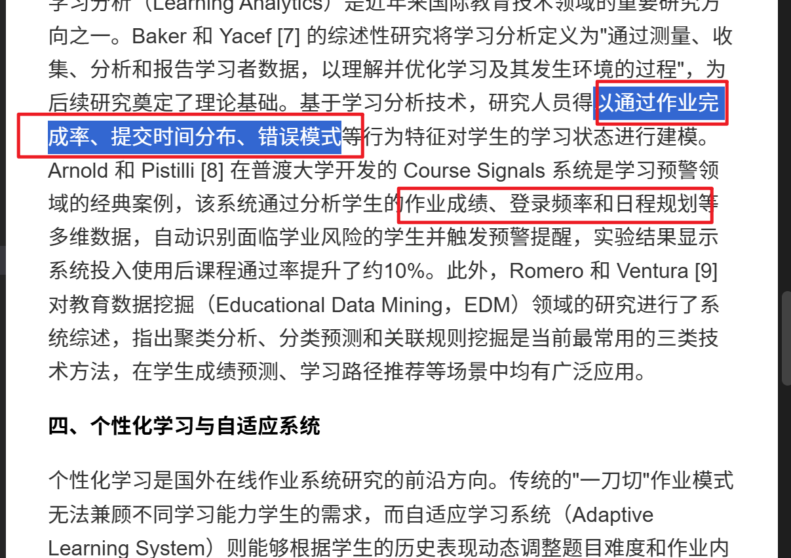
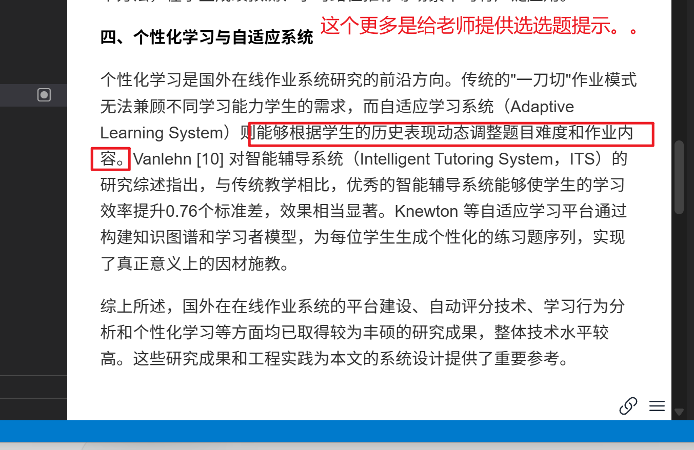
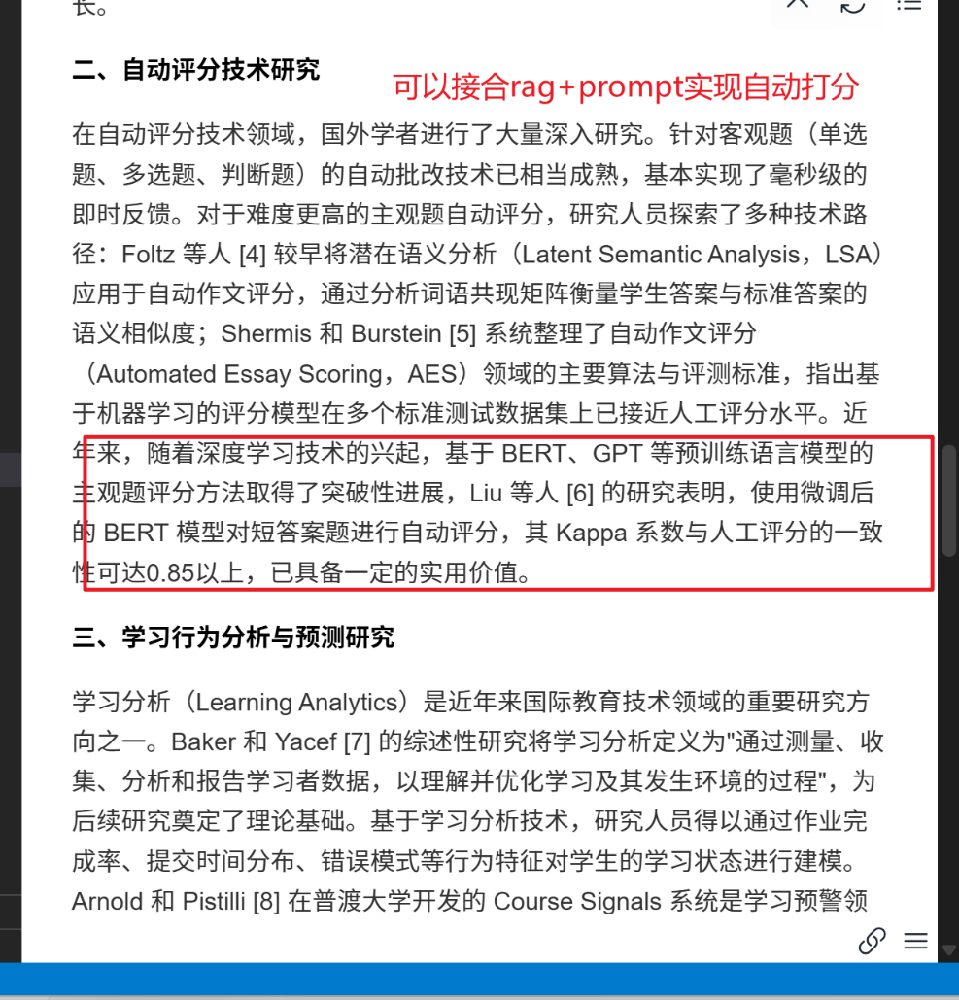

1自动评分技术研究、：准测试数据集上已接近人工评分水平。近年来，随着深度学习技术的兴起，基于 BERT、GPT 等预训练语言模型的主观题评分方法取得了突破性进展，Liu 等人 [6] 的研究表明，使用微调后的 BERT 模型对短答案题进行自动评分，其 Kappa 系数与人工评分的一致性可达0.85以上，已具备一定的实用价值。

2以通过作业完成率、提交时间分布、错误模式等、生的作业成绩、登录频率和日程规划等

3、自适应学习系统（Adaptive Learning System）则能够根据学生的历史表现动态调整题目难度和作业内容
以上是我观察你在国外研究现状的内容，我想知道这个项目是否存在这个功能，如果没有，你为我专门生成一个需求文档讲述如何在现有基础上实现。1我想到的就是rag+prompt+大模型调用的方式实现，2这几个维度应该可以写代码收集。3我觉得就是你看设计输入什么之前学生的真实数据座位context给大模型，然后写prompt约束输出一份作业难度和作业内容的分析报告？这个具体你来设计要求尽可能详细这份需求文档




===========下方是开始正文，上方留档不能删==========

# AI 增强功能需求文档

**项目名称**：基于 SpringBoot+Vue 的在线作业提交系统 —— AI 智能增强模块  
**文档版本**：v1.0  
**编写日期**：2026-04-06  
**文档状态**：待评审

---

## 一、现状分析

### 1.1 现有功能盘点

经对现有代码库分析，系统当前能力如下：

| 模块 | 现有能力 | 与目标功能的差距 |
|------|---------|----------------|
| 评分 | `ExamPaperQuestionCustomerAnswer.doRight` 仅做客观题对错判断；简答题需教师手动通过 `updateScore` 接口打分 | 无任何 AI 辅助评分，主观题全靠人工 |
| 行为采集 | `UserEventLog` 仅记录用户登录等基础事件，无答题行为细节 | 缺少完成率、提交时间分布、错误模式等维度 |
| 个性化推荐 | 无任何自适应机制，所有学生看到相同作业内容 | 完全空白 |

### 1.2 可利用的现有数据结构

以下字段可直接作为 AI 分析的数据源，无需改动数据库：

- **`exam_paper_answer`**：`userScore`、`paperScore`、`doTime`（做题用时）、`questionCorrect`、`questionCount`、`createTime`（提交时间）
- **`exam_paper_question_customer_answer`**：`questionId`、`questionType`、`customerScore`、`questionScore`、`answer`（学生原始答案）、`doRight`
- **`question`**：`difficult`（题目难度 1-5）、`questionType`、`correct`（正确答案）
- **`user_event_log`**：`createTime`（行为时间戳）、`content`（事件描述）

---

## 二、功能需求说明

本文档涵盖以下三个 AI 增强子功能：

| 编号 | 功能名称 | 技术路径 |
|------|---------|---------|
| F-01 | 简答题 AI 辅助评分 | RAG + Prompt Engineering + 大模型调用 |
| F-02 | 学习行为数据采集与分析 | 埋点扩展 + 统计分析 API |
| F-03 | 个性化作业难度与内容分析报告 | 学生历史数据 Context + 大模型 Prompt 输出 |

---

## 三、F-01：简答题 AI 辅助评分

### 3.1 功能概述

当教师批改简答题时，系统自动调用大模型，以题目标准答案为参考，对学生的简答题回答给出辅助评分建议（分数区间 + 评分理由）。教师可采纳或手动覆盖，最终得分仍由教师确认。

### 3.2 技术方案——RAG + Prompt

**为什么用 RAG？**  
题目库中存在大量学科相关知识点。将题目题干、标准答案、评分标准预先向量化入库（知识库），在评分时以学生答案为查询 Query，检索最相关的参考材料作为 Context 注入 Prompt，使大模型的评判更贴近题目本身的知识语境，而非通用常识。

#### 3.2.1 数据流设计

```
[题目入库阶段]
question.infoTextContentId → 解析题干+标准答案+解析
        ↓
向量化（Embedding 模型，如 text-embedding-ada-002）
        ↓
存入向量数据库（推荐 Milvus / pgvector）
字段：question_id, subject_id, difficult, chunk_text, vector

[评分触发阶段]
教师打开待批改答卷
        ↓
系统取出：题目题干 + 标准答案 + 学生答案
        ↓
以"题目题干 + 学生答案"为 Query → 向量检索 top-3 相关参考材料
        ↓
组装 Prompt → 调用大模型（如 DeepSeek / GPT-4o）
        ↓
解析返回 JSON → 展示辅助评分建议
        ↓
教师确认 → 写入 exam_paper_question_customer_answer.customerScore
```

#### 3.2.2 Prompt 模板设计

```
系统角色（System）：
你是一位严格、公正的教师评卷助手。你的任务是根据题目要求和标准答案，对学生的简答题回答进行评分，并给出详细的评分依据。
评分必须严格遵循以下规则：
1. 满分为 {question_score} 分（千分制，即实际满分 = question_score / 10）。
2. 评分粒度为 0.5 分（换算为千分制即 5 分）。
3. 只输出 JSON，不输出任何其他内容。

用户消息（User）：
【题目题干】
{question_content}

【评分标准】
{score_criteria}

【标准答案】
{standard_answer}

【参考知识点（来自知识库检索）】
{rag_context}

【学生答案】
{student_answer}

请按以下 JSON 格式输出评分结果：
{
  "suggested_score": <整数，千分制>,
  "score_level": "<优秀|良好|一般|较差>",
  "matched_points": ["<得分点1>", "<得分点2>"],
  "missing_points": ["<扣分点1>", "<扣分点2>"],
  "comment": "<50字以内的简要评语>"
}
```

#### 3.2.3 后端接口设计

**接口**：`POST /api/admin/ai/score-suggestion`

请求体：
```json
{
  "examPaperAnswerId": 123,
  "questionId": 456,
  "studentAnswer": "学生的作答内容"
}
```

响应体：
```json
{
  "code": 200,
  "data": {
    "suggestedScore": 70,
    "scoreLevel": "良好",
    "matchedPoints": ["正确说明了原理", "举例恰当"],
    "missingPoints": ["未提及边界条件"],
    "comment": "回答基本完整，但缺少对边界条件的分析。"
  }
}
```

#### 3.2.4 前端交互设计（管理端）

- 在现有批改页面（`/admin/exam/paper/answer`）的每道简答题旁，新增「AI 辅助评分」按钮
- 点击后异步请求，加载态展示 Loading
- 返回后以气泡卡片形式展示：建议分数、得分点、扣分点、评语
- 教师可点击「采纳」自动填入分数框，或忽略自行填写

#### 3.2.5 新增数据库字段

在 `exam_paper_question_customer_answer` 表新增：

```sql
ALTER TABLE t_exam_paper_question_customer_answer
  ADD COLUMN ai_suggested_score  INT          DEFAULT NULL COMMENT 'AI建议分数（千分制）',
  ADD COLUMN ai_score_comment    VARCHAR(500) DEFAULT NULL COMMENT 'AI评分评语',
  ADD COLUMN ai_score_time       DATETIME     DEFAULT NULL COMMENT 'AI评分时间',
  ADD COLUMN is_ai_adopted       TINYINT(1)   DEFAULT NULL COMMENT '教师是否采纳AI评分 1是0否';
```

---

## 四、F-02：学习行为数据采集与分析

### 4.1 功能概述

在现有 `user_event_log` 基础上扩展行为埋点，采集以下三类维度数据：

| 维度 | 采集内容 | 数据来源 |
|------|---------|---------|
| 作业完成率 | 学生应做/已做/逾期未做的作业数量 | `task_exam` + `task_exam_customer_answer` |
| 提交时间分布 | 每次提交的时间戳、距截止时间的提前量 | `exam_paper_answer.createTime` + `exam_paper.limitEndTime` |
| 错误模式 | 各题型错误次数、高频错题 ID、得分率趋势 | `exam_paper_question_customer_answer.doRight` |

### 4.2 行为埋点扩展方案

#### 4.2.1 扩展 UserEventLog 内容字段

`user_event_log.content` 现为纯文本。改为结构化 JSON 存储，并新增事件类型枚举：

```java
// 新增事件类型（在现有 UserEventLogService 扩展）
public enum EventType {
    LOGIN,                    // 已有
    EXAM_START,              // 新增：开始答题
    EXAM_SUBMIT,             // 新增：提交答卷
    EXAM_TIMEOUT_SUBMIT,     // 新增：超时自动提交
    TASK_COMPLETE,           // 新增：完成任务作业
    TASK_OVERDUE,            // 新增：任务逾期
    QUESTION_SKIP,           // 新增：跳过题目（未作答直接提交）
}
```

`content` JSON 示例（`EXAM_SUBMIT` 类型）：
```json
{
  "eventType": "EXAM_SUBMIT",
  "examPaperId": 12,
  "examPaperAnswerId": 88,
  "paperType": 6,
  "doTime": 1820,
  "submitBeforeDeadlineSeconds": 3600,
  "questionCount": 10,
  "answerCount": 9,
  "skipQuestionIds": [7]
}
```

#### 4.2.2 新增统计分析表

为支持高效查询，新增汇总统计表（每日定时任务刷新）：

```sql
CREATE TABLE t_student_behavior_stat (
  id               INT PRIMARY KEY AUTO_INCREMENT,
  user_id          INT         NOT NULL COMMENT '学生ID',
  stat_date        DATE        NOT NULL COMMENT '统计日期',
  task_total       INT         DEFAULT 0 COMMENT '应完成任务数',
  task_done        INT         DEFAULT 0 COMMENT '已完成任务数',
  task_overdue     INT         DEFAULT 0 COMMENT '逾期任务数',
  avg_submit_advance_sec INT   DEFAULT 0 COMMENT '平均提前提交秒数',
  total_questions  INT         DEFAULT 0 COMMENT '累计答题数',
  correct_count    INT         DEFAULT 0 COMMENT '累计答对数',
  score_rate       DECIMAL(5,2) DEFAULT 0 COMMENT '综合得分率(%)',
  update_time      DATETIME    DEFAULT CURRENT_TIMESTAMP ON UPDATE CURRENT_TIMESTAMP,
  UNIQUE KEY uk_user_date (user_id, stat_date)
) COMMENT='学生行为统计汇总表';

CREATE TABLE t_question_error_stat (
  id               INT PRIMARY KEY AUTO_INCREMENT,
  user_id          INT         NOT NULL COMMENT '学生ID',
  question_id      INT         NOT NULL COMMENT '题目ID',
  error_count      INT         DEFAULT 0 COMMENT '答错次数',
  attempt_count    INT         DEFAULT 0 COMMENT '总作答次数',
  last_error_time  DATETIME    DEFAULT NULL COMMENT '最近一次答错时间',
  UNIQUE KEY uk_user_question (user_id, question_id)
) COMMENT='题目错误统计表';
```

#### 4.2.3 统计分析 API

**接口1**：`GET /api/admin/analysis/student/{userId}/overview`  
返回指定学生的整体行为画像（完成率、得分率趋势、高频错题）

**接口2**：`GET /api/admin/analysis/class/submit-distribution`  
返回班级整体提交时间分布（按提前量分桶：截止前0~1h / 1~6h / 6~24h / 24h以上）

**接口3**：`GET /api/admin/analysis/student/{userId}/error-pattern`  
返回该学生各题型错误率、Top-5 高频错题详情

---

## 五、F-03：个性化作业难度与内容分析报告

### 5.1 功能概述

教师或学生点击「生成学习分析报告」，系统从数据库中提取该学生近 N 次（默认10次）的作答记录作为 Context，结合题目难度分布，调用大模型生成一份结构化的个性化分析报告，内容包含：当前掌握程度评估、薄弱知识点定位、作业难度适配性分析、下一步学习建议。

### 5.2 数据 Context 构建流程

```
输入：user_id + subject_id（可选）+ 最近N次记录

Step 1 - 查作答汇总（exam_paper_answer）
  → 最近N份答卷的 paperName, userScore, paperScore, doTime, createTime

Step 2 - 查题目级明细（exam_paper_question_customer_answer JOIN question）
  → 每道题的 questionType, difficult, doRight, customerScore, questionScore

Step 3 - 聚合计算（Java 层处理，不依赖大模型）
  → 各难度题目（1-5级）的 正确率
  → 各题型（单选/多选/判断/填空/简答）的 正确率
  → 得分率趋势（按 createTime 排序的 userScore/paperScore 序列）
  → 平均做题用时 vs 建议用时对比

Step 4 - 构建 Context JSON 注入 Prompt
```

**Context JSON 结构示例**：
```json
{
  "studentName": "张三",
  "subjectName": "计算机网络",
  "analysisRange": "最近10次作答（2026-03-01 至 2026-04-06）",
  "scoreRateTrend": [72, 65, 80, 78, 85, 83, 90, 88, 91, 95],
  "difficultyAccuracy": {
    "level1": 0.95,
    "level2": 0.88,
    "level3": 0.71,
    "level4": 0.45,
    "level5": 0.20
  },
  "typeAccuracy": {
    "singleChoice": 0.89,
    "multiChoice": 0.62,
    "judge": 0.91,
    "fillBlank": 0.70,
    "shortAnswer": 0.48
  },
  "avgDoTimeSeconds": 1920,
  "topErrorQuestions": [
    {"questionId": 301, "difficult": 4, "errorCount": 3, "questionType": "multiChoice"},
    {"questionId": 412, "difficult": 5, "errorCount": 2, "questionType": "shortAnswer"}
  ]
}
```

### 5.3 Prompt 模板设计

```
系统角色（System）：
你是一位专业的教学数据分析助手。根据学生的历史作答数据，你需要生成一份客观、专业、有针对性的学习分析报告。
报告语言为中文，语气建设性、鼓励性，避免打击学生信心。
只输出要求格式的 JSON，不输出任何其他内容。

用户消息（User）：
以下是学生【{studentName}】在学科【{subjectName}】的历史作答数据：

{context_json}

请依据以上数据生成学习分析报告，输出格式：
{
  "overallLevel": "<优秀|良好|中等|待提升>",
  "overallComment": "<100字以内的整体评价>",
  "masteredPoints": ["<已掌握知识点1>", "<已掌握知识点2>"],
  "weakPoints": [
    {
      "point": "<薄弱点描述>",
      "evidence": "<基于数据的依据>",
      "suggestion": "<具体改进建议>"
    }
  ],
  "difficultyAdaptation": {
    "currentSuitableDifficulty": "<1-5的整数>",
    "reason": "<难度适配分析>",
    "adjustSuggestion": "<是否建议增加/降低难度及幅度>"
  },
  "studyPlan": [
    "<建议1：具体到题型或知识点>",
    "<建议2>",
    "<建议3>"
  ]
}
```

### 5.4 后端接口设计

**接口**：`POST /api/admin/ai/learning-report`

请求体：
```json
{
  "userId": 101,
  "subjectId": 3,
  "recentCount": 10
}
```

响应体：
```json
{
  "code": 200,
  "data": {
    "generatedAt": "2026-04-06T14:30:00",
    "overallLevel": "良好",
    "overallComment": "张三同学近期进步明显，得分率从72%上升至95%，客观题掌握扎实，但多选题和简答题仍有提升空间。",
    "masteredPoints": ["单选题判断能力强", "判断题准确率高"],
    "weakPoints": [
      {
        "point": "多选题漏选率高",
        "evidence": "多选题正确率仅62%，低于平均水平27%",
        "suggestion": "建议专项练习多选题，重点训练排除法和全面性思维"
      }
    ],
    "difficultyAdaptation": {
      "currentSuitableDifficulty": 3,
      "reason": "难度4-5级题目正确率低于50%，当前综合水平适配难度3级",
      "adjustSuggestion": "建议先巩固3级难度，待正确率稳定在85%以上再挑战4级"
    },
    "studyPlan": [
      "针对多选题：每日专项练习5题，重点关注题目中的'全部正确'选项",
      "针对简答题：练习结构化表达，答题前先列要点再展开",
      "错题复习：重点回顾题目ID 301、412，理解错误原因"
    ]
  }
}
```

**报告缓存**：同一 `userId + subjectId` 生成的报告缓存至 Redis，TTL = 6小时，避免重复调用大模型产生费用。

### 5.5 新增数据库表（报告持久化）

```sql
CREATE TABLE t_ai_learning_report (
  id             INT PRIMARY KEY AUTO_INCREMENT,
  user_id        INT           NOT NULL COMMENT '学生ID',
  subject_id     INT           DEFAULT NULL COMMENT '学科ID，NULL表示全科',
  report_json    TEXT          NOT NULL COMMENT '完整报告JSON',
  context_json   TEXT          NOT NULL COMMENT '输入的数据快照',
  create_time    DATETIME      NOT NULL COMMENT '生成时间',
  INDEX idx_user_subject (user_id, subject_id)
) COMMENT='AI学习分析报告记录表';
```

---

## 六、非功能需求

| 项目 | 要求 |
|------|------|
| 大模型接口超时 | 单次调用超时设置为 30s，超时返回提示"AI 服务繁忙，请稍后重试" |
| 大模型调用失败降级 | F-01 评分建议失败不影响教师正常手动批改；F-03 报告失败提示重新生成 |
| API Key 安全 | Key 存储于服务端配置文件（`application.yml`），不暴露给前端，通过后端代理调用 |
| 数据隐私 | 发送给大模型的内容不包含学生真实姓名，使用脱敏 ID；报告中展示姓名仅由前端本地填充 |
| 向量数据库选型 | 优先考虑 pgvector（复用现有 PostgreSQL 或 MySQL 8.0+ JSON 方案），无条件部署时可降级为余弦相似度内存计算 |
| 并发控制 | AI 接口增加用户级别频率限制：同一用户 60s 内最多触发 3 次 AI 调用（Redis 计数器实现）|

---

## 七、开发优先级与工作量估算

| 编号 | 功能 | 优先级 | 估算工作量 |
|------|------|--------|-----------|
| F-02 | 行为数据采集扩展 | P0（最高） | 3天（无外部依赖，纯代码扩展）|
| F-01 | 简答题 AI 辅助评分 | P1 | 5天（需接入大模型 SDK + 向量库）|
| F-03 | 个性化学习分析报告 | P2 | 4天（依赖 F-02 数据积累）|

> 建议开发顺序：F-02 → F-01 → F-03

---

## 八、依赖与技术选型建议

| 组件 | 推荐选型 | 说明 |
|------|---------|------|
| 大模型 | DeepSeek-V3 / GPT-4o-mini | DeepSeek 价格更低，适合学生项目；接口兼容 OpenAI SDK |
| 向量化模型 | text-embedding-ada-002 / BGE-M3（本地） | BGE-M3 可完全本地运行，无需付费 |
| 向量数据库 | pgvector（轻量）/ Milvus（生产） | 毕设推荐 pgvector，无需额外部署 |
| LLM 调用 SDK | Spring AI / LangChain4j | LangChain4j 生态更成熟，支持 RAG Pipeline |
| 缓存 | Redis（已有） | 直接复用，无需新增组件 |